# Web 3D 开发实践：3D 月球组件

恰逢中秋节，有机会参与到一项中秋运营活动的项目中，负责为业务方提供一个移动端场景投放的 3D 月球组件。由于一直接触的是 2D 可视化开发，对于 3D 开发（WebGL）的技术未有深入了解和实践经验，基于对现有社区主流技术的简单了解和团队成员的技术背景，遂选定基于 Three.js 进行开发以降低风险。

这篇文章是基于 3D 月球组件的开发实践，记录 3D 开发实践中了解的一些 Web 3D 技术知识和一些典型问题场景的解决方案。

<!-- truncate -->

先看看最终线上效果：

<video src="/video/web-3d-practical-case-1_screenshot.mp4" width="280" controls autoPlay loop />

> [线上活动链接](https://eq.10jqka.com.cn/activepage/activeMidAutumn/#/home)

## 为什么选择 three.js？

这里，先简单的聊一聊为什么会选择 [three.js](https://threejs.org/)？

鉴于对 3D 开发技术不够了解和时间紧迫等原因，优先考虑借助工具库完成组件开发。开源社区主流的 3D 开发工具库可以根据 [npm trends](https://npmtrends.com/aframe-vs-babylonjs-vs-phaser-vs-react-three-fiber-vs-three) 提供的信息做个参考，其中 three.js 的下载量遥遥领先，可见 three.js 已经被应用的很广泛了，是一个足够成熟的工具库。另一方面，Web 3D 技术的应用场景大多还是集中在游戏领域，例如 [Babylon.js](https://www.babylonjs.com/) 这个游戏开发框架，以及用来构建 AR 应用的 [A-Frame](https://aframe.io/)，所以可选择的成熟方案并不多。

综合考虑，three.js 在社区应用广泛，并且资料丰富、官方文档也较为友好，是一个比较合适的方案，另一方面，three.js 属于是对底层进行封装抽象的 API 集合，轻量也不复杂，而对于一个偏向于框架的工具来说就引入了不必要的复杂度。与此同时，考虑到团队内成员的技术背景（部分人基于 three.js 实践过 3D 开发），基于 three.js 来开发组件技术风险也能低一些。顺带提及一下 [three-globe](https://github.com/vasturiano/three-globe) 这个工具库，是用来专门构建 3D 地球可视化场景的开箱即用工具箱，也是后来开发过程中才了解到的，值得探究。

### three.js 的应用程序结构

选定技术方案后，需要对此次的 3D 月球组件需求任务要进行一个分析和拆解，做一个简化的应用架构设计，方便后续编码实现和快速迭代。在设计 3D 月球组件之前，有必要了解一下 three.js 的应用程序结构，便于完成后续工作。

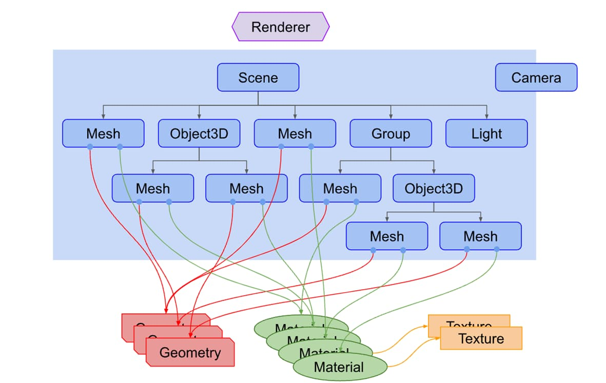

如上图所示，典型的 three.js 应用程序结构包含渲染器（Renderer）、场景（Scene）、相机（Camera）三大部分。相对于 2D 可视化开发来说，多了场景和相机这两个概念，前者要容易理解一些，可以简单的认为是绘图空间；而后者相机是一个新的东西，对于屏幕来说永远都是一个二维平面，三维物体的展现也是在特定的距离、方位和视角下，可以等同于人眼来理解相机。

场景图是 three.js 的核心，用来组织所有的可视元素节点，与 2D 开发类似，都有一个**组（Group）** 的概念，其可以很方便将大型场景进行分组设计、布局计算。对于 3D 月球组件的场景图结构设计也是基于组的概念来完成。

下面以一个现实中的场景来举例说明组（Group）的概念重要性。如下图所示，太阳（黄色）、地球（蓝色）、月球（灰色）的分布，我们都知道地球绕着太阳转，月球绕着地球转，在全局空间中月球的位置将会变得难以计算（因为月球参照的中心点地球位置在移动，而月球还绕着地球在旋转）。此时，可以考虑将月球放在地球形成的组（Group）中，在这个组中的任何物体的布局计算都不再是基于全局空间的坐标原点，而是基于该组所在的坐标点，在这个“局部空间”中月球的坐标计算只需要考虑自身旋转运动即可，组的坐标点更新会自动同步到组中月球节点上。


对于此次要开发的 3D 月球组件来说，场景图结构设计要简单得多，如下所示：

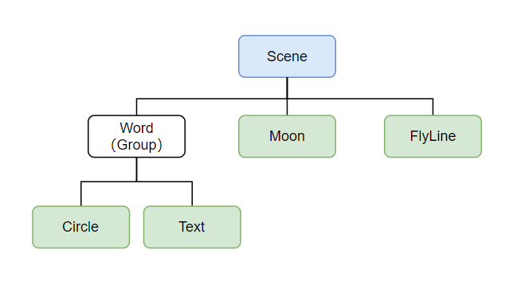

3D 月球组件中的 3 大元素就是月球（Moon）、标签（Word）、飞线（FlyLine），其中标签通过一个组（Group）来实现，因其包含一个圆形节点和文本节点，可以统一位置布局；事实上飞线也是会存在多个的，也可将其放入一个组（Group）内，只不过这里仅仅是用来便于统一管理。按理来说，标签位于月球表面，而月球会自转，标签和月球放入一个组（Group）内不是更好？但由于这里的月球中心位于坐标原点处，球面标签的位置非常好计算，而且月球的自转动画的实现也借助了轨道控制器（后续会提到），所以不放在一个组内也是可以的。

参考[官方文档](https://threejs.org/docs/index.html#manual/en/introduction/Creating-a-scene)，很快就能启动一个 3D 可视化项目，具体的代码不在这里举例说明。需要特别说明的是，对于三维场景中的坐标计算，通常利用一些简单的数学知识就能完成，而 three.js 提供了非常多的开箱即用的数学工具，例如线、球体、椭圆几何体的计算、向量的叉积与点积运算等、线之间的夹角计算等等，需要用到的时候先仔细翻翻官方文档，大概率是可以找到 api 的。

## 开始构建 3D 月球组件

现在，基于上文提到的场景图结构设计的参考图，再结合 2D 可视化开发中的组件化（模块化）思路，最终的项目结构呈现为：

```plain
src
├── assets
├── component
│   ├── FlyLine.ts
│   ├── Moon.ts
│   └── Word.ts
├── core
│   ├── Component.ts
│   └── Controller.ts
├── util
│   ├── common.ts
│   └── math.ts
└── index.ts
```

如上所示，**Controller.ts** 文件是整个组件程序控制流的实现，而 **component/** 文件夹中的几个文件是业务组件的实现。

```typescript
// src/core/Controller.ts
export default class Controller {
  private __initialize() {
    this.__initRenderer();
    this.__initScene();
    this.__initCamera();
    this.__initLights();
    this.__initControls();
    this.__initInteractionManager();

    this.___bindEvents();

    this.__initialized = true;
    this.__loop();
  }

  private __update() {
    this.__getAllComponents().forEach((comm) => {
      comm.update();
    });

    this.controls.update();

    this._renderer.render(this.scene, this.camera);
  }

  private __loop() {
    if (!this.__initialized) {
      return;
    }

    this.__animationLoop = requestAnimationFrame((timestamp) => {
      this.__update();

      this.__loop();
    });
  }
}
```

以上是 **Controller.ts** 文件的部分代码，展示了 3D 组件的程序主流程的核心实现，大致上遵循先初始化各个子组件实例，绑定事件，启动动画循环，然后在动画循环中更新组件、相机轨道控制器、渲染器重渲染等等这个模式。

基本上，组件的开发流程可以拆解为各个业务组件的逐步实现。

### 月球

首先要实现的便是月球组件，通过分析，其实现起来比较简单，本质上是一个球体在加一个月球表面的贴图即可。代码示例：

```typescript
class Moon {
  private __createSphere() {
    const geometry = new THREE.SphereGeometry(this.option.radius, 64, 32);
    const texture = textureLoader.load(moonImage as string);
    const material = new THREE.MeshBasicMaterial({
      // color: 0x00ff00,
      map: texture,
    });

    return new THREE.Mesh(geometry, material);
  }
}
```

如果月球组件这么简单的话，就没有必要写这篇文章了。事实上，设计师对于细节是有要求的，比如接下来遇到的这个问题。

为了让月球看起来更真实一些，需要做一个月球的外发光效果。在力争实现设计师预期的视觉效果的过程中，查阅了很多资料，发现 3D 场景中的物体发光并不是一个 three.js 默认支持的功能，有一定的技术成本。另一方面，发现有很多人在应对 3D 地球的发光效果时采用了一种折衷方案，该方案的具体做法就是让设计师提前准备好一张正方形的中心透明四周泛光的光圈贴图，然后将这个贴图和场景中的月球叠在一块，经过调整位置和大小就可以达到以假乱真的效果。贴图效果如下：

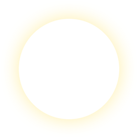

相信看到贴图的你已经知道我们要玩一种“以假乱真”的把戏，利用简单的贴图叠加实现月球的外发光效果。实现效果如下：

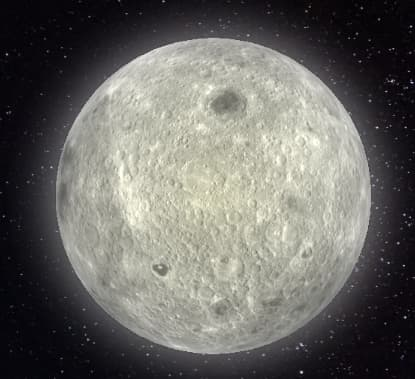

从最终的效果上看，设计师是比较满意的，从技术上讲这也是成本最低的方案。代码如下：

```typescript
class Moon {
  protected _initialize() {
    const moon = this.__createSphere();
    moon.name = 'Moon';
    moon.rotation.y += (Math.PI / 180) * 86;

    // 将外发光的阴影贴图和月球节点放在同一个 Group 内叠加
    const shadow = this.__createShadow();
    moon.add(shadow);

    this.group = moon;
    this.root.scene.add(moon);
  }

  private __createShadow() {
    const texture = textureLoader.load(moonShadowImage as string);
    const material = new THREE.SpriteMaterial({
      map: texture,
      transparent: true,
      depthWrite: false,
      opacity: 0.75,
    });
    const obj = new THREE.Sprite(material);
    // 调整大小和月球节点完美的叠加起来
    obj.scale.set(this.option.radius * 2.875, this.option.radius * 2.875, 1);

    return obj;
  }
}
```

至此，月球的外发光效果就基于贴图方案完美的解决掉了。当然，我们的产品是追求完美的，3D 场景下的物体务必要真实一些，而这个真实感就体现在月球表面的纹理（类似陨石坑一样的起伏）是否有立体感。

一般来说，3D 地球在 GIS 场景中应用时，会附加地形（DEM）数据，所以会看到地球表面明显的地形起伏，颇有真实感；但是，对于月球来说，真实的高程（DEM）数据是很难获得的，实现成本会很高，况且也毫无头绪。当然，问题还是得解决的，经过查阅资料发现有一种 [Bump mapping（凹凸贴图）](https://en.wikipedia.org/wiki/Bump_mapping)的技术可以用来解决该问题，而 three.js 也支持。

> 凹凸映射是计算机图形学中的一种纹理映射技术，用于模拟物体表面的凹凸和皱纹。这是通过扰动对象的表面法线并在光照计算期间使用扰动的法线来实现的。结果是一个明显凹凸不平的表面，而不是一个光滑的表面，尽管底层对象的表面没有改变。

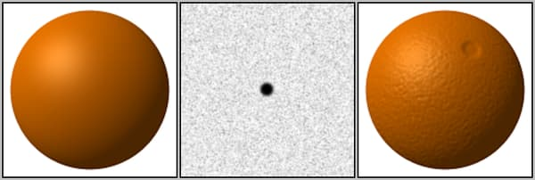

如上图所示，凹凸贴图可以实现让一个光滑的物体表面看起来凹凸不平的视觉效果，这也契合我们的需求。实现的效果不在这里给出截图，因为细节只有在真机设备上看起来才明显。代码比较简单：

```typescript
class Moon {
  private __createSphere() {
    const geometry = new THREE.SphereGeometry(this.option.radius, 64, 32);
    const texture = textureLoader.load(moonImage as string);
    // 更换为 MeshPhongMaterial 材质
    const material = new THREE.MeshPhongMaterial({
      map: texture,
    });

    // 添加 Bump 贴图
    const textureBump = textureLoader.load(moonImageBump as string);
    material.bumpMap = textureBump;
    material.bumpScale = 0.1;

    return new THREE.Mesh(geometry, material);
  }
}
```

如代码所示，需要注意的是，要先将月球表面的材质替换为 [MeshPhongMaterial](https://threejs.org/docs/index.html?q=MeshPhongMaterial#api/en/materials/MeshPhongMaterial) 类型，然后利用 [`bumpMap`](https://threejs.org/docs/index.html?q=MeshPhongMaterial#api/en/materials/MeshPhongMaterial.bumpMap) 配置再叠加一张 bump 贴图即可。通过解决这个问题可以发现，在 3D 场景中一般可以通过不同类型的材质和相应配置项就可以极低的成本实现“以假乱真”的效果，这也正是 three.js 提供的一项强大的能力。下面的材质特性表格值得作为参考：

> [Material Feature Table](https://threejs.org/manual/#en/material-table)

到了这里，三大业务组件中的月球组件已经实现了所有的功能，接下来看看月球表面的标签节点如何实现。

### 月球表面的标签

月球表面的标签是由两部分组成的，点节点和文本节点，它们作为一个整体（组）存在。首先，对于文本标签的应用场景，希望文本的视觉效果以通常的 2D 文本展示即可，不需要 3D 立体效果；同时，又希望能拥有 3D 场景中的真实感，即“近大远小”的效果。

对于文本（Text） 的创建，[three.js 的文档](https://threejs.org/docs/index.html#manual/en/introduction/Creating-text)有提到多种方案，大致可分类为 DOM 实现、纹理（Texture）、模型、文本几何体（Geometry）、位图字体（Bitmap Fonts），根据示例来看，DOM 实现和位图字体符合需求并且更灵活。综合考虑下来，DOM 实现要更简单方便一些，借助 [CSS3DRenderer](https://threejs.org/docs/index.html#examples/en/renderers/CSS3DRenderer) 不仅可以自动将 DOM 元素和 3D 场景中的节点绑定还可以实现“近大远小”的三维场景效果。示例代码：

```typescript
import { CSS3DRenderer } from 'three/examples/jsm/renderers/CSS3DRenderer.js';
import { CSS3DSprite } from 'three/examples/jsm/renderers/CSS3DRenderer.js';

// create
this._labelRenderer = new CSS3DRenderer();

const bBox = this._dom.getBoundingClientRect();

this._labelRenderer.setSize(bBox.width, bBox.height);
this._labelRenderer.domElement.style.position = 'absolute';
this._labelRenderer.domElement.style.top = '0';
this._labelRenderer.domElement.style.pointerEvents = 'none';

this._dom.appendChild(this._labelRenderer.domElement);

// update
this._labelRenderer.render(this.scene, this.camera);

// create label node
const geometry = new THREE.SphereGeometry(size / 2, 16, 8);
const material = new THREE.MeshBasicMaterial({
  color: NORMAL_COLOR,
  transparent: true,
});
const mesh = new THREE.Mesh(geometry, material);

// create label text
const $label = document.createElement('div');
$label.style.cssText = {
  position: 'relative',
  left: '0px',
  top: '4px',
  display: 'none',
  padding: '0 0 10px 0',
  '-webkit-tap-highlight-color': 'transparent',
  'user-select': 'none',
};
$label.innerHTML = `
  <div class="js-wrapper">
    <span class="js-label-content">
      标签
    </span>
  </div>
`;
const css3dText = new CSS3DSprite($label);

mesh.add(label);
this.scene.add(mesh);
```

额外补充一点，虽然 CSS3DRenderer 渲染器是开箱即用的，但是我们也可以自己完成将 DOM 元素的位置与场景图中 3D 元素节点位置同步的逻辑，参考[这篇文档](https://threejs.org/manual/#en/align-html-elements-to-3d)即可。

使用 DOM 实现标签很方便，但有一个本质上的缺陷就是它不属于三维场景的一部分，所以在三维场景中来看，月球表面我们始终只能看到一半，对于另一半的月球表面可认为是在视区外，在这种情况下当标签存在于月球背面时，DOM 节点是不会自动隐藏的，但预期的效果应该是标签不可见的。所以，为了实现预期的效果，需要判断哪些标签是位于月球背面的。尝试了很多的方案后，在 [stackoverflow](https://stackoverflow.com/questions/29316832/three-js-how-to-check-if-object-is-behind-a-sphere-not-visible) 看到一个答案，深受启发，才发觉原来利用数学物理知识可以很简单的解决该问题。用一副图来解释该方案：

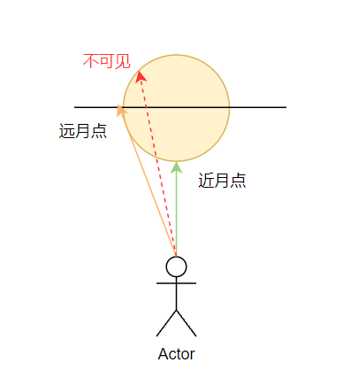

如图所示，假设一个人正视前方看向月球表面，那么月球表面距离这个人最近的点必然就是这个人所在位置与月球中心连线与球面的交点（近月点），而可见范围内月球表面距离这个人最远的点则是这个人所在位置与月球表明切线的切点（远月点）的距离。那么，既然知道这个人能看到月球表面的最远距离和每个标签节点距离这个人的距离，经过比较就可以知道标签是在月球正面还是背面，在每一帧刷新的时候进行判断控制标签节点的隐藏显示即可实现预期的效果。

完成标签的绘制后，如何把数十个标签均匀分布在月球表面又是一个难题，当然这个实际上是个很常见的分布规则，经过查阅文档，最终利用[斐波那契球算法](https://stackoverflow.com/questions/60578028/how-can-i-achieve-an-even-distribution-of-sprites-across-the-surface-of-a-sphere)比较理想的解决了这个问题。

下面这个是利用该算法实现的一个非常漂亮的示例：

> https://openprocessing.org/sketch/41142

算法的 JS 实现：

```typescript
function fibonacciSphere(
  numPoints: number,
  pointIndex: number
): [number, number, number] {
  const rnd = 1;
  const offset = 2 / numPoints;
  const increment = Math.PI * (3 - Math.sqrt(5));

  const y = pointIndex * offset - 1 + offset / 2;
  const r = Math.sqrt(1 - y ** 2);

  const phi = ((pointIndex + rnd) % numPoints) * increment;

  const x = Math.cos(phi) * r;
  const z = Math.sin(phi) * r;

  return [x, y, z];
}
```

最终，标签的实现效果如下图所示：

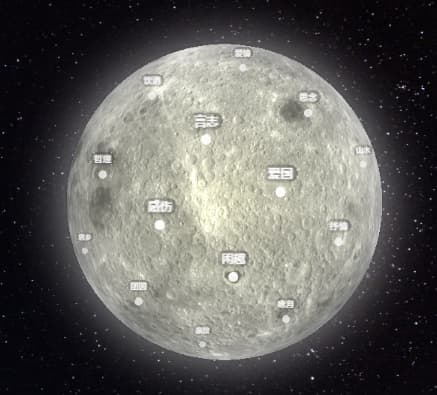

### 标签节点之间的飞线

可交互的应用总是能给用户带来更好的使用体验，因此标签节点被设计为是可以点击交互的，当点击标签时则选中该标签，多个选中的标签根据顺序将两两之间出现一条飞线。总的来说，飞线的需求其实很简单，两个标签点连成一条曲线，当然也有一些细节上的要求，飞线不能穿过球体以及飞线要看起来有流动的效果。

将问题拆解开来看，首先是曲线的绘制，three.js 提供了诸如 [CatmullRomCurve3](https://threejs.org/docs/index.html#api/en/extras/curves/CatmullRomCurve3)、[CubicBezierCurve3](https://threejs.org/docs/index.html#api/en/extras/curves/CubicBezierCurve3) 等几类三维曲线的实现，为了满足飞线不穿过球体，用 CatmullRomCurve3 实现要简单很多，在两点之间给一些插值的点即可，具体实现参考了[一个 3D 地球的开源项目](https://github.com/RainManGO/3d-earth/blob/main/lib/src/earth/flyLine.ts#L60)代码。但是，在尝试实现后，发现没有预期的效果好，而且点的插值策略并不好掌握，尤其是当两个标签位于两极时，曲线的弯曲夹角非常明显，并不像一个平滑的曲线一样。如下图所示：

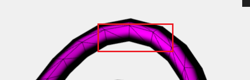

那么换一种方案的话，其实贝塞尔曲线在线型上是非常理想的效果，一开始也是简单做了尝试，发现一方面控制点很不好找，另一方面也是标签在两极时线会出现穿过球体的现象。在查阅资料的过程中，发现 3D 地球是一个很经典的 Web 3D 应用场景，而 GitHub 新首页的 3D 地球也是基于 three.js 做的，而且其官方还发布了如何构建该组件的[博客文章](https://github.blog/2020-12-21-how-we-built-the-github-globe/)。

由博文来看，GitHub 官方做了大量的细节优化，而其飞线这是用三次贝塞尔曲线实现的。当年 GitHub 发布新首页上的这个 3D 地球组件时，也风靡一时，引起了大量的开发者去复刻它。所以，开头提到的专门用来开发 3D 球应用的工具库 [three-globe](https://github.com/vasturiano/three-globe) 就被我找到了。在简略的查看了其源码后，专门仔细研究了一下其[飞线的实现代码](https://github.com/vasturiano/three-globe/blob/master/src/layers/arcs.js#L286)，也是参考这个实现最终完成了 3D 月球组件的飞线效果。效果如下：

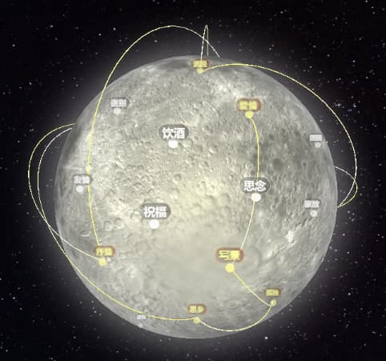

其中，比较关键的一段代码是先计算出贴着球面的曲线，然后根据该曲线上特殊的两个点坐标进行向量缩放得到贝塞尔曲线的控制点，参考代码如下：

```typescript
// * 贴着球面的曲线
// see https://github.com/vasturiano/three-globe/blob/master/src/layers/arcs.js#L286
function calcSphereArc(startVec, endVec) {
  const angle = startVec.angleTo(endVec);
  const getGreatCirclePoint =
    angle === 0
      ? () => startVec.clone() // points exactly overlap
      : (t) =>
          new THREE.Vector3()
            .addVectors(
              startVec.clone().multiplyScalar(Math.sin((1 - t) * angle)),
              endVec.clone().multiplyScalar(Math.sin(t * angle))
            )
            .divideScalar(Math.sin(angle));

  const sphereArc = new THREE.Curve();
  sphereArc.getPoint = getGreatCirclePoint;

  return sphereArc;
}

const sphereArc = calcSphereArc(source.clone(), target.clone());

// 这里根据两个标签节点位置之间的夹角大小来优化控制点的位置，
// 避免在两个标签点距离很近时，飞线弧度过大，且离月球表面很远
let scale = 1;
let at = [0.25, 0.75];
if (distanceDivRadius < 0.5) {
  scale = 1.15;
} else if (distanceDivRadius < 1) {
  scale = 1.25;
} else if (distanceDivRadius < 1.25) {
  scale = 1.35;
} else if (distanceDivRadius < 1.5) {
  scale = 1.4;
} else if (distanceDivRadius < 1.75) {
  scale = 1.5;
} else {
  scale = 1.75;
  at = [0.3, 0.7];
}

// 得到三次贝塞尔曲线
// see https://github.com/vasturiano/three-globe/blob/master/src/layers/arcs.js#L271
const curve = new THREE.CubicBezierCurve3(
  source,
  (sphereArc.getPoint(at[0]) as THREE.Vector3).multiplyScalar(scale),
  (sphereArc.getPoint(at[1]) as THREE.Vector3).multiplyScalar(scale),
  target
);
```

第二个方面则是实现飞线的流动效果，如果用单纯的曲线几何体，必然是不可能实现流动效果的，此时需要借助 [TubeGeometry](https://threejs.org/docs/index.html?q=TubeGeometry#api/en/geometries/TubeGeometry) 和材质更新来实现。具体实现的思路是参考了[这篇文章](http://www.xiaobaigis.com/Home/WebArticle?ID=89)。

在初版完成后，针对飞线又提了一个经典的效果需求，即从无到有的生长动画。这个在一些人口迁徙、航线分布等 3D 可视化场景中是非常常见的，GitHub 首页的 3D 地球实际上就有这个动画效果。正因为应用广泛，所在有很多可[参考的资料](https://stackoverflow.com/questions/36426139/incrementally-display-three-js-tubegeometry)。这里提到了一个 three.js 非常重要的 [setDrawRange()](https://threejs.org/docs/index.html#api/en/core/BufferGeometry.setDrawRange) API，其原理也很简单，因为 3D 场景中的任何几何体表面都是由三角格网组成的，所以一个几何体表面有大量的顶点数据，该 API 就是用来控制实际要渲染几何体表面的哪些顶点数据。换句话说，可以多次调用 setDrawRange 让飞线从一端开始慢慢的增加渲染范围从而实现生长动画。这也是最终选定的方案，因为飞线的生长动画效果的应用场景很简单，采用该方案实现起来成本很低，但是也正因为实现简单，其也有无法精确控制几何体渲染的缺点。对于几何体的部分渲染，实际上还有另一个方案，由于依赖于着色器代码，所以实现成本略高，可参考[这篇文章](https://stackoverflow.com/questions/37090564/how-to-animate-the-drawing-of-a-mesh-in-three-js/37091797#37091797)。

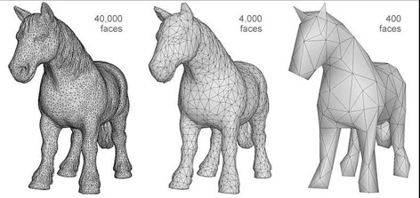

飞线生长动画最终的实现效果可参考文章开头放的动图。

对于飞线来说，还有一个比较棘手的问题需要解决，那就是飞线的发光效果，类似于刚开始提到的月球外发光效果。但是，飞线是没有办法采用之前的方案来实现发光效果的，因为飞线是动态变化的，位置具有不确定性，而且不是规则的曲线。不过不用担心，物体的发光效果是个比较常见的需求，three.js 虽然没有默认支持，但还是提供了一种[后处理的机制](https://threejs.org/docs/index.html#examples/en/postprocessing/EffectComposer)来实现此类效果，并且有完整的[示例代码](https://threejs.org/examples/#webgl_postprocessing_unreal_bloom_selective)。

采用该方案来实现飞线的发光效果是很容易的，具体的代码基本上将官方示例的源码复制过来就能用。从官方示例的源码中可以看到其实现采用了着色器代码。不过，官方示例源码中的着色器代码会导致一个问题，在设置了场景的透明色背景后会失效，场景的背景会变成黑色，当然社区中也早已有成熟的[解决方案](https://discourse.threejs.org/t/shader-to-turns-black-into-transparency-bloompass/22351)可供参考。利用该文章中提到的着色器代码替换掉 `UnrealBloomPass.prototype.getSeperableBlurMaterial` 函数中的实现即可。至此，飞线发光效果也算是比较圆满的解决了。效果如下图所示：

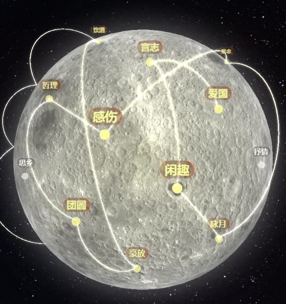

到了这里，3D 月球组件的大部分功能已经实现了。当然，从文章开头的动图里面看到月球组件会自转，而且有一些额外的元素，比如灯光等。对于这部分东西，是为了后续结合 3D 场景中的交互处理统一讲一下的，因为交互处理是个比较典型的应用场景。

## 3D 场景下的交互处理

对于 Web 3D 应用来说，提供丰富的鼠标和触摸交互能大大提高用户体验，而这些交互并不是 three.js 默认提供的，需要自己编码实现。当然，three.js 官方还是很贴心的提供了一种[光线投射方案（物理拾取）的代码实现](https://threejs.org/docs/index.html#api/en/core/Raycaster)，代码非常简洁，可以快速上手。

三维空间中的物体拾取要比二维空间难度大很多，一般来说有两种实现方案：

- 物理拾取
- GPU 拾取

其中，物理拾取也是 three.js 官方示例代码所采用的方案，其本质是利用交互点和相机形成的射线与场景中的物体逐一进行相交检测来实现物体的拾取。而 GPU 拾取是一种更精准、高效的方案，但代码实现略有难度，通俗一点解释就是将屏幕上每一像素都和在这个像素上渲染的物体对应起来，当鼠标点击到任一像素时，搜索与该像素对应的渲染物体即可拾取到物体。与 GPU 拾取相关的两篇资料（[How to pick a 3D object?](https://sites.google.com/site/csc8820/educational/picking) 和 [3D Picking](https://ogldev.org/www/tutorial29/tutorial29.html)）值得一读。

所以，最终对比来看，3D 月球组件这种简单场景采用光线投射（物理拾取）方案即可，但官方提供的示例代码未免太过简陋，更进一步来看的话并不属于生产就绪的代码。查看官方文档，会发现每一个对象都继承自 [EventDispatcher](https://threejs.org/docs/index.html#api/en/core/EventDispatcher) 类，其提供了标准的事件 API，但没有具体的交互事件实现，为了能在应用层面更好的管理元素节点的事件，需要设计一个事件交互管理类。在思考的同时，发现社区提供了一个不错的工具库 [THREE.Interactive](https://github.com/markuslerner/THREE.Interactive#readme)，可以直接拿来用。其 API 设计和使用方式也较为简单，这里举例说明：

```typescript
import { InteractionManager } from 'three.interactive';

const interactionManager = new InteractionManager(
  renderer,
  camera,
  renderer.domElement
);

interactionManager.update();

// 将需要交互的元素节点添加到交互管理器中
interactionManager.add(cube);

// 注册事件处理函数
cube.addEventListener('click', (event) => {});
```

这里有一个小细节需要注意一下，为何没有默认开启对场景中所有元素节点的交互支持呢？主要目的还是基于性能优化考虑，射线相交检测的计算也需要耗费一定的性能。

接下来，会介绍一下 3D 月球组件实现过程中交互处理方面的一些核心要点。

### 月球自转运动

根据需求，月球默认状态下是要有自转运动的，同时，一旦用户手指发生交互，自转运动要停止下来，用户手指离开屏幕恢复自转运动。

一般来说，首先考虑的是给月球节点加动画，但交互互斥的逻辑处理并不简单。因为要支持用户的手指触摸交互，以便于用户调整相机视角，应用了官方提供的 [OrbitControls](https://threejs.org/docs/index.html?q=OrbitControls#examples/en/controls/OrbitControls)，偶然发现该轨道控制器有一个 `autoRotate` 配置项可以开启自动旋转，同时还能配置旋转速度，很完美的解决了该问题。

通过这一点可以看出来，为了解决一个旋转动画问题，直接采用节点动画方案的话，实现起来并不简单；反过来利用开箱即用的轨道控制器不断的改变相机视角，也可以实现类似的旋转动画，要简单得多，这是一个特定场景下的完美解决方案（运动是相对的）。

### 相机和光源的同步

前面已经提到组（Group）无论在 2D 还是 3D 可视化开发中都是一个重要的概念，也介绍了一些应用场景，同样的在 3D 月球组件开发过程中，利用组非常巧妙的解决了一个难题。

具体问题是，为了使月球表明看起来更真实一些，在可视范围的一个球面定点位置加了一个光源（SpotLight），由于月球是不断的旋转的，光源如果要照射到视区范围的定点位置就得抵消月球的转动量以达到预期效果（即看起来光源不动）。想到这里，似乎要眉头紧锁了，有限的时间内实现该效果还是得费一番功夫。

在经过翻阅文档和网络资料后，发现 three.js 中几乎所有的对象都继承自 object3d 对象（即 Group），那问题瞬间就简化了，我们预期光源和相机的相对位置保持不变，将光源放在相机所属的组中即可。

```typescript
const spotLight = new THREE.SpotLight('#FFFB64');

-this.scene.add(spotLight);
+this.camera.add(spotLight);
+this.scene.add(this.camera);
```

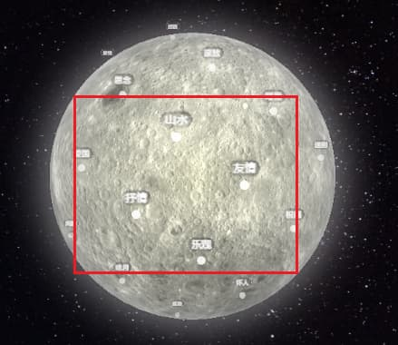

如上图所示，红框中的位置就是光源的照射位置，随着月球的自转运动，光源将一直保持在月球表面的红框位置不移动。

## 性能优化

Web 3D 应用的良好性能体验取决于设备的硬件性能和程序优化能力，尤其对于移动端设备的用户来说，性能的影响因素一般在于开发过程中的所做的优化措施，所以掌握一些比较典型的性能优化方案可以极大的提升用户体验。在开发 3D 月球组件的时候，线上真机测试期间确实发现了性能问题，在采取了一些降级措施后较好的解决了性能问题，在这里简单的列举一下。

### 由于 Vue 引起的一个插曲

首先遇到了一个小插曲，将组件交付给业务前端接入时，本地开发过程中就遇到了很严重的性能问题，但自己在本地却无法复现，经过努力的调试和查阅资料后，才发现是一个较为尴尬的原因。

业务方基于 Vue 框架进行页面开发，在接入组件过程中将实例化后的组件实例变量赋值在了 vue 组件实例的 data 上，鉴于 Vue 是基于类似“脏检查”的机制监听挂载的对象变化，所以组件实例上存在一些频繁变化的对象时（例如相机实例，相机自动的变换视角），页面会产生严重的卡顿问题。

解决方案也非常简单，将组件实例变量不要绑定在 vue 的组件实例上即可。

### 渲染策略

如果是静态场景，只需要渲染一次即可，对于可交互和支持动画效果的动态场景，需要多次渲染。官方文档和一些主流动画工具库的教程中，一般都会提到利用 [requestAnimationFrame() API](https://developer.mozilla.org/en-US/docs/Web/API/window/requestAnimationFrame) 实现动画循环的代码，如下所示：

```typescript
function animate() {
  requestAnimationFrame(animate);

  cube.rotation.x += 0.01;
  cube.rotation.y += 0.01;

  renderer.render(scene, camera);
}

animate();
```

动画循环是一种非常常见和实现起来很简单的渲染策略，还可以根据需要优化渲染的帧速率（一般 30 帧/s 即可）。但是，这种方案有性能上的劣势，周期性的渲染会导致一些不会频繁更新的元素节点重复渲染（或者执行不必要的代码逻辑），对于复杂的三维场景应用很有可能造成严重的性能问题。

因此，为了解决这个问题，还有一种策略就是按需渲染，那就是在需要重新渲染的时候调用更新逻辑。举例来说，如果是因为某些交互行为触发后才有的动画效果更适合采用按需渲染策略。

事实上，可以很好的将这两种渲染策略结合起来使用，为每一个元素实例暴露一个 `update()` 方法在动画循环中调用，但在该函数的代码实现中我们可以使用标记位来判断要不要具体执行更新逻辑，而标记位则由相应的一些交互行为触发后改变。这样，就可以很好的将交互处理和元素更新完全解耦，这也是很多绘图工具库（例如 zrender）所采用的方案。

在开发 3D 月球组件的过程中，第一个版本线上真机测试就遇到了性能问题，在一些低端机型上月球卡着无法旋转，组件初始化也很缓慢，将动画循环的帧速率降到 30，并且调整了一些性能参数后，即便是 5 年前发布的中低端机型也能流畅的进行交互。

### 贴图资源的内存占用

对于 Web 3D 应用来说，性能是比较敏感的，尤其是内存占用。当使用到纹理（Textures）贴图的时候，需要明确知道加载一张贴图时，对内存的影响程序是怎样的。通过[这篇文档](https://threejs.org/manual/#en/textures)，可以了解到一个用来计算图像加载的内存占用量的公式：

> width \* height \* 4 \* 1.33 = bytes

看到这里，似乎与我们通常的认知不太一样？实际上，图像的物理大小只是影响从网络获取该资源的加载性能，对于内存占用的影响在于其宽高。一般设计师追求高质量的视觉效果，会提供高清二倍图、三倍图，如果不经过二次处理，就会发生加载一个仅 157kb 大小，但宽高为 3024 \* 3761 的图片会消耗 60mb 左右的内存，这显然会对运行时性能产生不利影响。

如何既保证内存占用小的同时视觉效果好？目前并没有太好的方法，只能通过肉眼判断是否达到了预期的视觉效果，加载尽可能小的贴图。

除此之外，在 3D 应用中最常见的一个优化措施就是重用纹理（Texture）、材质（Material）、几何（Geometry）资源。在这里的一个应用场景就是，多条飞线节点实例都使用了同一个材质资源。

## 结语

3D 月球组件在预期的时间内开发完成并顺利交付并上线发布，值得庆幸。这是首次尝试 3D 组件在简单场景下的应用开发，遇到了一些 Web 3D 开发过程中典型的问题，通过解决这些问题对 Web 3D 开发技术有了更深入的了解，也为后续接触更复杂场景下的开发积累了实践经验。相对于 2D 可视化开发来说，3D 可视化开发的难点在于 3D 场景下有很多新的概念需要去了解和学习，另一方面 three.js 发展了这么多年，已成为一个学习 3D 开发很好的工具库，值得一试。

## 参考资料

- https://threejs.org/
- https://threejs.org/manual/#en/fundamentals
- https://threejs.org/docs/index.html?q=OrbitControls#examples/en/controls/OrbitControls
- https://stackoverflow.com/questions/29316832/three-js-how-to-check-if-object-is-behind-a-sphere-not-visible
- https://sites.google.com/site/csc8820/educational/picking
- https://ogldev.org/www/tutorial29/tutorial29.html
- https://github.com/markuslerner/THREE.Interactive#readme
- https://github.com/vasturiano/three-globe
- https://github.blog/2020-12-21-how-we-built-the-github-globe/
- https://stripe.com/blog/globe
- https://zhuanlan.zhihu.com/p/473982513
