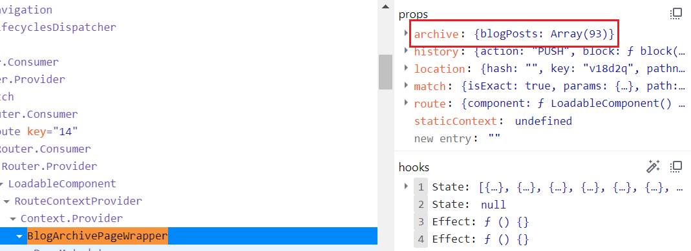
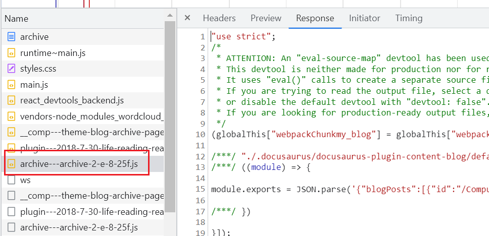
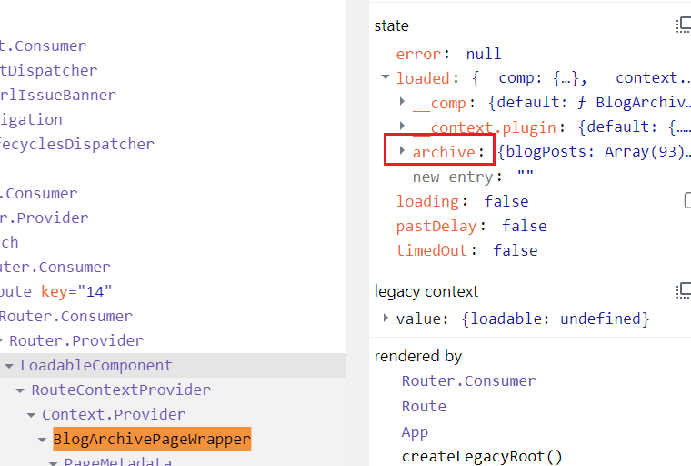

> _最后更新于 2022-11-15 00:47:00_

大概早在一年前就了解到 Meta(Facebook) 发布的一款专门用来构建文档站点的 [Docusaurus](https://docusaurus.io/) 工具库，那时候 Docusaurus 就已在社区中受欢迎起来，随着这一年多来看到很多开源项目的文档站点都基于 Docusaurus 构建，便下定决定要找机会尝试一下。于是，前不久在团队内对基建做改进时，对于文档这一块的迭代了解了很多热门的社区方案，一直举棋不定，在某天闲下来时就准备基于 Docusaurus 做一个尝试，最终发现效果还不错，而且迁移起来也几乎没有什么成本。

基于对 Docusaurus 这次尝试留下的好印象，便顺带深入了解了一下，发现还支持博客站点，而且功能很丰富，最吸引人的便是可以借助插件构建本地的离线全站搜索功能。说干就干，找了个周末就把自己的博客站点完全迁移到基于 Docusaurus 构建的站点了。当然，迁移过程是挺顺利的，而且也并没有想象中的麻烦，只是以前的博客页面都是自己写的，而现在基于 Docusaurus 的博客页面是开箱即用的主题，尤其是归档页面并不太符合期望，准备自己重新实现归档页面。经过[查看文档](https://docusaurus.io/docs/swizzling)，发现 Docusaurus 确实提供了重写归档页面的机制。不过，在重写之前，我心里突然发出一个疑问：我只能在已有的路由下（`/archive`）重写页面吗？博客的数据解析后是如何存储并传递给页面组件的呢？为了一探究竟，我便带着这些问题对 Docusaurus 的路由机制做了简单的探索，总算是了解了 Docusaurus 是如何以巧妙的方式做到这些事情的。

<!-- truncate -->

## 如何重写页面

根据 Docusaurus 官方的文档描述，首先对于重写页面的场景做了简单的分类，第一类便是[样式重写](https://docusaurus.io/docs/styling-layout)，此类场景只需要覆盖 CSS 样式即可；而另一类场景，以更细粒度的方式调整页面结构，也就是 Docusaurus 提供的 [**Swizzling**](https://docusaurus.io/docs/swizzling) 机制。对于调整页面结构，Docusaurus 又提供了两套方案 [**Ejecting**](https://docusaurus.io/docs/swizzling#ejecting) 和 [**Wrapping**](https://docusaurus.io/docs/swizzling#wrapping)，根据官方推荐来看，后者要比前者更安全一些，随即选了后者，但后面因为完全重写了整个博客的归档页面，所以实际上干了前者所对应的事情。

**Wrapping** 方案简单的来说就是对原有的 `BlogArchivePage` 组件做一层包装，即实现 `BlogArchivePageWrapper` 组件，用代码来表达的话如下：

```typescript
function BlogArchivePageWrapper(props) {
  return (
    <>
      {/** TODO something */}
      <BlogArchivePage {...props} />
    </>
  );
}
```

为了重写博客的归档页面，必然得了解 `props` 的数据结构。

## 页面的数据从何而来

随即打开 Chrome 的开发工具，利用 React 的调试插件查看了页面组件树，了解了 `BlogArchivePageWrapper` 组件所接收的 `props` 数据结构。如下图所示：



此时，我便产生了刚开始提到的一些疑问：页面的数据从何而来？是否有 API 可以获取？如果我想利用博客的数据构建一个自定义路由下的页面是否有可能呢？

带着这些问题我仔细查看了官方的文档，然而一无所获。当然，这便引起了我的兴趣，我决定通过探索 Docusaurus 源码的方式搞清楚这些问题。通过快速的阅读源码，大致了解了其机制和原理，觉得非常有意思和有技巧性，决定记录下来。（事实证明，由于没有仔细看官方的架构设计文档，花费了很多不必要的时间。）

### 创建路由

第一步，便是通过分析得到的数据结构关键字 `archive` 做一个源码的全局搜索，便找到了 **@docusaurus/plugin-content-blog** 包的源码实现部分。其关键代码如下：

```typescript title="https://github.com/facebook/docusaurus/blob/v2.2.0/packages/docusaurus-plugin-content-blog/src/index.ts#L229"
async contentLoaded({content: blogContents, actions}) {
  // ...
  // highlight-next-line
  addRoute({
    path: archiveUrl,
    component: blogArchiveComponent,
    exact: true,
    modules: {
      // highlight-next-line
      archive: aliasedSource(archiveProp),
    },
  });
  // ...
}
```

根据源码可以看出，通过 `addRoute()` API 创建了一个路由（即默认的 `/archive`），并将解析好的博客归档数据 `archive` 作为参数传入。这个时候，如果及时查看一下[官方插件文档](https://docusaurus.io/docs/api/plugin-methods/lifecycle-apis#addRoute) 理解起来要容易很多，当然跟踪上游的代码实现也是可以的，毕竟源码是绝对可信的。

在看源码之前，仔细看看官方的[架构文档](https://docusaurus.io/docs/advanced/architecture)和[路由文档](https://docusaurus.io/docs/advanced/routing)对于源码的理解要更深一些。关键源码如下：

```typescript title="https://github.com/facebook/docusaurus/blob/v2.2.0/packages/docusaurus/src/server/plugins/index.ts#L119"
// highlight-next-line
addRoute(initialRouteConfig) {
  // Trailing slash behavior is handled generically for all plugins
  const finalRouteConfig = applyRouteTrailingSlash(
    initialRouteConfig,
    context.siteConfig,
  );
  pluginsRouteConfigs.push({
    ...finalRouteConfig,
    context: {
      ...(finalRouteConfig.context && {data: finalRouteConfig.context}),
      plugin: pluginRouteContextModulePath,
    },
  });
},
```

单纯看这段源码的话，并不能明白 `addRoute()` API 具体做了什么事情，不过架构文档中对于该 API 有一段描述，一个重点则是 **“插件代码和主题代码不直接相互导入，而是通过 JSON 临时文件和调用 `addRoute`”**。另一方面，可以注意到以上关键代码位于 _server/_ 目录下，而 Docusaurus 是 Server-Client 架构。

### 页面是如何加载数据的

经过以上分析，我们知道博客插件将解析好的博客归档数据 `archive` 通过 `addRoute()` API 注册路由时绑定了起来，那么页面加载 `/archive` 路由时如何获取这份数据是非常关键的。最简单的方式就是查看开发工具的请求信息，当然确实发出了一个**js 文件**请求，如下图所示：



根据该 JS 文件的源码来看，实际上是一个包含了博客归档 JSON 数据的 webpack 构建的模块。联想到之前架构文档中提到的 JSON 数据通信，再去看一下官方的[插件文档](https://docusaurus.io/docs/advanced/plugins) 发现提供了一个很有用的 **debug plugin's metadata panel** 调试面板，然后再看看项目根目录的 _.docusaurus_ 文件夹，很容易就找到了 _.docusaurus/docusaurus-plugin-content-blog/default/archive-3ef.json_ 文件，而这正是博客归档数据，也是以上 JS 模块所包含的 JSON 数据。而该 JSON 文件又是何时生成的呢？

回过头来看，在分析 `addRoute()` 源码的时候忽略了其上几行的 `createData()` API 的关键代码：

```typescript title="https://github.com/facebook/docusaurus/blob/v2.2.0/packages/docusaurus-plugin-content-blog/src/index.ts#L220"
// Create a blog archive route
const archiveProp = await createData(
  // highlight-next-line
  `${docuHash(archiveUrl)}.json`,
  JSON.stringify({ blogPosts }, null, 2)
);
```

至此，已经清楚的知道插件在通过 `addRoute()` 添加路由时，就调用 `createData()` API 生成了相关的 JSON 数据临时文件，以备后续客户端代码通信。

根据之前留意的一个细节，`addRoute` 的源码在 _server/_，现在来看看 _client/_ 目录便可知晓客户端页面是如何加载数据的。在此之前，先通过开发工具的 React 调试插件看看该数据到底是从哪个父组件获取并注入 `BlogArchivePageWrapper` 组件的。结果如下：



如图中所示，实际上是 `LoadableComponent` 完成了数据获取，并将其注入到子组件中。这一看似乎是 [react-loadable](https://github.com/jamiebuilds/react-loadable) 的代码，经过查看源码确实如此，不过让我感到疑惑的是，曾经用过 react-loadable 却不知道其还有加载（请求）数据的功能？实际上，Docusaurus 利用了其[自定义渲染的 API](https://github.com/jamiebuilds/react-loadable#optsrender) 来巧妙的完成了页面加载时数据请求的任务。关键代码如下：

```typescript title="https://github.com/facebook/docusaurus/blob/v2.2.0/packages/docusaurus/src/client/exports/ComponentCreator.tsx#L75"
render(
  loaded: {[keyPath: string]: {[exportedName: string]: unknown}},
  props,
) {
  // `loaded` will be a map from key path (as returned from the flattened
  // chunk names) to the modules loaded from the loaders. We now have to
  // restore the chunk names' previous shape from this flat record.
  // We do so by taking advantage of the existing `chunkNames` and replacing
  // each chunk name with its loaded module, so we don't create another
  // object from scratch.
  // highlight-next-line
  const loadedModules = JSON.parse(JSON.stringify(chunkNames)) as {
    __comp?: React.ComponentType<object>;
    __context?: RouteContext;
    // highlight-next-line
    [propName: string]: unknown;
  };
}
```

这段代码中，`chunkNames` 实际上就是请求的 JS 模块加载后注入到全局的数据信息（参考 Webpack 模块机制）。现在，我们明白了客户端页面是如何完成数据加载工作的，但还有一个问题还未解决，我们了解了 JSON 数据临时文件何时生成的，JS 模块是何时加载数据的，但唯独中间过程，即是如何利用 JSON 数据临时文件生成该 JS 模块文件的目前还不得而知？

实际上，这个问题随着追溯上面代码的上下文 `ComponentCreator` 方法的引用就立刻明白了。于是，又回到了服务端代码 _server/routes.ts_ 中，这是路由的核心实现。

```typescript title="https://github.com/facebook/docusaurus/blob/v2.2.0/packages/docusaurus/src/server/routes.ts#L246"
/**
 * This is the higher level overview of route code generation. For each route
 * config node, it returns the node's serialized form, and mutates `registry`,
 * `routesPaths`, and `routesChunkNames` accordingly.
 */
function genRouteCode(routeConfig: RouteConfig, res: LoadedRoutes): string {
  // ...
}

/**
 * Routes are prepared into three temp files:
 *
 * - `routesConfig`, the route config passed to react-router. This file is kept
 * minimal, because it can't be code-splitted.
 * - `routesChunkNames`, a mapping from route paths (hashed) to code-splitted
 * chunk names.
 * - `registry`, a mapping from chunk names to options for react-loadable.
 */
export function loadRoutes(
  routeConfigs: RouteConfig[],
  baseUrl: string,
  onDuplicateRoutes: ReportingSeverity
) {
  // ...
}
```

以上不再细说，代码和注释已经非常的清晰了。

## 结语

最终，由于在重写博客归档页面中引起的一些疑问简单探索了 Docusaurus 路由机制的实现原理，了解了从数据解析到路由创建，再到页面加载完成数据请求并渲染页面内容的整个过程。从这个分析过程中，可以看到 Docusaurus 实现静态文档站点工具库所使用的一些技术和技巧，也许可以在解决某些问题时受到启发。
