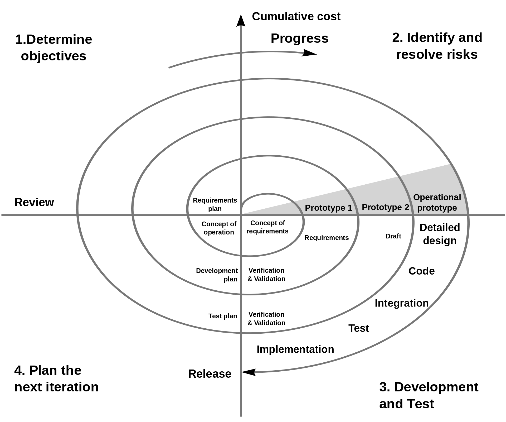

> _最后更新于 2023-03-05 16:47:00_

在日常工作中，经常被糟糕的项目进度控制和需求变更等因素搞得人身心俱疲，为了缓解这类问题，产品设计、程序设计、项目管理等多个环节都需要参考一些优秀的案例，而《设计原本》就针对**设计过程**进行了较为深入的探讨，在阅读过后发现其中一些概念是日常在用的，但没有意识到的，也有我们大多数人一直追求的理想状态被作者认为是不合理的，值得一读。

<!-- truncate -->

在翻阅博文中读书相关分类的文章时，发现自 2021 年更新后一年多已经没有更新了，倒也不是这一年多没有看书，只是看书是断断续续的，也没有坚持持续性的记录下来。近段时间刚好不是很忙，看到电脑中之前收藏的一本电子书《设计原本》，便饶有兴致的看了起来。鉴于现在工作忙的原因，一般看书的时候都是下班后晚上进行速读，遇到好的内容会花多一些时间深入阅读，这本书是连续几个晚上，总共花费 6 个多小时阅读完的，虽然时间不多，但还是有一些收获的。

这本书总体来说，内容并不是偏向学术理论的，文中有大量的实际案例，更具备实用性。也是在这本书中，又一次见到了“银弹”的说法，对这个说法有了更深入的了解。

## 关于理性模型的讨论

在阅读这本书的过程中，我被吸引的第一个关注点就是关于“理性模型”的讨论，实际上在这之前我对这个概念没有任何认知。

> 将设计过程建模为一种系统化的、按部就班的过程的观念。

以上是书中对“理性模型”这个概念的概述，这对很多人来说似乎稀松平常，如果进一步了解作者在后续过程中举例的软件开发领域的“瀑布模型”之后更会觉得原来不过如此。

如上图所示，这就是软件开发领域的理性模型，即瀑布模型。乍一看这不就是我们每天开发软件的总体流程吗？

但是，本书的作者却不完全认同理性模型，认为这是过于理想化的东西，不符合现实情况。仔细想想也有道理，因为按这样的流程开发软件时，对于一些过程中的细节我们总会因为各种各样的现实情况而妥协或者采取折中方案。

### 理性模型的优点

针对理性模型的讨论，作者先叙述了其优点。

> 与“先开始编码再说，先开始构建再说”的行为相比，任何将设计过程系统化的工作都可以视为一种长足的进步。它为设计项目的规划提供了清晰的步骤。它为日程规划和进度评估定义了明确的阶段里程碑。它为项目组织和人员配备指明了方向。它改进了设计团队的内部沟通。而在设计团队和其项目经理之间以及项目经理和其他利益攸关者之间而言，它对于沟通的改进尤为显著。新手很容易就可以上手。掌握了它，新手在面对分派给他的第一个设计任务时，就知道从何人手了。

根据实际来看，以上叙述比较符合我们日常工作的感受。

> 理性模型在特定的情形下会体现出更多的长处。在项目早期就给出目标的显式陈述、相关的必要条件以及约束说明，这有助于避免让团队陷于举棋不定的局面，也促使团队形成关于项目宗旨的统一认识。在开始编码或正式的制图工作开始之前做好整体的设计过程规划，就能够规避大量麻烦，也避免让许多努力付之东流。

以上两部分内容算是对理性模型优点的总体概括，感觉还是比较深刻的，尤其是对于团队协作、设计项目管理等方面的考虑很到位。

### 理性模型的缺陷

接下来便是探讨了理性模型的缺陷，这部分内容其实也是最值得我们阅读和思考的。

首要的一点便是我们在初始阶段并不真正地知道目标是什么，理性模型最严重的缺陷在于，设计师们往往只有一个模糊不清的、不完整的既定目标，或者说是主要目的。

> 设计中最困难的部分在于决定要设计什么。

在我们日常的软件开发工作中，项目发起时大家都会明确目标，不过这个目标偏向于结果，对于项目或者产品本身没有太多具体的表述，如果具体去落地这个事情便成为了一个最大难题。这就会导致项目过程中出现频繁的需求变更，更甚者还需要进行目标修正，这一般会导致项目周期拉长，多次延期。当然，应对此类问题书中提了一种方案，那就是快速原型设计。

> 设计师的主要任务乃是帮助客户发现他们想要的设计。

快速原型设计采用一种迭代的过程和方式，来帮助客户逐渐明确需求，从而确定设计目标。也就是说，目标的迭代须作为设计过程的固有组成部分加以考虑。

其次，设计不是一蹴而就的，在一些高技术的领域，一个人很难有足够的知识在一开始就确定好设计目标，对于周期长的项目还会出现中途换人的情况，所以这实际是一种探索的过程。那么理性模型在这方面来看就过于理想化。

另一方面，项目进行过程中，很多设计决策并不是最终方案，实际上只能算是一个暂定方案，随着项目的进行，一些未考虑到的因素会被发现并影响既有的设计决策，同时客户的需求发生变化也会产生同样的结果。也就是说，在现实情况中，不可控因素有很多，理性模型注重的是按部就班、持续推进的单向工作流，但这明显不符合现实情况。

还有一种观点认为，设计师通常并不会按理性模型预想的步骤做事，这样只会限制他们的创造力。

最令我印象深刻则是，书中作者大胆指出，很多时候我们自己并不按理性模型设计的那样做事，但又要求别人如此做事，而这样的方式对于我们来说无法给别人提供很好的帮助。

基于以上所有的讨论，书中也做了几点总结，作为参考：

> 一个正式的设计过程模型是必需的，目的是帮助组织设计工作、辅助为项目内部以及项目相关的沟通工作，亦有益于教学。
>
> 给予设计过程模式以可视化的几何表示至关重要，因为设计师们都擅长空间思维。他们最乐于学习、思考、分享和讨论有着明确儿何图像的模型。
>
> 对工程师来说，设计的理性模型是自然而然的。
>
> 线性的按部就班的理性模型具有很大的误导性。它并未能反映出设计师的真实工作，或是一流的设计思想家所认定的设计过程的本质。
>
> 坏的模型流毒甚广。它会导致需求的过早固定，从而导致过度膨胀的产品，以及日程表、预算和性能的灾难。
>
> 理性模型在实践中积重难返，尽管它有种种不足，而且对它早有大量有说服力的批判。这是因为它具有诱人的逻辑简单性，也是因为构建者和客户之间需要“合同”。

通过阅读这些内容，给人感受最深的有两点：第一，我们预期的理想化的过程通常与我们实际做事的过程不相符；第二，理性模型（瀑布模型）是在没有更好的方案之时，为了快速达成某些前置目标而选取的方案。

### 螺旋模型

在批评了理性模型之后，书中也探讨了一些其它模型的方案，其中螺旋模型作者认为比较合理。

> 螺旋的形状当然表示的是过程。它将同一活动的连续反复彼此关联起来。这种几何形状很容易理解，而且令人印象深刻。该模型强调的是原型方法，它主张远在一个可以跑起来的原型成为可能之前，就从用户界面原型和用户测试起步。

从瀑布模型和螺旋模型两者可视化表示的层面来看，从前者的线性模型变成了后者的迭代式模型，这意味着设计是一个不断重复的过程，这似乎更符合我们实际的现实情况。

当然，作者提出螺旋模型并不是目前最优的方案，但基于螺旋模型进行迭代和发展是一个非常有潜力的方向。

## 书

- 《设计原本》- [美] Jr·Frederick P·Brooks 著，王海鹏、高博 译
