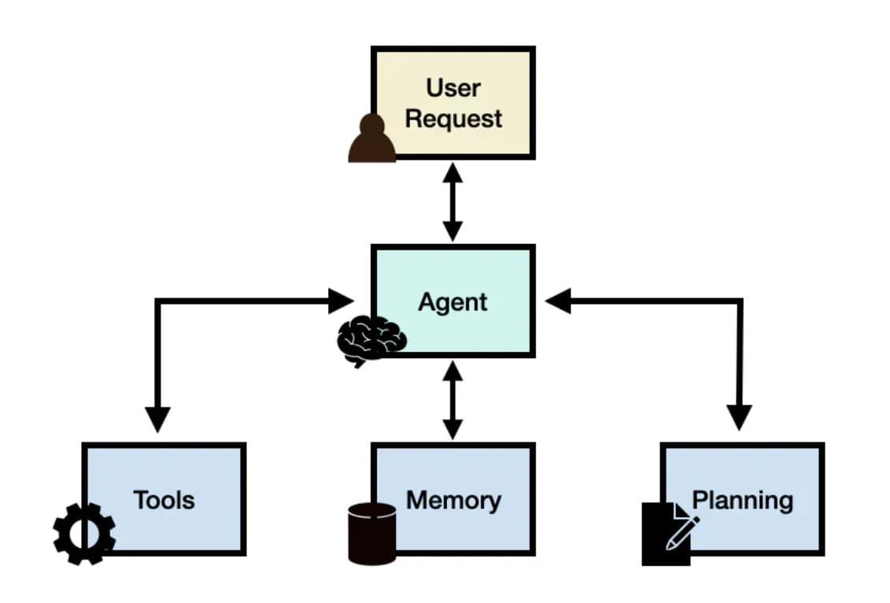
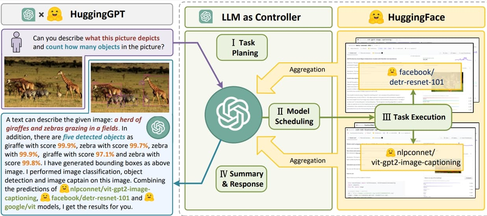

> _最后更新于 2024-03-22 18:57:00_

自 OpenAI 2022 年底发布了 ChatGPT 后不久就爆发了 AI 领域的技术热潮，经过一年多的迅速发展和迭代，当前（2024） Agent 已被认为是未来 AI 应用的主流形态。

<!-- truncate -->

AI 技术在业务场景（产品）中顺利落地，需要工程侧和机器学习领域技术人员的共同配合，作为工程侧技术开发，理解 Agent 技术架构目前来看很有必要。结合去年在业务中利用 LLMs 技术做的一些 AIGC 业务场景探索的经验，以及对现有的 Agent 技术相关的资料的了解，简单谈谈现阶段对 AI Agent 技术的理解。

## 什么是 AI Agent？

不管是查看维基百科还是一些学术论文或者技术博客，可以了解到 AI Agent（中文译为智能体）不是一个新的概念，已经出现了相当久。简单的来说，AI Agent 指的是能够**自主感知环境**、并**采取行动**实现目标的智能实体。

根据资料来看，AI Agent 具备一些关键能力：**感知、学习、推理、行动（Sense, learn, reason, act）**。这些其实也是利用 Agent 技术架构解决问题的关键所在。

现有类 ChatGPT 的产品（Claude、Gemini 等）已经被我们广泛的使用，能解决很多文本领域相关的问题，交互形式主要是单轮对话（简单问题）和多轮对话（较复杂问题）。鉴于很多客观原因，其存在一定局限性，因此这类产品目前还难以解决复杂问题、专业领域问题。原因有很多，例如当前大多数大语言模型（LLMs）属于静态模型，无法了解最新的知识，上下文 Token 限制（随着技术迭代已经被缓解）致使涉及到长文本的任务不能被很好的完成，通用模型不了解一些专业领域的知识等等。

那么，为了让 AI 技术能真正落地具备实用性，AI Agent 事实上是**一种解决复杂问题、专业问题的系统性方案**，一种基于 AI 模型构建应用的新范式。而且，现在的大多数 AI Agent 更多是基于大语言模型的 LLMs Agent，因为大语言模型展现出的优秀的自然语言处理（NLP）能力为未来产品应用的人性化交互设计奠定了坚实的基础。

目前业内对 AI Agent 技术架构的简单定义如下图所示：



其具备四个关键组件：**代理模型（Agent Model）、工具（Tools）、外部存储（Memory）、规划器（Planner）**。这里仅说明 AI Agent 的核心架构，不再具体去阐述这几部分的作用和具体实现，一方面是目前的技术还在迭代，变化很快，另一方面现有的其它资料针对这些内容有更详细、准确的解释。

让我们换个角度，看看从 ChatGPT 发布至今，大家利用 AI 技术解决问题路径的演变过程，将有助于我们更好地理解这些组件的必要性。

## AI 技术的演变

### 提示词工程

一开始，ChatGPT 以聊天应用的形式发布，大家都在探讨如何仅通过简单的对话来更好的解决问题，提示词工程（Prompt Engineering）则成为了这一阶段的主角。在此期间，出现了很多非常有用的方案，例如思维链（CoT，Chain of Thought）、思维树（Tree  of Thoughts）等等，这些都是值得去深入了解学习的。

实际上，**提示词工程**技术应该是 AI Agent 技术的关键所在，与模型交互的过程需要设计提示词以得到更符合预期的输出。

### 检索增强生成

为了解决大语言模型无法了解新知识（专业领域知识）的问题，**检索增强生成（Retrieval Augmented Generation, RAG）** 技术因为低成本优势成为了最佳方案，核心思路是为大模型构建一个外部的知识数据库，而该知识库可以以极低的成本进行维护和高频更新。存储外部知识文档资料的数据库为向量数据库（Vector database），提供了比传统的文本检索（基于关键字匹配）技术更高效、准确的向量搜索（Vector search）方案。

这也是 AI Agent 架构需要**外部存储组件**的部分原因，**向量数据库、向量搜索，以及嵌入（Embedding）技术**是我们需要了解学习的新技术领域。

### 浏览器自动化

AI 技术热潮的再一次爆发，让人们又看到了通用人工智能（Artificial General Intelligence, AGI）的可能性，很多用户自发的在探索当前 AI 技术能力的边界。这一阶段，出现了一些利用浏览器自动化工具结合大语言模型完成需要人类介入才能完成的任务，例如人们经常检索信息的操作，打开谷歌搜索、输入查询关键字、上下滚动查看检索结果条目、点击某项结果查看更详细信息等等，更甚的还有在线购物场景案例，打开购物网站、查找商品、加入购物车等等。

以上的案例的思路都是仅利用大语言模型以自然语言的方式进行交互，并将模型输出转换为 GUI 自动化工具的输入来模拟人类交互以完成复杂任务。实际上，GUI 自动化工具在软件测试场景有所应用，考虑到其适用的平台及其它一些限制性因素，这并不算是一个完美的方案。

### WebGPT

经过一年多时间的发展，ChatGPT 及其同类产品已经在背后做了大量优化，其中通过**接入外部搜索引擎**来解决大语言模型无法了解现实世界最新知识问题的方案已被广泛应用。这一方案正是 OpenAI 在 2022 年发表的有关 WebGPT 的论文中所探讨的内容。

这一阶段，实际上证明了大语言模型可以**通过调用外部工具来完成任务**的技术路径的可行性，也是目前 AI Agent 技术的核心思路。像 OpenAI 发布的 JSON 响应模式、函数调用（Function Call）功能都是大语言模型与外部工具进行交互的典型方案，值得一提的还有 Google 研究团队发布的 ReAct 范式，为大语言模型解决问题提供了新的思路，展示了其规划、推理、行动和根据结果迭代调整的路径模式。

基于以上内容的了解，随着大语言模型的更新和不断出现的新提示词范式，基础模型具备了将大任务拆分为小任务的规划能力，借助外部存储和调用外部工具来解决一些复杂问题已经具备可行性，而这正是 AI Agent 技术架构中几个关键组件的由来。

## 案例

截至目前，业内都在大力跟进 AI Agent 技术的发展，目前还远未到技术收敛的时候，因此如何利用 AI Agent 很好地解决复杂系统问题还处于工程化实践探索的阶段。不过，可以通过一些案例了解一下业内的进展情况。

### AutoGPT

AutoGPT 项目是业内较早实践 AI Agent 理念的，其核心思想在官方文档中也有所描述：

> The concept was (and still is) fairly simple: let an LLM decide what to do over and over, while feeding the results of its actions back into the prompt. This allows the program to iteratively and incrementally work towards its objective.

简单的来说，就是通过类似多轮对话的方式，让大语言模型一遍又一遍地决定要做什么（这个过程中人类可以参与反馈），同时将其操作的结果反馈到提示中，这使得该程序能够迭代地、逐步地​​实现其目标。AutoGPT 项目架构中，组件（Components）是构成 Agent 的基本模块，而组件中的命令（Commands）定义了如何调用外部工具。

### HuggingGPT

微软研究团队提出了一种 HuggingGPT 项目架构，其思路是基于大语言模型处理自然语言的优势使其充当中央控制器（规划器），在每一个子步骤中具体解决问题时则调用更适合该任务的其它机器学习模型（例如翻译、图片生成、视频生成模型），这有点类似于大模型领域的 MoEs 架构。



## 框架工具

虽然 AI Agent 的技术架构较为简单，但具体到真实的业务开发中，需要处理大量的细节问题，而框架工具能帮助我们抽象掉底层细节。

先通过一个最简单的工具来理解 AI Agent 的实现思路。Hugging Face 提供了 JavaScript SDK 包，其中一个为 `@huggingface/agents`，用来实现最简单的 Agent 工具。先来看看怎么使用：

```typescript
// 1. 提出问题：执行生成代码操作
const code = await agent.generateCode(
  "Draw a picture of a rubber duck with a top hat, then caption this picture."
);

// code generated by the LLM
// async function generate() {
//   const output = await textToImage("rubber duck with a top hat");
//   message("We generate the duck picture", output);
//   const caption = await imageToText(output);
//   message("Now we caption the image", caption);
//   return output;
// }

// 2. 回答问题：执行上一步生成的代码，并得到最终结果
const messages: Update[] = await agent.evaluateCode(code);

export interface Update {
  message: string;
  // 结果可能是文本、文件
  data: undefined | string | Blob;
}
```

该项目的思路是生成代码片段，并通过执行这段代码调用外部工具得到最终结果，**中间产物是代码片段**。而这些代码片段实际上就是定义的外部工具的接口，来看看如何定义一个工具：

```typescript
const englishToGermanTool: Tool = {
  name: "englishToGerman",
  description:
    "Takes an input string in english and returns a german translation. ",
  examples: [
    {
      prompt: "translate the string 'hello world' to german",
      // highlight-next-line
      code: `const output = englishToGerman("hello world")`,
      tools: ["englishToGerman"],
    },
    {
      prompt:
        "translate the string 'The quick brown fox jumps over the lazy dog` into german",
      // highlight-next-line
      code: `const output = englishToGerman("The quick brown fox jumps over the lazy dog")`,
      tools: ["englishToGerman"],
    },
  ],
  call: async (input, inference) => {
    const data = await input;
    if (typeof data !== "string") {
      throw new Error("Input must be a string");
    }
    const result = await inference.translation({
      model: "t5-base",
      inputs: input,
    });
    return result.translation_text;
  },
};
```

注意上面高亮的行，是中间产物代码片段的不同案例，代表了调用该工具需要执行的代码，**需要关注的是其中仅参数不同**，`call` 字段则是该工具具体要执行的逻辑的实现，这里是定义了一个翻译工具，通过调用谷歌的 t5 模型来完成翻译任务。

通过 `@huggingface/agents` 项目我们可以了解到 AI Agent 技术中实现大语言模型与外部工具交互的方式，当然这种方式不仅只有这一种，接下来看看另一个项目 Vercel AI SDK 中定义外部工具的案例。

```typescript
const result = await generateText({
  model: openai('gpt-3.5-turbo'),
  tools: {
    // highlight-start
    weather: tool({
      description: 'Get the weather in a location',
      parameters: z.object({
        location: z.string().describe('The location to get the weather for'),
      }),
      execute: async ({ location }) => ({
        location,
        temperature: 72 + Math.floor(Math.random() * 21) - 10,
      }),
    }),
    // highlight-end
  },
  prompt:
    'What is the weather in San Francisco and what attractions should I visit?',
});
```

以上定义了一个查询地区温度的工具，与 `@huggingface/agents` 不同的是将 `code` 字段换成了 `parameters`，可以想象的是**中间产物由代码片段变成了 JSON 格式参数对象**，这其实比较符合 OpenAI 的函数调用功能设计。

除此之外，还可以了解的是 **AutoGen** 项目，这是微软团队发布的用来构建多代理架构应用的框架，官方文档比较详细，这里不再赘述。

需要额外提及的是，**LangChain** 是社区中主流的开发 AI 应用的开源框架，也提供了 Agent 开发能力。值得注意的是其对 Agent 模型做了分类，例如支持函数调用的 OpenAI 模型、擅长 XML 处理的 Claude 模型、基于结构化数据的简单模型、基于 ReAct 范式的简单模型等等，这意味着**基础模型提供的能力不同，开发 Agent 时要处理的细节也不同**，这是工程化开发中需要关注的。

综上，是现阶段对 AI Agent 的简单理解，主要关注的是其核心架构和技术原理，通过一些业内案例和框架工具了解部分技术实现细节。该领域的技术还在快速发展中，需要继续关注后续发展以更深入的了解产业落地情况和实践中遇到的问题。

## 参考资料

- [Intelligent agent](https://en.wikipedia.org/wiki/Intelligent_agent)
- [What are AI Agents?](https://aws.amazon.com/what-is/ai-agents/)
- [Ai agents driving the next wave of digital transformation](https://www.leewayhertz.com/ai-agents/)
- [Introducing Agents.js: Give tools to your LLMs using JavaScript](https://huggingface.co/blog/agents-js)
- [The Anatomy of Autonomy: Why Agents are the next AI Killer App after ChatGPT](https://www.latent.space/p/agents)
- [LLM Powered Autonomous Agents](https://lilianweng.github.io/posts/2023-06-23-agent/)
- [LLM Agents](https://www.promptingguide.ai/research/llm-agents)
- [The Landscape of Emerging AI Agent Architectures for Reasoning, Planning, and Tool Calling: A Survey](https://arxiv.org/abs/2404.11584v1)
- [A Survey on Retrieval-Augmented Text Generation for Large Language Models](https://arxiv.org/html/2404.10981v1)
- [ACT-1: Transformer for Actions](https://www.adept.ai/blog/act-1)
- [WebGPT: Improving the factual accuracy of language models through web browsing](https://openai.com/index/webgpt/)
- [ReAct: Synergizing Reasoning and Acting in Language Models](https://react-lm.github.io/)
- [AutoGPT Agent](https://docs.agpt.co/autogpt/)
- [HuggingGPT: Solving AI Tasks with ChatGPT and its Friends in Hugging Face](https://ar5iv.labs.arxiv.org/html/2303.17580)
- [Introducing Agents.js: Give tools to your LLMs using JavaScript](https://huggingface.co/blog/agents-js)
- [Vercel AI SDK: Tools and Tool Calling](https://sdk.vercel.ai/docs/ai-sdk-core/tools-and-tool-calling)
- [LangChain: Agent Types](https://js.langchain.com/docs/modules/agents/agent_types/)
