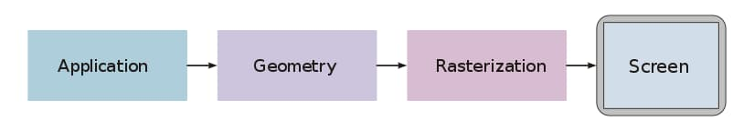
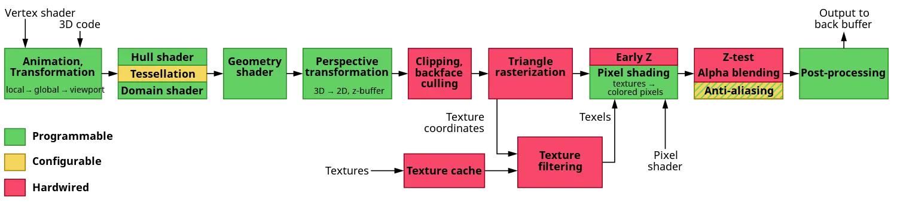
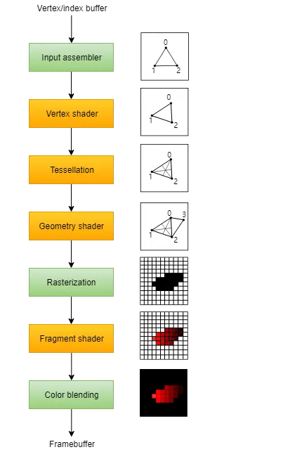
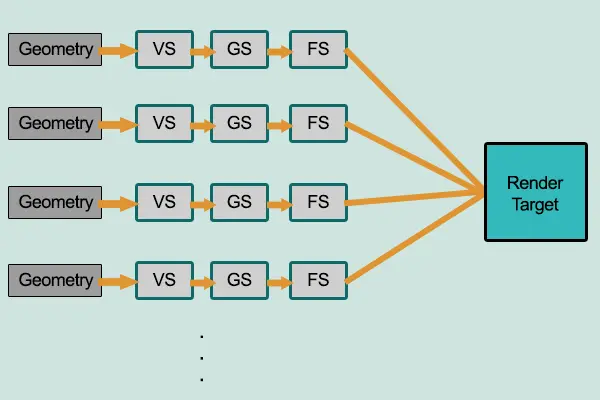
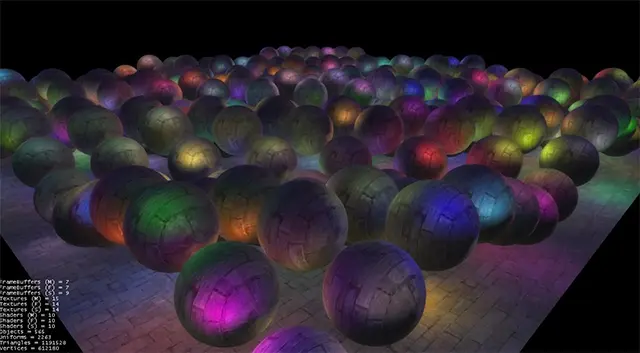
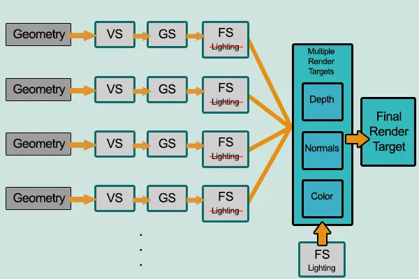

> _最后更新于 2023-03-18 14:30:00_

相对于 2D 开发，3D 开发由于有大量的概念需要进行学习了解因此门槛较高，近期刚好针对 3D 图形渲染技术中的两种常见技术正向渲染和延迟渲染进行了简单的了解，在此做个简单的记录，另外通过了解这些概念的同时也对光照相关的知识有了更深入的了解。

在此之前，虽然已经进行了相当多的开发实践，但由于场景受限，一直对于 3D 开发中的光照技术应用的偏少，不过恰好近期在学习了解性能相关的知识，在了解到渲染这方面的知识概念时，才意识到光照在 3D 开发中的是一个非常重要的技术。

<!-- truncate -->

## 渲染管线

无论是做普通的前端业务开发，还是数据可视化开发，了解程序性能瓶颈的一个关键方面是知道**程序代码到 UI 视觉效果是如何实现（映射）的**，也即**渲染管线（Rendering Pipeline）**。



上图概括了 3D 开发渲染管线的大体流程，即：应用程序、几何图形和光栅化。简单来说，应用程序的代码是一系列绘图逻辑的高度抽象，而这些逻辑代码被编译为底层的几何图元绘制指令，经过一系列运算后交给图形处理器完成光栅化，最终呈现在终端显示器上，具体内容参考[维基百科](https://en.wikipedia.org/wiki/Graphics_pipeline)等资料即可，这里不做赘述。

接下来主要是要了解一些常用概念，目的是对后续两种不同渲染技术进行分析说明时更容易理解。

### 着色器

这里首先需要了解的便是着色器的概念，在计算机图形学中，**着色器是一种计算机程序**，负责在 3D 场景渲染过程中计算适当的亮度、暗度和颜色级别，这个过程也被称之为着色。

在探讨 3D 开发中的渲染管线时，一定要结合软硬件来思考，换句话说，图形处理器（GPU）被设计为流水线架构，分成多个阶段，其中某些阶段由底层硬件暴露给上层软件可编程接口，着色器则为这些可编程的阶段提供了运行的程序。所以，可灵活编程的着色器程序，为 3D 开发提供了强大的图形处理能力。



上图是图形处理器的流水线架构设计的一个大体示意图，也可看作是渲染管线的硬件实现，其中绿色部分是可编程的阶段，而各种不同阶段的程序对应不同类型的着色器。

其中，顶点着色器（Vertex shaders）是最成熟和最常见的 3D 着色器类型，并且为提供给图形处理器的每个顶点运行一次。目的是将每个顶点在虚拟空间中的 3D 位置转换为它出现在屏幕上的 2D 坐标（以及 Z 缓冲区的深度值）。顶点着色器可以操纵位置、颜色和纹理坐标等属性，但不能创建新的顶点。

几何着色器（Geometry shaders）程序在顶点着色器之后执行。它们将整个原语作为输入，可能带有邻接信息。例如，在三角形上操作时，三个顶点是几何着色器的输入。然后着色器可以输出零个或多个图元，这些图元被光栅化并且它们的片段最终传递给像素着色器。

来自光栅化阶段的每个片段的数据由片段着色器（像素着色器，Pixel shaders）处理。片段着色器的输出是每个要写入的颜色缓冲区的颜色列表、深度值和模板值。片段着色器无法为片段设置模板数据，但它们可以控制颜色和深度值。

以上三类常见着色器中片段着色器是着色器编程中接触最多的，也算是最核心的。

最后，给出一张 Vulkan （新一代现代图形卡抽象设计 API）文档中对于渲染管线的示意图，相信这幅图能以更直观的方式帮助我们理解渲染管线。



## 渲染技术

在对前置概念渲染管线做了简单的了解之后，接下来便是本文的核心内容，两种不同的渲染技术。

### 正向渲染

正（前）向渲染（Forward Rendering）又称正向着色，是大多数 3D 渲染引擎的默认渲染技术实现。

**这是一种直接的方式，渲染一个对象并用场景中所有的光源照亮它。如果场景中有大量的对象，则为场景中的每个对象分别执行此操作。**这句话总结了正向渲染技术的实现思路和技术原理，其非常符合我们人类思考的方式。

虽然很容易理解和实现，但它对性能的影响也很大，因为每个渲染对象都必须为每个渲染片段迭代每个光源，由于片段着色器输出被覆盖，正向渲染也往往会在深度复杂度高的场景（多个对象覆盖同一屏幕像素）中浪费大量片段着色器运行结果，导致大量的无效渲染。



在上图中，每个几何图形被一次一个传递给渲染管线，经过顶点着色器、几何着色器、片段着色器等多个阶段后最终渲染到渲染目标（显示器），这也正是正向渲染技术处理渲染对象的流程。

### 延迟渲染

延迟渲染（Deferred Rendering）技术似乎并不常见，但被市面上大多数 3D 渲染引擎所支持。



上图是一个有大量动态光源的场景，而这也正是延迟渲染技术的典型应用场景。**延迟渲染（着色）基于这样的想法，即我们将大部分繁重的渲染（如照明）推迟或推迟到后期。**

延迟着色由两个过程组成：在第一个过程中，称为几何通道，我们渲染一次场景并从我们存储在纹理集合中的对象中检索各种几何信息，称为 G 缓冲区; 考虑位置向量、颜色向量、法线向量和/或镜面反射值。场景的几何信息存储在 G 缓冲区然后用于（更复杂的）光照计算；我们在称为照明通道的第二个通道中使用 G 缓冲区中的纹理，在该通道中我们渲染一个屏幕填充的四边形，并使用存储在 G 缓冲区中的几何信息计算每个片段的场景照明；我们逐个像素地迭代 G 缓冲区。我们不是将每个对象从顶点着色器一直迭代到片段着色器，而是将其高级片段处理分离到后面的阶段。光照计算完全相同，但这次我们从相应的 G 缓冲区纹理中获取所有必需的输入变量，而不是顶点着色器（加上一些统一变量）。



所以，延迟渲染很关键的一点是将光照计算这种非常耗性能的流程推迟到后期统一完成，避免了正向渲染技术中产生的大量无效渲染。

### 特点对比

目前，大部分的 3D 渲染引擎默认采用就是正向渲染技术，例如 Three.js、Babylon.js、Unity 3D；将延迟渲染技术作为默认方案的很少，例如 Unreal Engine 4。另一方面，Three.js 也[支持延迟渲染技术](https://threejs.org/docs/#api/en/renderers/WebGLMultipleRenderTargets)，而 Unity 3D 支持的渲染技术[更多](https://docs.unity3d.com/Manual/RenderingPaths.html)，Unreal Engine 4 也提供了[正向渲染的支持](https://docs.unrealengine.com/4.26/en-US/TestingAndOptimization/PerformanceAndProfiling/ForwardRenderer/)。

正向渲染容易理解，实现成本低，灵活度高，可以很好的处理透明度、Z 缓冲区、抗锯齿等场景；但在多光源的场景下，光照计算对性能影响很大，会导致大量的无效渲染，在简单场景下可以考虑用光照贴图替代真实光源。用类似大 O 表示法来表示正向渲染技术的渲染复杂度：

```plain
正向渲染复杂度：O(num_geometry_fragments * num_lights)
```

相对来说，延迟渲染实现成本较高，对着色器的支持有限，适合应用在大量动态光的场景，会极大的提升渲染性能，但需要支持多个渲染目标的显卡，高带宽以支持大量的缓冲区传输，内存消耗高，默认不支持透明度、抗锯齿等，不过业内有相应的解决方案。那么，延迟渲染技术的渲染复杂度则可表示为：

```plain
延迟渲染复杂度：O(screen_resolution * num_lights)
```

对比两者的渲染复杂度，具体选用哪种渲染技术，取决于场景中的光源数量以及几何图形的量级等因素。

## 参考资料

- https://en.wikipedia.org/wiki/Graphics_pipeline
- https://www.khronos.org/opengl/wiki/Shader
- https://en.wikipedia.org/wiki/Shader#Pixel_shaders
- https://vulkan-tutorial.com/Drawing_a_triangle/Graphics_pipeline_basics/Introduction
- https://gamedevelopment.tutsplus.com/articles/forward-rendering-vs-deferred-rendering--gamedev-12342
- https://learnopengl.com/Advanced-Lighting/Deferred-Shading
- https://www.klab.com/jp/blog/tech/2021/unitydeferredrendering.html
- https://en.wikipedia.org/wiki/Deferred_shading
