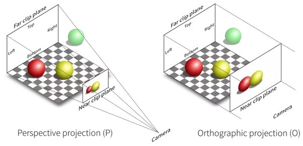
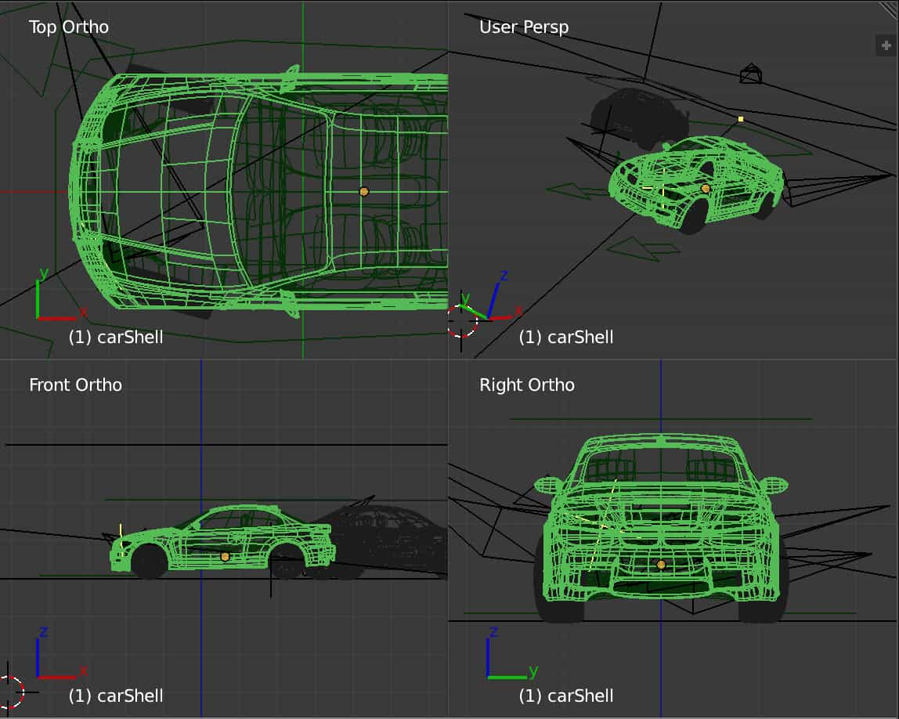
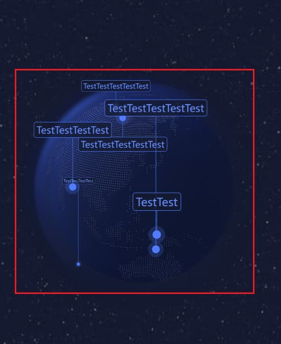
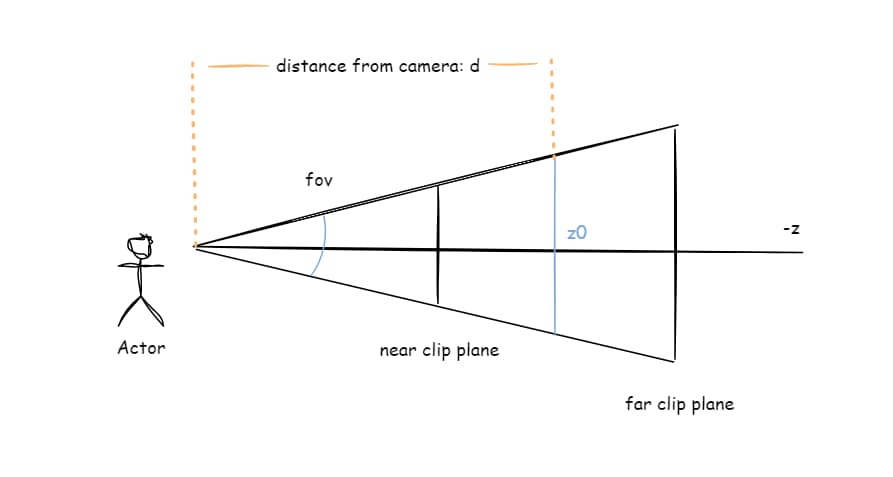
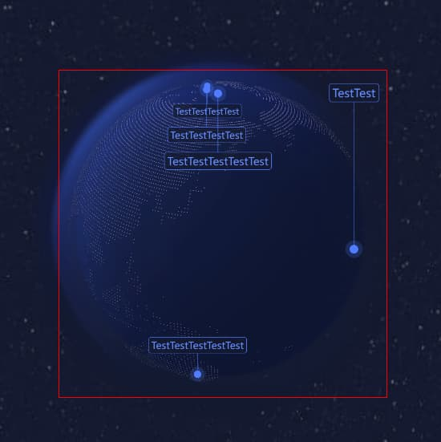
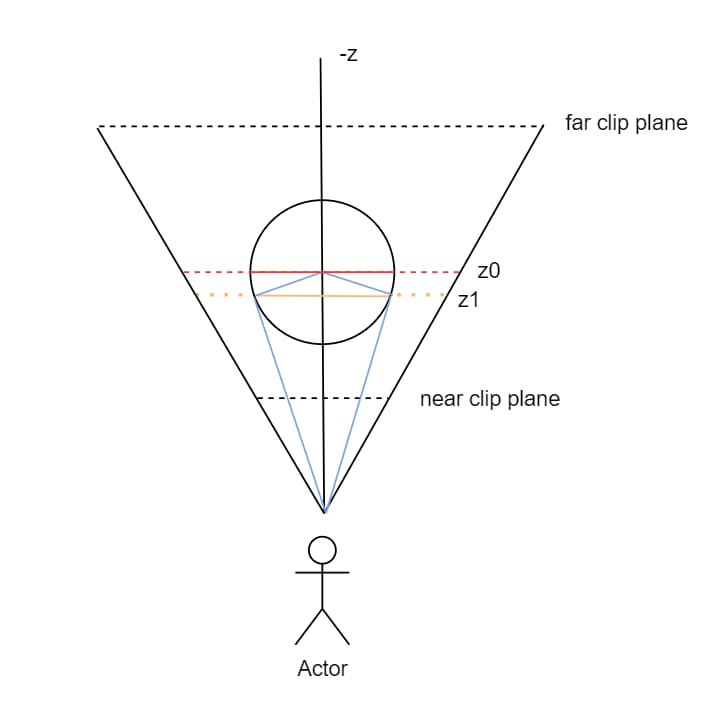

> _最后更新于 2022-12-20 00:09:00_

这次是基于中秋节活动时开发 3D 月球组件的经验来开发 3D 地球组件，相比于上一次，这一次很多技术难点都有了现成的解决方案，可以说开发成本降低了三分之二之多，而这些额外的开发成本则花费在隐藏在需求细节中的技术难点。这篇文章主要用来记录开发过程中遇到的一个比较有意义的技术难点，即 3D 空间中的物体投影到 2D 平面中时如何换算像素尺寸，在探索解决该难点的过程中，对 3D 与 2D 空间之间的关系有了一个更深刻的认识。

<!-- truncate -->

## 透视相机与正交相机

在开始之前，有必要介绍一下相机相关的知识，因为正在讨论的问题是在使用透视相机（[`PerspectiveCamera`](https://threejs.org/docs/#api/en/cameras/PerspectiveCamera)）时遇到的。

对于 3D 开发，大部分场景下都会使用透视相机，这是因为透视相机（投影）符合我们人眼观察世界的方式，会产生一种物体“近大远小”的视觉效果。另一方面，正交相机（[`OrthographicCamera`](https://threejs.org/docs/#api/en/cameras/OrthographicCamera)）也很常用，绘制 2D 视图就会用到，像我们生活中常见的工程制图一般应用的就是正交投影。



以下是 3D 建模过程中透视投影和正交投影的应用，其中 3 张图片是应用正交投影分别产生的车身 3 个不同视角的视图，而右上角则是应用透视投影后和我们人眼所观察到的视觉效果相一致。



实际上，这里要讨论的问题即就是在透视相机（投影）所观察到的 3D 空间中某个物体在 2D 平面上的像素尺寸和坐标，是不是又有点像正交投影呢？

## 需求与问题

现在来说说具体的问题是什么，如下图所示，地球表面有大量的点标记，点标记又会通过一根竖线和矩形文本框的标签连接起来，也就是说标签的位置取决于点标记在地球表面的经纬度坐标。在转动地球的过程中，如果点标记所在的位置已经被转到当前视角的背面，点标记、竖线、标签作为一个整体都会隐藏掉，这符合我们对三维空间物体的感知。但事情并非想象的这么简单，由于在移动端应用，如果某个标签的文本长度够长会出现标签已出现在屏幕之外而点标记的位置还在当前视角的可视范围内，那么标签就不会隐藏，而产品和交互更倾向于将标签作为参照对象，而不是点标记，**当标签的边缘超出图中红色的矩形框时，标记点、竖线、标签作为一个整体同时隐藏不可见**。



实际上，点标记、竖线、标签均是用 DOM 绘制的，利用 3D 场景中的点坐标和 2D 平面的像素坐标投影转换即可得到点标记的屏幕坐标。这个应用场景之一是在处理鼠标交互时，可以将鼠标点击的屏幕像素坐标转换为 3D 空间中的坐标。

那么，解决该问题的思路实际上也比较简单，标记点、标签的屏幕像素坐标知道，关键在于图中红色矩形框的位置和大小，其基准是 3D 空间中地球在 2D 平面上投影的矩形包围盒的位置和大小，而根据地球的球心坐标可以很容易换算出屏幕的像素坐标，但难点在于知道 3D 空间中地球的半径却不知如何换算为 2D 平面中的像素尺寸。

## 3D 空间尺寸与像素尺寸的对应关系

这个问题之所以棘手，就是因为在透视相机（投影）所观察到的 3D 空间中每个物体都会呈现出“近大远小”的视觉效果，所以虽然在同一个 2D 平面（屏幕）上绘制物体，但在 3D 空间中距离相机远近不同，同样的 3D 空间尺寸投影到 2D 平面（屏幕）上时像素尺寸大小是不一样的。

现在，可以进一步将问题具体化为：**在特定的相机距离下，3D 空间中的尺寸与 2D 投影平面的像素尺寸换算关系**。

到了这里，对于 3D 开发经验并不丰富的我来说，技术层面实际上没有太多思路，于是只能搜索是否有解决方案。事实上，查找资料的过程并不顺利，首先是搜索关键字的问题，无法确定有效的关键字，导致一直得不到期望的结果；其次，也是比较耗费时间的一点，有很多不直接相关的问题并有相应的解决方案，但如果不花费时间理解则很容易错过一些很有用的“细节”。最终，从[如何计算给定 Z 深度处的可见宽度/高度](https://discourse.threejs.org/t/functions-to-calculate-the-visible-width-height-at-a-given-z-depth-from-a-perspective-camera/269)这个讨论中找到了解决问题的线索，这个讨论中试图实现无论相机如何缩放，都可以让 3D 空间中的某个物体占满全屏。

可以发现，3D 开发中通常都是利用一些数学知识来解决问题的。对于文初的示意图中透视相机（投影）的模型，我们可以画出一个侧视图：



如上图所示，假设 `z0` 深度处可见高度（蓝色竖线）为 `h` 以及距离相机 `d`，知道相机的 `fov` 角度，根据三角函数：

```plain
tan(fov / 2) = (h / 2) / d
```

那么可见高度 `h` 就可以得到：

```plain
h = 2 * tan(fov / 2) * d
```

根据相机的视野比例 `camera.aspect` 很容易就能得到可见宽度：

```plain
w = h * camera.aspect
```

这里需要注意的是，根据 `z0` 与相机位置得到的 `d`，以及计算出的 `h` 和 `w` 都是 3D 空间中的尺寸（坐标尺度）。假设 3D 场景中有一个面向相机的矩形平面，在相机不断缩放的过程中，计算出 `h` 和 `w` 并设置为该矩形平面的高与宽，就能达到任意缩放比例下，该矩形平面都能占满整个场景的可视范围（即画布整个区域）。

既然如此，那我们很容易就能得到像素尺寸和 3D 尺寸的换算关系（假设物体在 3D 空间中的高度为 `H`，屏幕投影的像素高度为 `pixelH`）：

```plain
pixelH / canvas.clientHeight = H / h
```

### 计算球体在屏幕上投影的包围盒位置

至此，我们就可以利用以上的结论很方便的计算出：指定位置（`z` 深度处）和指定球体半径 `radius` 的地球在屏幕上投影的矩形包围盒像素宽高。

```plain
rectPixelH = (radius / (2 * tan(fov / 2) * d)) * canvas.clientHeight
```

这样就可以利用程序实现在 canvas 上叠加一个 div 在相机缩放过程中同步 div 的宽高与地球球体投影矩形包围盒的宽高，如下图所示：



知道球体的矩形包围盒的位置和大小后，只需要给四周加上一定的偏移即可动态确定标签显隐检测的矩形范围，就顺利的解决了需求难题。不过，对于球体来说，有其特殊性，我们可以做进一步的优化，让包围盒的范围更精确。

### 球体的特点

让我们先来看看 3D 空间中地球的俯视图投影：



如上图所示，从相机位置为起点的两条蓝色直线是球体俯视投影圆的切线（切线与切点到圆心连线形成的夹角为 90° 直角），根据数学知识我们知道，四边形（蓝色实线）内角和为 360°，两条切线的夹角永远大于 0°，对角将永远小于 180°，也就意味着两个切点连线（黄色实线）的长度会无限接近直径（红色实线）长度但永远小于直径长度。

前面我们都是假设相机所能看到的最大范围是直径（图中红色实线）长度，但经过以上分析我们已经知道，对于球体来说，视野的最大范围是两个切点连线（图中黄色实线）的长度。所以，对于球心在 `z0` 深度处的球体，相机所能观察到的球体投影范围的矩形包围盒的宽高小于半径的两倍（即相当于圆心在 `z1` 深度处的小圆）。根据示意图所示，运用数学知识就能很快计算出黄色实线对应的 3D 空间中的长度及其和直径长度的比例关系，再将其按照前文所述的换算原理进行计算即可得到对应的像素长度，这里不再赘述。

## 结语

在 Web 3D 开发中，很多技术难点实际上都是因为我们对于数学知识的运用和实践经验不足，这篇文章用一个实际案例来说明利用数学知识解决 3D 场景中物体在 2D 平面（屏幕）投影的像素尺寸计算问题，也简单了解了透视相机（投影）和正交相机（投影）的应用场景。

## 参考资料

- https://threejs.org/manual/#en/cameras
- https://en.wikipedia.org/wiki/3D_projection#Perspective_projection
- https://en.wikipedia.org/wiki/Orthographic_projection
- https://people.computing.clemson.edu/~dhouse/courses/405/notes/projections.pdf
- https://discourse.threejs.org/t/functions-to-calculate-the-visible-width-height-at-a-given-z-depth-from-a-perspective-camera/269/18
- https://gist.github.com/ayamflow/462190f13eeef04f01cb
- https://stackoverflow.com/questions/13350875/three-js-width-of-view/13351534#13351534
