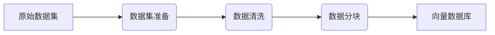
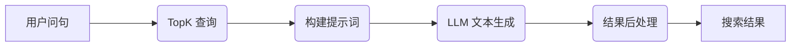

在 OpenAI 引领 AI 技术潮流的当下，LLM 成为很多企业跃跃欲试并尝试进行商业化的一个重要技术领域，其中结合 AI 技术进行知识库构建成为了开源社区在该领域最成功的经典案例，恰好团队也有机会基于此进行探索尝试。

<!-- truncate -->

有此机会也是因为目前业务侧也在探索 AI 落地的应用场景和可能性，利用社区已经成熟的经验在团队基建方面进行探索尝试也是熟悉 AI 相关技术应用的一个很好的途径。

目前，利用 LLM 构建知识库，其核心是**基于向量搜索（Vector Search）和机器学习（Machine Learning）技术提升搜索的效率和准确性**，简单来说传统的搜索是基于关键字匹配，当你无法了解查找的目标的信息和关键字时，你可以以你认为相近的描述信息进行搜索，这大大增强了搜索体验。

> 关于向量搜索推荐参考 [Elastic 官方对其的描述](https://www.elastic.co/cn/what-is/vector-search)。

站在业务层面来看，数据可视化属于一个细分领域，有一定的专业门槛，基于此提升普通开发者使用文档的搜索体验是再合适不过了。初期，我们主要关注的是文本数据的检索。

具体的技术方案可以大致概括为以下两个部分。

首先，准备数据集构建向量数据库：



然后，实现向量搜素和 LLM 文本生成的查询链路：



为了快速验证技术可行性，我们直接采用 [LangChain](https://www.langchain.com/) 框架来构建产品原型。

## 构建向量数据库

虽然整个技术路径开源社区已有大量的成熟经验可供参考，但**关键环节在于数据预处理和分割策略要视需求和具体情况而进行选择，其会对最终效果产生显著影响。**

近半年来，关于 AI 相关的商业化尝试也是一直备受关注，有一家创业公司的产品 [MarkPrompt](https://markprompt.com/) 目标是解决技术文档的检索问题，与我们的需求非常相似。在其一篇[博客文章](https://markprompt.com/blog/content-structure)中我们了解到了他们是如何处理技术文档的，再结合一些其它参考资料，我们最终选择也采用类似的策略，即**技术文档一般大多以 Markdown 格式存在且篇幅较少，对其按标题为单位进行分割，构建向量数据库记录。**

此时，有三个问题待解决：

1. 收集原始数据，得到 Markdown 格式数据集；
2. 实现对 Markdown 文件按标题进行分割；
3. 选择向量数据库。

第一步，考虑到方便后期对原始文档进行引用，不直接用文档的 Markdown 源文件，而是将在线文档网页抓取下来，利用工具库将 HTML 文件先进行预处理，去掉多余无用信息再转换为 Markdown 格式，同时保存其**元信息**。由于技术文档本身的简单性，效果还是不错的，这样也能兼顾到源文件不是 Markdown 格式的数据。

第二步，由于 LangChain 框架提供了一些处理文档的组件，所以寄希望于最好能用现成的方案，遗憾的是当时 LangChain 的 JavaScript 实现中并没有提供相关组件。不过，在查看 LangChain 的 Python 版本文档时，却发现了社区近期贡献的一个组件（`MarkdownHeaderTextSplitter`）刚好能满足按标题对 Markdown 文件进行分割的需求，这就致使了我们数据处理环节本来打算使用更熟悉的 Node 技术栈实现，结果最终全用了 Python 技术栈，不过代码倒也不复杂。

问题基本都顺利解决了，来到最后一步，向量数据库的选择。经过简单的调研，了解到 Redis 支持向量搜索，但目前公司内部运维资源具体情况也不太清楚，而且没有前端团队有过类似成功案例可借鉴，考虑到为了快速验证可行性和迅速上线测试版，寻求基于本地文件的向量数据库实现，Python 倒是有，但是目前线上只有 Node 服务环境，只能先看看有没有 Node 方案。

经过查找，找到了**基于本地文件的向量数据库**的 Node 方案 [vectra](https://github.com/Stevenic/vectra#readme)，尴尬的是该库目前是 0.0.1 版本，而且发布于半个月前，不得已的情况下仔细看了其文档和源码大致的实现后，确定应该问题不大能满足基本需求，做了简单的验证后遂采用了此方案。

至此，以上三个问题均已解决。

## 文本嵌入服务

实际上，这里面有一个重要的概念需要简单的解释一下，即文本数据是如何转换为向量数据入库的？

这里使用到了机器学习领域的[嵌入（Embeddings）](https://en.wikipedia.org/wiki/Word_embedding)技术，简单来说就是**将高维数据编码为低维空间的向量数据，在这里就是将文本数据编码为向量数据（数学表示形式）。**

公司内部提供了 OpenAI 的嵌入服务接口资源，但是每个团队有配额，考虑到上线后的调用量会消耗大量的 Token，做缓存的话初期比较麻烦，随即转变思路，结合前段时间对 AI 技术应用的一些细节的了解，**一个大任务往往是由多个环节，甚至多个大小模型配合完成的**，那嵌入服务是否也可以寻找开源方案自己部署呢？

当然是可以的，LangChain 就提供了基于 Google 的 [TensorFlow 机器学习框架的本地离线嵌入方案](https://js.langchain.com/docs/integrations/text_embedding/tensorflow)，其使用的是 Google [universal-sentence-encoder](https://www.kaggle.com/models/google/universal-sentence-encoder/frameworks/TensorFlow1/variations/lite/versions/1) 模型的 Lite 版本。

这个时候，出现了一个致命问题，即 Google 的这个嵌入模型只对英文进行了预训练，虽然在文档中找到了支持其它语言的方案，但效果肯定无法达到预期。比较幸运的是，公司内部有做 NLP 的团队，经过和同事沟通过后，推荐了**专门针对中文做了预训练优化**的 [m3e 嵌入模型](https://huggingface.co/moka-ai/m3e-small)，经过简单调研和验证其效果确实不错。在 Hugging Face 上可以看到其有两个版本，我们初期选择了 m3e-small 版本，资源占用低，效果也能达到预期。

至此，使用 [SentenceTransformer](https://www.sbert.net/) 框架配合 Flask 服务框架，寥寥几行代码就能实现在本地部署一个文本嵌入服务。

```python
from flask import Flask, request
from sentence_transformers import SentenceTransformer

# model = SentenceTransformer('moka-ai/m3e-base')
model = SentenceTransformer('moka-ai/m3e-small')

app = Flask(__name__)

@app.route("/")
def hello_world():
    return "<p>Hello, World!</p>"

@app.route("/embeddings", methods=['POST'])
def embeddings():
    embeddings = model.encode(request.json['texts'])

    return {
        "code": 0,
        "data": {
            "vectors": embeddings.tolist(),
        },
    }
```

## 实现查询链路

接下来就是实现具体的查询链路了，也是结合 LLM 构建知识库的优势所在。

**首先将用户的问句文本进行嵌入，转换为向量数据，再通过相似度匹配从之前构建的向量数据库中召回 TopK（一般选择 5 条）的记录，然后根据这些结果构建提示词（Prompt）模板，调用 LLM 的文本生成服务，获取到模型的输出结果，再做一定处理后返回给用户。**

整条查询链路较长，实际上最简化的版本不需要工程手段介入，但效果会比较差，之所以需要工程手段介入是因为根据具体的需求场景可以定制化，得到更好的结果。

例如，在构建向量数据库的过程中我们保留了每条记录的一些元信息，例如链接引用，这样就可以在得到 LLM 的输出后，再添加相关的链接信息，帮助用户在得不到预期的结果时，还可以主动查看相关的引用信息。

另外，为了使结果的信息展现更丰富（包含纯文本、代码片段、链接、图片等），会在提示词模板中要求 LLM 返回 Markdown 格式的结果，我们再渲染到页面上，为了保证结果的稳定性，我们还会对 LLM 的 Markdown 输出做进一步的校正。

所以，查询链路的实现关键在于**如何结合多种能力将同一件事情做的更好**。随着 LLM 的 Token 限制越来越宽容，我们可以在提示词中加入更多内容，这也催生了大量的优化手段来确保输出的质量，其中值得关注的是 RAG（retrieval augmented generation，检索增强生成）技术，可以参考 StackOverflow 一篇[博文](https://stackoverflow.blog/2023/10/18/retrieval-augmented-generation-keeping-llms-relevant-and-current/)对其的介绍。

总的来说，借此机会我们对构建 AIGC 产品涉及的技术有了进一步的了解，认识到目前 LLM 的能力域和局限性，当然更多的是 AI 技术带来的产品构建的想象力是值得我们对其持续关注的。

## 参考资源

- <https://www.elastic.co/cn/what-is/vector-search>
- <https://en.wikipedia.org/wiki/Word_embedding>
- <https://js.langchain.com/docs/get_started/introduction>
- <https://flask.palletsprojects.com/en/>
- <https://huggingface.co/moka-ai/m3e-small>
- <https://www.sbert.net/>
- <https://www.tensorflow.org/js>
- <https://www.kaggle.com/models/tensorflow/universal-sentence-encoder>
- <https://github.com/Stevenic/vectra#readme>
- <https://markprompt.com/blog/content-structure>
- <https://www.pinecone.io/learn/chunking-strategies/>
- <https://stackoverflow.blog/2023/10/18/retrieval-augmented-generation-keeping-llms-relevant-and-current/>
