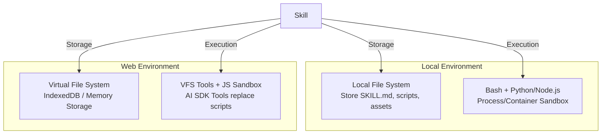
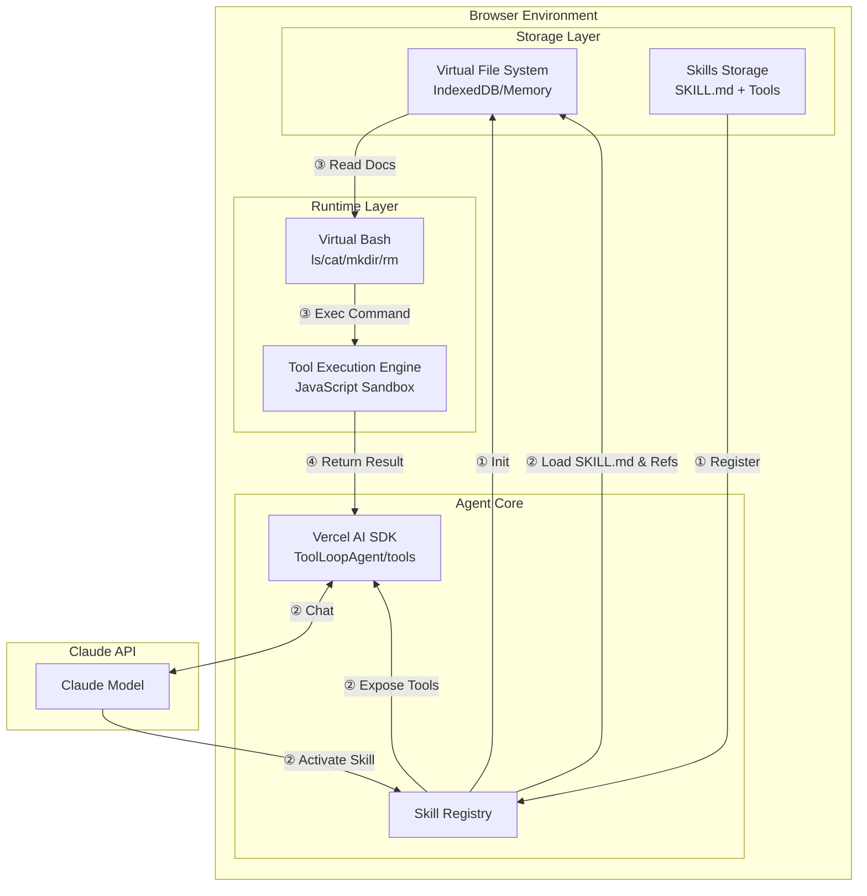

一些基于 Vercel AI SDK 将 Claude Skills 扩展架构移植到 Web 环境的 Agent 开发实践经验。Claude Skills 提供了比 MCP 更灵活的 Agent 扩展机制，但官方实现依赖本地文件系统等环境。如何让它在浏览器里跑起来？

<!-- truncate -->

## Agent 的插件机制

Claude Skills 是一种扩展 Agent 能力的插件机制。类似的机制在其他编码工具中也有实现，如 Gemini CLI 的扩展系统、Codex CLI 的工具集等。但 Claude Skills 在近期获得了更高的关注度，这与 Claude 在编码领域的领先表现密切相关。

相比传统的 MCP（Model Context Protocol），Claude Skills 的核心优势在于其**渐进式披露**策略。MCP 将所有 Tools 的描述一次性注入上下文，当 Tool 数量增加时，容易导致上下文窗口溢出。而 Claude Skills 采用分层暴露机制：模型首先仅获知有哪些 Skill 可用，仅在明确调用时才加载对应 Skill 的 _Skill.md_。这种按需加载的模式有效缓解了上下文爆炸问题。

然而，Claude Skills 的官方实现深度依赖本地文件系统（通过文件目录组织 Skill 模块），这天然限制了其在 Web 环境的适用性。浏览器缺乏直接访问本地文件系统的能力，也无法通过文件路径解析模块结构。因此，将 Claude Skills 架构迁移到 Web 环境需要重新设计存储层和模块加载机制。

下文将基于 Vercel AI SDK 的实践，探讨如何在浏览器环境中实现一套类似 Claude Skills 规范的扩展系统。

## Claude Skills 的环境依赖

理解 Claude Skills 的环境依赖，需要先看清楚一个 Skill 的完整结构。根据官方规范，一个典型的 Skill 文件组织如下：

```
my-skill/
├── SKILL.md              # 核心文件（包含 YAML frontmatter + 指令内容）
├── scripts/              # 可执行脚本（Python、Bash 等）
│   ├── init_skill.py
│   └── validate.py
├── references/           # 参考文档
│   └── api-reference.md
└── assets/               # 模板和资源文件
    └── template.json
```

Claude Skills 架构对运行环境有两项核心依赖：

**1. 文件系统**

_SKILL.md_ 中会引用 _scripts/_、_references/_、_assets/_ 目录下的文件。例如：

```bash
python {baseDir}/scripts/init_skill.py
```

这种引用机制要求底层提供文件系统能力，能够按路径定位并读取这些分散的文件。没有文件系统，Skill 无法加载其依赖的脚本和资源。

**2. 代码执行环境**

_scripts/_ 目录包含的可执行脚本需要运行时环境。Claude Code 的实现依赖 Bash tool 来执行这些脚本，提供：
- 进程隔离能力
- 受限的权限控制（通过 `allowed-tools` 配置）
- 标准化的脚本执行接口

Web 浏览器天然缺乏这两类能力：无法直接操作本地文件系统，也没有类似 Node.js 的进程模型来执行外部脚本。这意味着将 Claude Skills 迁移到 Web 环境时，必须重新设计存储层（替代文件系统）和执行层（替代沙箱环境）。

### Web 环境的替代方案

恰好 Vercel 近期发布了一篇[博文](https://vercel.com/blog/how-to-build-agents-with-filesystems-and-bash)，介绍了为 Agent 提供 bash 和 file 工具将大大增强其能力。其背后的逻辑是：LLM 在预训练阶段已经对命令行操作和文件系统操作建立了深刻的理解，这些是最基础、最普遍的计算机交互范式。

基于这个思路，Vercel 为 AI SDK 构建并发布了 `bash-tool`。但实测后发现，这些工具依赖 Node.js 运行时，无法在浏览器环境中直接使用。不过这提供了很好的思路：我们可以在 Web 环境中实现虚拟的 bash 和虚拟文件系统。

- **虚拟文件系统**：使用 IndexedDB 或 Memory Storage 模拟文件树结构，提供类似 `readFile`、`writeFile`、`glob`、`grep` 等文件操作接口。这样 _SKILL.md_ 中的 `{baseDir}` 引用就可以映射到虚拟路径上。
- **虚拟 Bash**：实现一个支持常用命令（`ls`、`cat`、`mkdir`、`rm` 等）的轻量级命令解析器，将命令映射到虚拟文件系统的操作上。复杂的脚本逻辑则可以用 JavaScript/TypeScript 在沙箱中执行。

另外，Claude Skills 中 _scripts/_ 目录的本质——工程代码实现，其实与 Vercel AI SDK 的 Tool 概念是一致的。Tool 就是一个可调用的函数，接收参数、执行逻辑、返回结果。因此，我们可以直接用 AI SDK 的 Tool 机制来替代 _scripts_ 的概念：**每个 Skill 注册一组 Tools，当 Skill 被调用时，这些 Tools 对模型可用。**

这样，存储层（虚拟文件系统）+ 执行层（Tool 机制）的组合，基本上就解决了在 Web 环境中实现类似 Claude Skills 插件机制的核心依赖问题。



## 插件机制设计

Vercel AI SDK 提供了非常灵活的基础能力：`ToolLoopAgent` 支持 agent loop，`tools` 参数支持外部工具注册。这些能力实际上构成了 Agent 设计的核心模块——无论是早期的 Function Call、后来的 MCP，还是现在的 Claude Skills，本质上都是 LLM 的模型服务调用循环和外部工具调用的组合。

### Skills 作为元工具

实现一个支持 Skills 的 Agent，核心思路是将 Skills 抽象为一个特殊的 Tool，不妨称之为 **Skill Tool**。这个 Tool 的职责是为 Agent 提供 Skills 的动态发现和激活能力：

**1. 动态发现**

Skill Tool 的描述（description）需要包含所有已注册 Skills 的名称和描述。当模型收到用户输入时，会先看到这个 Skill Tool 的描述，从而了解有哪些 Skills 可用。

**2. 激活机制**

Skill Tool 接受一个参数 `skill_name`，当模型决定调用某个 Skill 时，会触发 Skill Tool 并传入对应的名称。Skill Tool 根据名称查找并返回：
- _SKILL.md_ 的内容（注入到上下文中）
- 该 Skill 关联的 Tools 列表
- 可选的 references 和 assets

**3. 动态工具注册**

这里有一个关键难点：**Skills 被激活后，其对应的 Tools 需要动态加入到 Agent 的可用工具集中。** 幸运的是，AI SDK 已经提供了动态工具切换的能力（`activeTools` 配置），让我们可以根据 Skills 的激活状态实时调整可用工具列表。

### Skill Registry 设计

为了支持上述机制，我们需要实现一个 **Skill Registry**（Skill 注册中心），其核心职责包括：

- **Skill 注册**：支持预先注册（built-in skills）和动态注册（user-added skills）
- **Skill 查询**：根据名称查找 Skill 的元数据和资源
- **状态管理**：维护每个 Skill 的激活状态（active/inactive）
- **工具聚合**：根据当前激活的 Skills，返回合并后的可用工具列表

```typescript
interface SkillRegistry {
  // 注册 Skill
  register(skill: Skill): void;
  
  // 激活 Skill，返回 SKILL.md
  activate(skillName: string): Skill;
  
  // 获取所有可用 Tools Id
  getAvailableTools(): string[];
  
  // 获取所有 Skills 的 Tools
  getAllSkillsToolSets(): Toolset;
  
  // 生成 Skill Tool 的描述（用于模型发现）
  getSkillToolDescription(): string;
}
```

### 调用流程

1. **初始化**：所有 Skills 注册到 Skill Registry，但只有 Skill Tool 暴露给模型
2. **发现阶段**：模型通过 Skill Tool 描述了解有哪些 Skills 可用
3. **激活阶段**：Agent 请求触发 Skill Tool，传入 `skill_name`，Skill 被激活，其 Tools 加入可用列表
4. **执行阶段**：模型使用激活 Skills 提供的 Tools 完成任务

这种设计保留了 Claude Skills 渐进式披露的核心理念，同时适配了 AI SDK 的 Tool 机制。

### 动态工具切换实现

AI SDK 提供了 `prepareStep` hook，可以在 Agent loop 的每个步骤中动态调整激活的工具集。这正好满足 Skills 激活后需要动态扩展可用工具的需求：

```typescript
import { streamText } from 'ai';

const result = ToolLoopAgent({
  model: "anthropic/claude-sonnet-4.5",
  messages: conversationHistory,
  tools: {
    // 基础工具始终可用
    ...BASE_TOOLS,
    // Skill Tool 用于发现和激活 Skills
    skill: skillTool,
    // 所有 Skills 的 Tools 都注册在这里，但通过 activeTools 控制可见性
    ...skillRegistry.getAllSkillsToolSets(),
  },
  // 动态控制哪些工具对模型可见
  prepareStep: (...args) => {
    return {
      activeTools: [
        // 基础工具始终激活
        ...Object.keys(BASE_ACTIVE_TOOLS),
        // 根据当前激活的 Skills 动态添加其 Tools
        ...skillRegistry.getAvailableTools(),
      ],
    };
  },
});
```

在这个实现中：
- **注册阶段**：所有可能的 Tools（包括所有 Skills 的 Tools）都注册到 `tools` 参数中
- **控制阶段**：`prepareStep` 在每次模型调用前执行，根据当前激活的 Skills 返回 `activeTools` 列表
- **隔离阶段**：未激活 Skills 的 Tools 对模型不可见，避免上下文污染

这正是 Skills 渐进式披露策略的技术实现——模型只能看到已激活 Skills 的工具，而非全部。

### 整体架构



1. **初始化阶段**：Skills 从存储中加载，注册到 Skill Registry，VFS 完成初始化
2. **技能发现阶段**：Agent 理解用户需求，通过 Skill Tool 发现并激活特定 Skill，获取该 Skill 的指令（_SKILL.md_）、参考文档（_references/_）和工具集
3. **执行阶段**：模型阅读 Skill 指令和参考文档，通过虚拟 Bash 操作虚拟文件系统，并调用相关 Tools 完成具体任务
4. **响应阶段**：执行结果返回给模型，对话继续进行，或根据上下文激活其他 Skills

### 上下文管理的必要性

当然，仅为 Agent 引入 Skills 插件扩展能力还不够，上下文管理同样关键。_SKILL.md_ 中可能包含大量的指令、参考文档和示例代码，一个复杂的 Skill 完全可能占据数万字的上下文空间。如果没有有效的上下文管理策略，激活几个 Skills 就会导致上下文溢出。

在 Web 环境中，可以考虑以下策略来缓解这一问题：

- **Token 预算控制**：在激活 Skill 前估算其大致的 Token 占用，确保总上下文在安全范围内
- **动态卸载**：当某个 Skill 的任务完成后，及时将其从激活状态移除，释放上下文空间
- **内容摘要**：对于大型参考文档，可以先提取关键摘要加载到上下文中，而非全文注入
- **对话压缩**：当对话历史过长时，对早期消息进行摘要压缩，保留关键信息的同时节省空间

这些策略与渐进式披露相结合，才能在 Web 环境中真正发挥 Skills 架构的优势。

## 结语

至此，在 Web 环境中为 Agent 添加类似 Claude Skills 的扩展能力基本实现。通过虚拟文件系统替代本地文件系统，通过 AI SDK Tool 机制替代脚本执行，我们成功将原本依赖本地环境的 Skills 架构迁移到了浏览器中。

这个过程也让我们对插件模式有了更深的理解：Skills 本质上解决的是能力边界的扩展问题——在不修改核心系统的前提下，动态地为 Agent 注入新的知识和工具。同时，这也引发了对 LLM 服务如何与外部资源交互的思考：从最初的 Function Call 到 MCP，再到现在的 Skills，本质上都是在探索如何让模型更安全、更高效地调用外部能力。


Web 环境的 Agent 开发仍在快速演进中，期待更多类似的架构创新能够打破环境限制，让强大的 AI 能力在各种场景下都能发挥作用。

## 参考

- [Agents Skills](https://agentskills.io/)
- [Claude Skills are awesome, maybe a bigger deal than MCP](https://simonwillison.net/2025/Oct/16/claude-skills/)
- [Vercel AI SDK](https://ai-sdk.dev/)
- [How to build agents with filesystems and bash](https://vercel.com/blog/how-to-build-agents-with-filesystems-and-bash)
