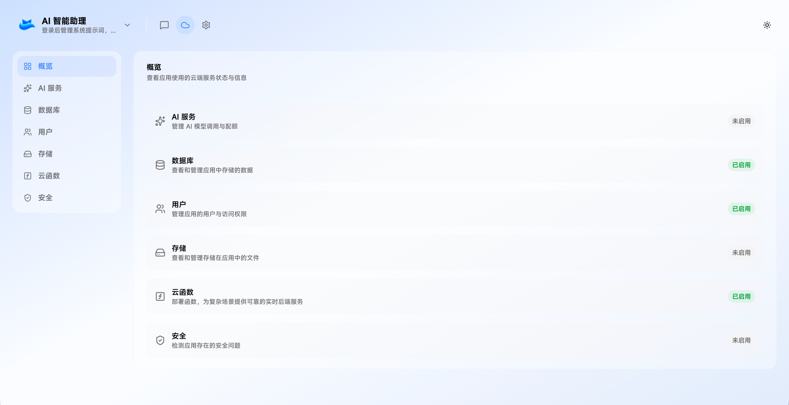
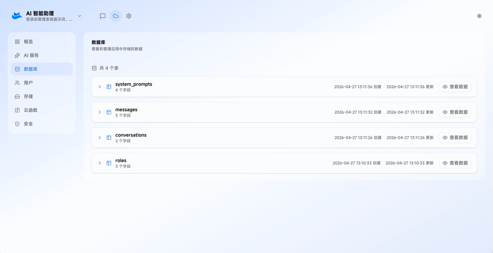
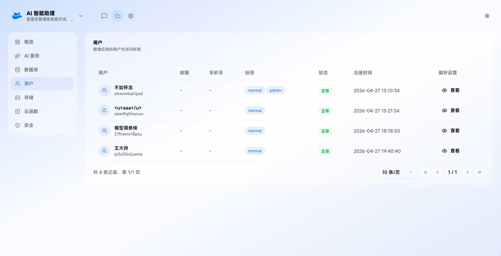
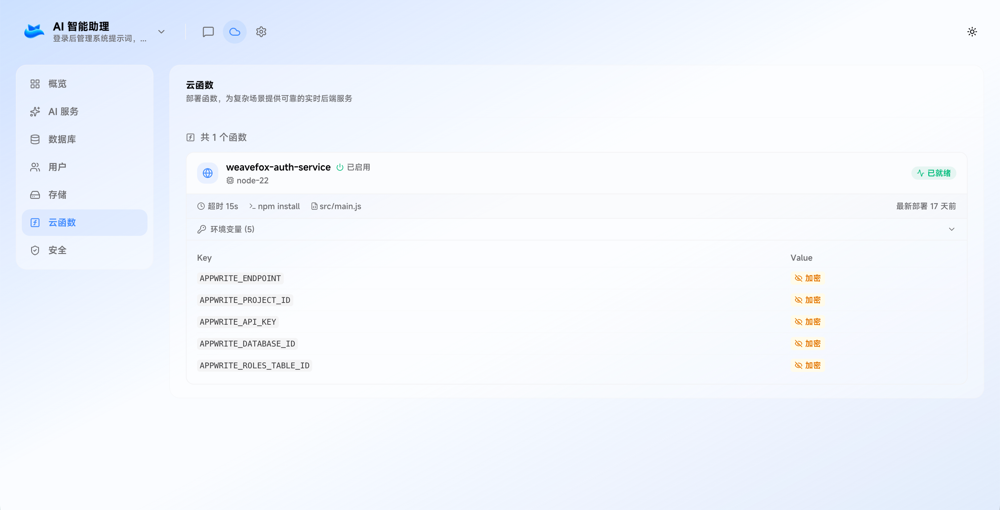
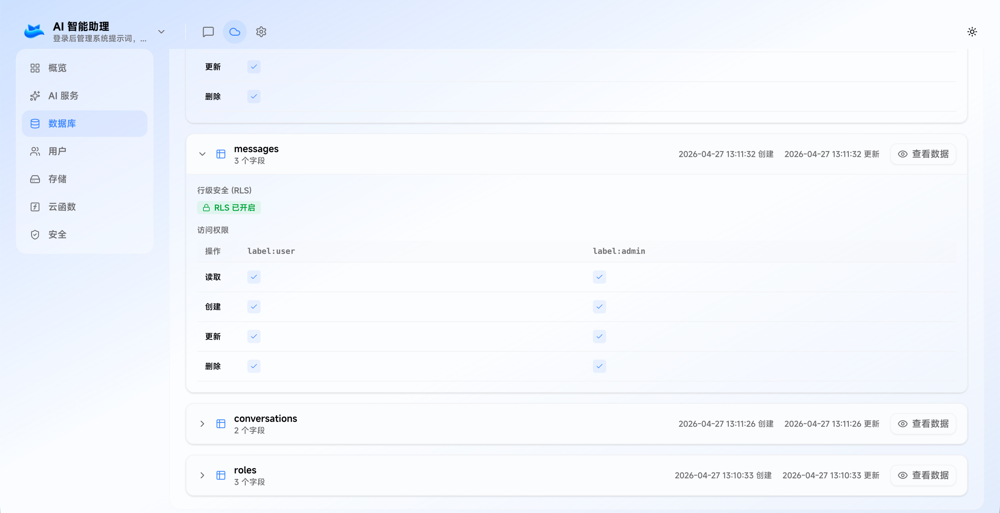

2023 年以来，AI 辅助开发经历了从 Copilot 式的“行级补全”到 v0、Lovable 式的“页面级生成”的跨越。一段提示词需求描述，AI 就能生成一个精美的 React 组件甚至是 Web 应用项目。然而，惊喜之后往往是冷峻的工程现实：**一个只有前端 UI 的应用，只是一张华丽的“皮囊”**。

在 Weavefox 中，通过 Vibe Coding 方式可以构建 AI 全栈应用——即支持后端逻辑与持久化存储，实现从“一段前端代码”到“一个线上运行产品”的端到端交付，支撑这些实现的背后是 AI 时代的应用基建 BaaS（Backend as a Service）。

<!-- truncate -->

WeaveFox 目前已经深度接入 OceanBase 托管的 Appwrite 服务，并通过用户授权的方式集成 Supabase 服务。

## BaaS 是什么？

> 后端即服务（BaaS）是一种云服务模式，开发者将应用的所有后端工作外包，只需编写和维护前端代码。BaaS 厂商为服务器上进行的活动提供预编写的服务接口，如用户认证、数据库管理、消息推送，以及云存储和托管。
>
> https://www.cloudflare.com/learning/serverless/glossary/backend-as-a-service-baas/

后端逻辑通常需要复杂的运行时环境配置。通过使用 Appwrite 这样的 BaaS 服务，Agent 能够将“环境配置”转化为“API 调用”，让 AI 无需理解底层 Docker 或 K8s 即可部署全栈服务，Weavefox 也能够实现更快的构建和启动应用。

## 核心能力解构：BaaS 提供了什么？

在 WeaveFox 生成全栈应用的过程中，Appwrite 并非简单的数据库，而是作为 AI 的“工程化接口”， Appwrite 所具备的能力和使用说明作为 Skills 文档，并关联一系列调用 Appwrite 服务能力的工具（Tools）。同时，WeaveFox 也支持用户查看生成的应用使用的云服务状态。

**持久化存储：数据库**

AI Agent 生成的应用往往需要根据用户描述动态创建数据模型，Appwrite 的 Database 基于 Schema 来描述数据模型，数据库表的设计可以映射为一段 JSON 描述，Skill 文档只需要描述支持字段类型、索引类型、权限类型即可，通过调用工具（Tool）创建数据库表，并在工具中实现校验逻辑，返回可读的异常信息，允许 Agent 进行自我修复，形成反馈循环。

**身份认证：登录鉴权**

Appwrite 提供内置的用户表与鉴权服务，无需创建业务用户表，Skill 文档会描述如何实现一个权限管理的模式，比如先规划用户角色权限，再调用工具创建角色权限表，然后创建其它业务表，并根据角色添加表级访问权限。

**云函数：后端实时服务**

对于超出 CRUD（增删改查）范畴的复杂逻辑，如支付回调、外部 API 集成，Appwrite Functions 充当了 AI 逻辑的“执行容器”。让 AI Agent 能够动态生成后端业务逻辑，动态部署与更新，将其封装在安全的后端环境运行，确保了整个应用架构的闭环。

## 如何确保应用的数据安全？

当 AI Agent 生成全栈应用的代码变得更加简单，却依然逃不过一个工程问题，应用的数据安全如何保障？BaaS 服务提供了数据表的行级安全策略来实现数据隔离，WeaveFox 通过应用云服务的可视化状态信息，让用户可以明确看到数据表的权限配置情况，并可通过对话的方式进行修复。

**数据表的行级安全策略（RLS）**

BaaS 服务通常提供客户端 SDK，并通过连接凭证可以直接访问后端服务，包括用户登录鉴权、数据的 CRUD（增删改查），这些凭证信息都直接暴露在前端代码中，极不安全。BaaS 提供了数据表的行级安全策略（RLS），**任何人拿到数据库连接的凭证仅能访问自己创建的数据，其它用户的数据默认不可见，需要给予明确的权限后才能访问。**

**数据表权限的可视化管理**

AI Agent 在生成全栈应用的代码后，用户可以在应用的云服务页面以可视化的方式查看数据表的权限配置，并通过对话的方式修复不符合预期的情况。

未来，WeaveFox 还会加入安全检测的功能，结合 AI 检测项目中的漏洞，帮助用户实时发现潜在的安全问题。

## Vibe Coding 的局限性

虽然 Vibe Coding 极大地加速了交付，但 BaaS 并非银弹，它无法完全规避传统工程中“有状态应用”的复杂性。在多轮对话迭代中，WeaveFox 引入了类似 Git 的版本管理机制，支持代码级的秒级回滚。然而，数据库 Schema 的调整通常具有“破坏性”和“不可逆性”。
为了确保版本切换后的系统稳定性，WeaveFox **采取了“只增不减”的影子演进策略**：AI Agent 被禁止执行删除表（Drop）或修改字段（Update）等破坏性操作。这种对数据库变更的约束，确保了每一份历史代码在回滚后，依然能找到其对应的底层结构支撑，从而实现真正意义上的“版本闭环”。

## BaaS 是 AI 应用规模化的加速器

**BaaS 的本质是将成熟的工业级后端能力“接口化”，让 AI 能够像搭积木一样组装出完整的、可生产的软件生态。** WeaveFox 通过集成行业标准的 BaaS 服务，不断持续优化全栈应用生成的效果，覆盖更多高级场景，例如构建支持空间协作功能的应用。

[你的创意，值的让全世界看到！](https://www.weavefox.cn/) WeaveFox 用 Vibe Coding 的方式让你的灵感创意快速落地，成为一个可运行的全栈 Web 应用。
