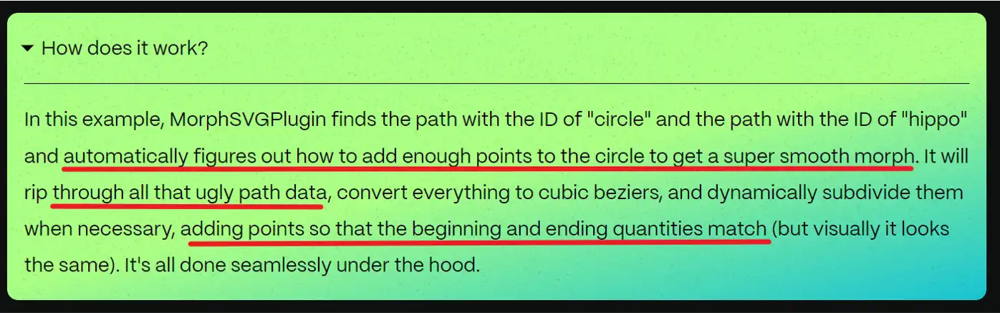

> _最后更新于 2023-11-11 21:56:00_

ECharts 的 [UniversalTransition 动画](https://echarts.apache.org/zh/option.html#series-line.universalTransition)提供了一些复杂场景下过渡动画的解决方案，这类场景的难点在于让**不规则图形**或者**不同形状的图形**之间如何完成一个比较流畅的过渡动画，在业内比较熟知的类似技术则是 SVG Morph 动画。

查看以下 ECharts 官方示例：

> - <https://echarts.apache.org/examples/zh/editor.html?c=scatter-aggregate-bar>
> - <https://echarts.apache.org/examples/zh/editor.html?c=scatter-symbol-morph>
> - <https://echarts.apache.org/examples/zh/editor.html?c=map-bar-morph>
> - <https://echarts.apache.org/examples/zh/editor.html?c=treemap-sunburst-transition>

<!-- truncate -->

## SVG Morph 动画

在探究 ECharts 的 UniversalTransition 动画之前先来看看比较成熟的 SVG Morph 技术。

### CSS 方案

通常，动画会优先采用 CSS 方案，一方面是因为方便，另一方面则是因为会有硬件加速的优势。实际上，SVG 的 Morph 动画也可以使用 CSS 来实现。查看以下示例：

> <https://codepen.io/chriscoyier/pen/NRwrNp>

```html
<svg viewBox="0 0 10 10" class="svg-1">
  // highlight-next-line
  <path d="M2,2 L8,8" />
</svg>
```

```css
.svg-1:hover path {
  // highlight-next-line
  d: path("M8,2 L2,8");
}
```

`<path>` 标签的 [`d`](https://developer.mozilla.org/en-US/docs/Web/SVG/Attribute/d) 属性是一个 Presentation Attributes，所以可被用来作为 CSS 属性使用。不过，目前浏览器的支持度仅有 [70%](https://caniuse.com/mdn-svg_elements_path_d_path) 多，兼容性并不高。

### SMIL 方案

实际上，在 CSS 支持的更早之前，业内采用 [SMIL 技术](https://www.w3.org/TR/REC-smil/)来实现 Web 上的矢量图形形变动画。来自 [MDN 文档](https://developer.mozilla.org/en-US/docs/Web/SVG/Element/animate)的示例如下：

```html
<svg viewBox="0 0 10 10" xmlns="http://www.w3.org/2000/svg">
  <rect width="10" height="10">
    // highlight-start
    <animate
      attributeName="rx"
      values="0;5;0"
      dur="10s"
      repeatCount="indefinite" />
    // highlight-end
  </rect>
</svg>
```

可见，其实际上是类似 HTML 标签的形式，所以在应对一些高度复杂的动画场景时局限性比较大。

给出一个实际案例，状态管理库 jotai 的官方 GitHub 仓库 logo 动画的源文件：

> <https://raw.githubusercontent.com/pmndrs/jotai/master/img/title.svg>

### GSAP 的 MorphSVG 插件

要实现效果比较好的形变动画并不容易，目前，业内功能比较强大的工具库则是 [GSAP 的 MorphSVG 插件](https://gsap.com/docs/v3/Plugins/MorphSVGPlugin/)，我们在其官方文档中可以看到其中的技术难点。



在处理两个不同的 SVG 图形之间的形变过渡时，要确保其 `d` 属性包含的**点数量是一致**的，为了实现这个目标，则需要对其数据进行插值和优化处理，将其转换和细分为多段**贝塞尔曲线**。

为了更好的理解，可以参考以下这篇关于使用 D3.js 实现折线图过渡动画的文章：

> <https://bocoup.com/blog/improving-d3-path-animation>

以上文章中对于不同点数量的折线图过渡动画的数据点插值尝试了多个方案，可以看出不同的插值算法对动画的效果影响是比较明显，这也是 SVG 形变动画中的难点。

## 贝塞尔曲线为什么这么重要？

查阅不同的资料，发现大家在实现 SVG 形变动画时，数据插值优化过程中都会将其转换为贝塞尔曲线进行处理，遂产生了好奇心，更进一步的探索才发现贝塞尔曲线是非常重要的一个数学函数和曲线，几乎所有的图形引擎都支持绘制贝塞尔曲线。

可参考以下这篇文章来简单的了解贝塞尔曲线在设计领域的重要性：

> <https://www.linearity.io/blog/bezier-curves/>

根据维基百科：

> 由于需要点阵化更精细的分辨率时，重新插值（补点）的计算量较小，**贝塞尔曲线被广泛地在计算机图形中用来为平滑曲线建立模型**。

## ECharts 的动画实现细节

根据源码，ECharts 的 UniversalTransition 动画被实现为一个插件功能：

```typescript title="https://github.com/apache/echarts/blob/5.3.3/src/animation/universalTransition.ts#L626"
export function installUniversalTransition(registers: EChartsExtensionInstallRegisters) {

  registers.registerUpdateLifecycle('series:beforeupdate', (ecMOdel, api, params) => {
    // ...
  });
  registers.registerUpdateLifecycle('series:transition', (ecModel, api, params) => {
    // TODO api provide an namespace that can save stuff per instance
    const globalStore = getUniversalTransitionGlobalStore(api);

    // TODO multiple to multiple series.
    if (globalStore.oldSeries && params.updatedSeries && params.optionChanged) {
      // Use give transition config if its' give;
      const transitionOpt = params.seriesTransition;
      if (transitionOpt) {
        each(normalizeToArray(transitionOpt), opt => {
          transitionSeriesFromOpt(opt, globalStore, params, api);
        });
      }
      else {  // Else guess from series based on transition series key.
        const updateBatches = findTransitionSeriesBatches(globalStore, params);
        each(updateBatches.keys(), key => {
          const batch = updateBatches.get(key);
          // highlight-next-line
          transitionBetween(batch.oldSeries, batch.newSeries, api);
        });
      }

      // ...
    }

    // ...
  });
}
```

分析一些关键性源码，可以了解到其过渡动画的实现细节，直接来看看两个系列之间的过渡是如何实现的。

```typescript title="https://github.com/apache/echarts/blob/5.3.3/src/animation/universalTransition.ts#L160"
function transitionBetween(
  oldList: TransitionSeries[],
  newList: TransitionSeries[],
  api: ExtensionAPI
) {
  // ...

  function updateOneToOne(newIndex: number, oldIndex: number) {
    const oldItem = oldDiffItems[oldIndex];
    const newItem = newDiffItems[newIndex];

    const newSeries = newItem.data.hostModel as SeriesModel;

    // TODO Mark this elements is morphed and don't morph them anymore
    const oldEl = oldItem.data.getItemGraphicEl(oldItem.dataIndex);
    const newEl = newItem.data.getItemGraphicEl(newItem.dataIndex);

    // Can't handle same elements.
    if (oldEl === newEl) {
      newEl && animateElementStyles(newEl, newItem.dataIndex, newSeries);
      return;
    }

    if (
      // We can't use the elements that already being morphed
      (oldEl && isElementStillInChart[oldEl.id])
    ) {
      return;
    }

    if (newEl) {
      stopAnimation(newEl);

      if (oldEl) {
        stopAnimation(oldEl);

        // If old element is doing leaving animation. stop it and remove it immediately.
        removeEl(oldEl);

        hasMorphAnimation = true;
        // highlight-start
        applyMorphAnimation(
          getPathList(oldEl),
          getPathList(newEl),
          newItem.divide,
          newSeries,
          newIndex,
          updateMorphingPathProps
        );
        // highlight-end
      }
      else {
        fadeInElement(newEl, newSeries, newIndex);
      }
    }
  }

  (new DataDiffer(
    oldDiffItems,
    newDiffItems,
    createKeyGetter(true, useId),
    createKeyGetter(false, useId),
    null,
    'multiple'
  ))
  .update(updateOneToOne)
  .updateManyToOne(function (newIndex, oldIndices) {
    // ...
  })
  .updateOneToMany(function (newIndices, oldIndex) {
    // ...
  })
  .updateManyToMany(function (newIndices, oldIndices) {
    // ...
  })
  .execute();

  // ...
}
```

在应用 Morph 动画之前，对两个图形元素进行了遍历迭代，得到其包含的所有 `path` 实例。需要注意的是，ECharts 的底层绘图引擎是 ZRender，而其所有图形的基类就是 `Path`，这只是绘图层的抽象设计，与 svg 的 `<path>` 标签对象不是同一个概念。

```typescript title="https://github.com/apache/echarts/blob/5.3.3/src/animation/morphTransitionHelper.ts#L110"
export function applyMorphAnimation(
  from: DescendentPaths | DescendentPaths[],
  to: DescendentPaths | DescendentPaths[],
  divideShape: UniversalTransitionOption['divideShape'],
  seriesModel: SeriesModel,
  dataIndex: number,
  animateOtherProps: (
    fromIndividual: Path,
    toIndividual: Path,
    rawFrom: Path,
    rawTo: Path,
    animationCfg: ElementAnimateConfig
  ) => void
) {
  // ...

  function morphOneBatch(
    batch: MorphingBatch,
    fromIsMany: boolean,
    animateIndex: number,
    animateCount: number,
    forceManyOne?: boolean
  ) {
    const batchMany = batch.many;
    const batchOne = batch.one;
    if (batchMany.length === 1 && !forceManyOne) {
      // Is one to one
      const batchFrom: Path = fromIsMany ? batchMany[0] : batchOne;
      const batchTo: Path = fromIsMany ? batchOne : batchMany[0];

      if (isCombineMorphing(batchFrom as Path)) {
        // Keep doing combine animation.
        morphOneBatch({
          many: [batchFrom as Path],
          one: batchTo as Path
        }, true, animateIndex, animateCount, true);
      }
      else {
        const individualAnimationCfg = animationDelay ? defaults({
            delay: animationDelay(animateIndex, animateCount)
        } as ElementAnimateConfig, animationCfg) : animationCfg;
        // highlight-next-line
        morphPath(batchFrom, batchTo, individualAnimationCfg);
        animateOtherProps(batchFrom, batchTo, batchFrom, batchTo, individualAnimationCfg);
      }
    }
    else {
      // ...

      const {
        fromIndividuals,
        toIndividuals
      } = fromIsMany
        // highlight-next-line
        ? combineMorph(batchMany, batchOne, separateAnimationCfg)
        // highlight-next-line
        : separateMorph(batchOne, batchMany, separateAnimationCfg);

      // ...
    }
  }

  // ...

  for (let i = 0; i < morphBatches.length; i++) {
    morphOneBatch(morphBatches[i], fromIsMany, animateIndex, animateCount);
    animateIndex += morphBatches[i].many.length;
  }
}
```

ECharts 为了使不同的图表元素在动画过渡时更自然一些，提供了多种策略，允许图形分割、合并等。

从源码中可以看到，ECharts 只处理了一些业务逻辑，真正的图形变形逻辑实际上在 ZRender 中实现。

```typescript title="https://github.com/ecomfe/zrender/blob/5.3.2/src/tool/morphPath.ts#L482"
export function morphPath(
  fromPath: Path,
  toPath: Path,
  animationOpts: ElementAnimateConfig
): Path {
  if (!fromPath || !toPath) {
    return toPath;
  }

  const oldDone = animationOpts.done;
  // const oldAborted = animationOpts.aborted;
  const oldDuring = animationOpts.during;

  // highlight-next-line
  prepareMorphPath(fromPath, toPath);

  // highlight-next-line
  (toPath as MorphingPath).__morphT = 0;

  function restoreToPath() {
    restoreMethod(toPath, 'buildPath');
    restoreMethod(toPath, 'updateTransform');
    // Mark as not in morphing
    (toPath as MorphingPath).__morphT = -1;
    // Cleanup.
    toPath.createPathProxy();
    toPath.dirtyShape();
  }

  toPath.animateTo({
    // highlight-next-line
    __morphT: 1
  } as any, defaults({
    during(p) {
      // highlight-next-line
      toPath.dirtyShape();
      oldDuring && oldDuring(p);
    },
    done() {
      // highlight-next-line
      restoreToPath();
      oldDone && oldDone();
    }
    // NOTE: Don't do restore if aborted.
    // Because all status was just set when animation started.
    // aborted() {
    //     oldAborted && oldAborted();
    // }
  } as ElementAnimateConfig, animationOpts));

  return toPath;
}
```

根据以上源码来看，ZRender 在对两个 `Path` 对象实例做 Morph 动画处理时，会先做一部分**准备工作**，然后劫持 `buildPath()` 和 `updateTransform()` 两个方法，再利用 `__morphT` 标记位完成整段动画，最终再将被劫持的方法还原。

```typescript title="https://github.com/ecomfe/zrender/blob/5.3.2/src/tool/morphPath.ts#L396"
function prepareMorphPath(
  fromPath: Path,
  toPath: Path
) {
  // highlight-next-line
  const fromPathProxy = fromPath.getUpdatedPathProxy();
  // highlight-next-line
  const toPathProxy = toPath.getUpdatedPathProxy();

  // highlight-next-line
  const [fromBezierCurves, toBezierCurves] =
    // highlight-next-line
    alignBezierCurves(pathToBezierCurves(fromPathProxy), pathToBezierCurves(toPathProxy));

  const fromPathTransform = fromPath.getComputedTransform();
  const toPathTransform = toPath.getComputedTransform();
  function updateIdentityTransform(this: Transformable) {
    this.transform = null;
  }
  // highlight-next-line
  fromPathTransform && applyTransformOnBeziers(fromBezierCurves, fromPathTransform);
  // highlight-next-line
  toPathTransform && applyTransformOnBeziers(toBezierCurves, toPathTransform);
  // Just ignore transform
  saveAndModifyMethod(toPath, 'updateTransform', { replace: updateIdentityTransform });
  toPath.transform = null;

  const morphingData = findBestMorphingRotation(fromBezierCurves, toBezierCurves, 10, Math.PI);

  const tmpArr: number[] = [];

  saveAndModifyMethod(toPath, 'buildPath', { replace(path: PathProxy) {
    // ...
  } });
}
```

上面提到的准备工作是非常关键的，这个阶段 ZRender 会首先获取两个 Path 实例的**绘图代理**（为了同时支持 SVG、Canvas 等环境做的抽象设计），并将其**转换为贝塞尔曲线**的绘图指令组，然后将两段贝塞尔曲线组上的**点数量进行对齐**，然后对贝塞尔曲线应用变换。

以上就是 ECharts 的 UniversalTransition 动画实现细节，总结一下就是其与 SVG 的 Morph 动画实现思路一致，**关键都在于对两个图形的路径点进行插值转换处理，并将点数量对齐**，然后完成动画过渡。

### 示例：ZRender 实现的 SVG Morph 动画

GSAP 的 MorphSVG 插件固然强大，但其只有注册为会员才能使用，并不是开源免费的方案，实际上用 ZRender 就可以做出类似的效果，这里给出 GSAP 官网文档示例的 ZRender 实现：

```html
<style>
  html,
  body,
  #container {
    width: 100%;
    height: 100%;
    display: flex;
    flex-direction: column;
  }

  .nav {}

  .chart {
    flex: 1;
    height: 0;
  }
</style>

<div id="container">
  <nav class="nav">
    <button id="play">play</button>
    <button id="reset">reset</button>
  </nav>
  <div id="chart" class="chart"></div>
</div>

<script src="https://cdn.bootcdn.net/ajax/libs/zrender/5.3.2/zrender.min.js"></script>
<script>
  const zr = zrender;
  const zrIns = zr.init(document.getElementById('chart'));

  const from = zr.path.createFromString("M490.1,280.649c0,44.459-36.041,80.5-80.5,80.5s-80.5-36.041-80.5-80.5s36.041-80.5,80.5-80.5 S490.1,236.19,490.1,280.649z");
  const to = zr.path.createFromString("M149,245c2.7-36.7,16.11-69.08,40.1-97.06c27.04-31.6,60.92-47.39,101.63-47.39c15.48,0,38.48,2.45,69.02,7.29 c30.54,4.89,53.53,7.28,69.03,7.28c23.69,0,57.87,8.85,102.53,26.48c7.91,3.01,17.47,11.24,28.7,24.59 c6.38,7.89,16.26,19.77,29.62,35.57c3.04,2.14,7,5.32,11.86,9.6c4.86,4.22,8.19,6.06,10,5.46c0.62-1.84,2.15-4.4,4.58-7.74 c1.21-1.23,1.96-1.83,2.26-1.83c0.93,0.61,1.83,1.21,2.75,1.83c0.91,0.62,1.21,2.42,0.91,5.46c-0.62,5.47-0.91,7.14-0.91,5 c-0.33,3.06-0.76,5.01-1.37,5.95c-3.95,6.67-5.48,11.85-4.55,15.47c0.92,3.32,3.77,8.67,8.64,15.96c4.87,7.29,7.59,12.76,8.19,16.4 c-0.3,2.73-0.43,7.12-0.43,13.21l-4.57,11.38c0,8.51,9.86,23.11,29.62,43.78c9.44,4.22,14.12,18.83,14.12,43.71 c0,19.47-16.09,29.17-48.27,29.17c-4.26,0-8.81-0.13-13.68-0.47c-3.34-1.2-8.2-2.56-14.58-4.07c-7.59-0.93-12.76-3.49-15.48-7.77 c-4.88-6.95-12.78-13.51-23.71-19.58c-1.82-0.88-4.48-4.22-7.98-10.02c-3.5-5.77-6.61-9.42-9.33-10.95 c-2.72-1.49-6.68-1.81-11.86-0.88c-8.81,1.49-13.68,2.26-14.57,2.26c-2.14,0-5.25-0.6-9.34-1.83c-4.11-1.21-7.05-1.83-8.89-1.83 c-2.11,9.73-2.59,19.15-1.36,28.25c0.3,2.45,1.83,4.43,4.56,5.92c4.27,3.05,6.53,4.71,6.85,5.05c2.72,2.11,5.61,5.61,8.64,10.45 c0.62,1.85-0.52,4.95-3.42,9.34c-2.89,4.41-5.22,7.01-7.06,7.74c-1.81,0.79-5.77,1.18-11.85,1.18c-8.82,0-29.45-2.45-30.98-2.73 c-7.59-1.53-14.13-3.94-19.58-7.3c-2.76-1.81-5.91-10.33-9.56-25.52c-3.68-16.41-6.72-26.27-9.14-29.64 c-0.6-0.9-1.36-1.33-2.26-1.33c-1.53,0-4.05,1.49-7.53,4.56c-3.49,2.99-5.86,4.65-7.05,5.01c-4.24,17.9-6.4,26.4-6.4,25.47 c0,7.01,1.97,12.89,5.92,17.77c3.94,4.86,8.06,9.57,12.32,14.11c5.16,5.77,7.74,10.78,7.74,15.04c0,2.41-0.75,4.52-2.28,6.37 c-6.38,7.89-17.02,11.85-31.9,11.85c-16.71,0-27.64-2.28-32.79-6.84c-6.7-5.77-10.95-11.86-12.76-18.2 c-0.3-1.53-1.05-6.09-2.28-13.68c-0.61-4.58-1.98-7.29-4.08-8.18c-6.1-0.92-13.69-2.58-22.78-5.01c-1.84-1.21-3.81-4.26-5.94-9.12 c-3.93-9.4-6.83-15.79-8.66-19.13c-9.13-4.56-23.7-9.7-43.76-15.45c-0.92,1.83-1.35,4.37-1.35,7.72c3.34,4.26,8.34,10.8,15.03,19.58 c5.47,7.29,8.2,14.3,8.2,20.96c0,12.78-8.2,19.13-24.61,19.13c-12.45,0-20.96-0.88-25.52-2.71c-6.67-2.73-12.29-9.14-16.85-19.13 c-7.6-16.74-11.85-26.16-12.76-28.27c-4.87-11.23-8.2-21.13-10.01-29.65c-1.23-6.05-3.06-15.35-5.49-27.8 c-2.12-10.3-5.46-18.36-10.01-24.13C155.33,279.36,147.5,260.6,149,245z");

  from.attr({
    style: {
      fill: 'red',
      stroke: 'red'
    },
    x: 0,
    y: 0
  });
  to.attr({
    style: {
      fill: 'red',
      stroke: 'red'
    },
    x: 0,
    y: 0,
    ignore: true
  });

  zrIns.add(from);
  zrIns.add(to);

  window['play'].onclick = () => {
    from.attr({
      ignore: true
    });
    to.attr({
      ignore: false
    });
    zr.morph.morphPath(from, to, {
      duration: 2e3
    });
  }

  window['reset'].onclick = () => {
    from.attr({
      ignore: false
    });
    to.attr({
      ignore: true
    });
    zr.morph.morphPath(to, from, {
      duration: 2e3
    });
  }
</script>
```

## 参考资料

- <https://echarts.apache.org/zh/option.html#series-line.universalTransition>
- <https://developer.mozilla.org/en-US/docs/Web/SVG/Attribute/d>
- <https://caniuse.com/>
- <https://www.w3.org/TR/REC-smil/>
- <https://developer.mozilla.org/en-US/docs/Web/SVG/Element/animate>
- <https://gsap.com/docs/v3/Plugins/MorphSVGPlugin/>
- <https://bocoup.com/blog/improving-d3-path-animation>
- <https://en.wikipedia.org/wiki/B%C3%A9zier_curve>
- <https://www.linearity.io/blog/bezier-curves/>
