> _最后更新于 2023-05-14 15:42:00_

随着 Chrome v113 的发布，WebGPU API 已正式可用，预计其它平台也将很快发布正式支持，WebGPU 为 Web 平台现代 3D 图形开发提供了一流的支持，不过相比于在 3D 图形开发领域的发展，其还有一个更值得关注的目标，即为 Web 平台带来通用计算 API 的一流支持。

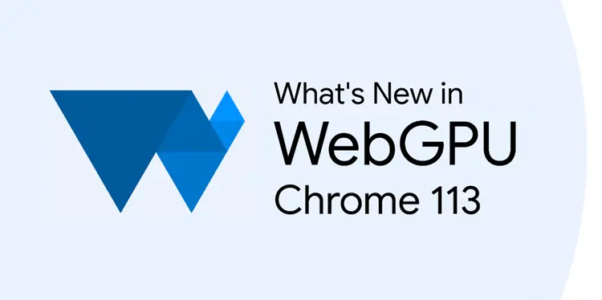

<!-- truncate -->

在 [Chrome 113 的发布日志页面](https://developer.chrome.com/blog/new-in-chrome-113/#webgpu)，Chrome 团队列举了个几个主流的工具库对 WebGPU 的支持情况，例如 Babylon.js、PlayCanvas、TensorFlow.js、Three.js。其中，有三个是大家比较熟悉的 Web 3D 图形开发绘图引擎/框架工具，而 TensorFlow.js 则与 3D 图形开发无关，是 Google 发布的机器学习框架工具。

很多人认为 WebGPU 将替代 WebGL，长期来看这应该是一个必然的结果，但短期内 WebGL 可能仍将是主流方案，不过这些观点都仅针对 Web 3D 图形开发领域。接下来先来看看官方是如何定义这两者的。

## WebGL 与 WebGPU 的官方定义

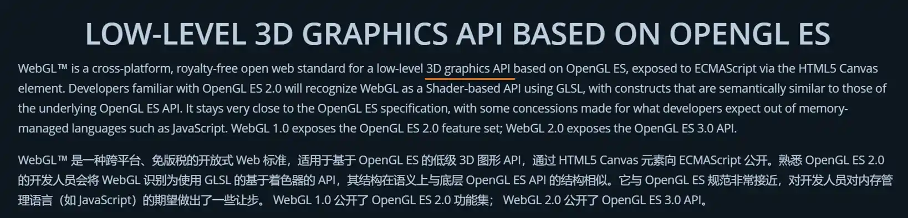

以上截图来自于 WebGL 标准的维护组织 [Khronos Group 的官方网站](https://www.khronos.org/webgl/)，可以明确的看出 WebGL 标准的制定目标是为 Web 平台提供 3D 图形开发 API 支持。

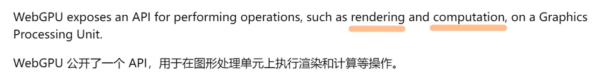

另外，以上截图来自于 WebGPU 标准的制定组织 [W3C 标准文件](https://www.w3.org/TR/webgpu/)，可以从上图的描述看出 WebGPU 的目标至少包含 **3D 图形开发**和**计算**两个领域。所以，WebGPU 的出现并不是纯粹的为了替代 WebGL，还为 Web 平台带来了更多可能性，比如通用计算领域。

## WebGL 与 WebGPU 的技术架构

在讨论 WebGPU 的通用计算 API 之前先来简单了解一下其与 WebGL 的技术架构有何不同。

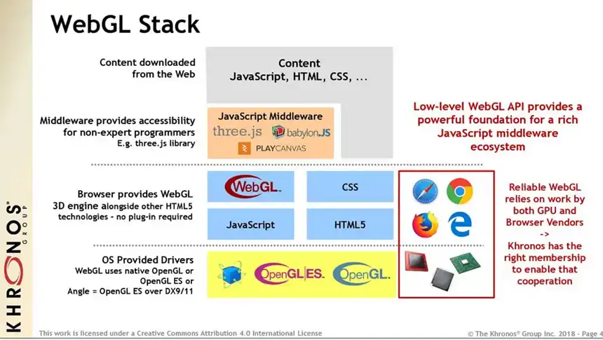

WebGL 程序由使用 JavaScript 编写的控制代码和使用 OpenGL ES 着色语言(G​​LSL ES)（一种似于 C 或 C++ 的语言）编写的着色器代码组合，并在计算中机器的图形处理元(GPU)上行。WebGL 是基于 OpenGL ES 标准针对 Web 平台的一个实现，而同时期与 OpenGL（ES）对等的是微软 Win 平台的 DirectX 11。

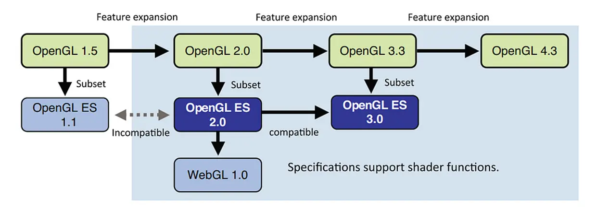

随着硬件技术的发展，OpenGL 标准也在持续发展，至今最新的版本则是 4.x，而 WebGL 标准的发展则相对缓慢，直至去年（2022）初 Khronos Group 才宣布 WebGL 2.0 在所有的主流 Web 平台得到支持，其基于 OpenGL ES 3.0 标准制定。也就是说，距离 OpenGL ES 4.0 标准的 WebGL 标准还很遥远，可见 Web 平台即便是基于 WebGL 2.0 的实现也无法充分利用现代 GPU 的能力，这也许就是 WebGPU 出现的一个重要因素。

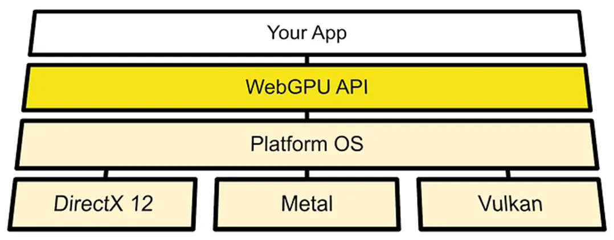

与 WebGL 不同，WebGPU 不是任何现有的原生 API 的直接接口。它基于 Vulkan、Metal 和 Direct3D 12 提供的 API，旨在跨移动和桌面平台提供高性能。而且，WebGPU 使用 WGSL（一种类 Rust 的语言）着色语言编写着色器代码。

值得一提的是，在过去的一段时间里，随着 Apple 平台发布 Metal，OpenGL ES 在 Apple 平台逐渐被放弃，与此同时 Win 平台的 DirectX 12 发布也预示着 OpenGL 标准已经落后于现代图形开发领域的发展。面对这种情况，Khronos Group 也迅速推出了现代跨平台的图形开发标准 Vulkan。至此，Metal、DirectX 12、Vulkan 成为了更低级的、更接近现代 GPU 架构实现的图形开发标准，而 WebGPU 标准则基于这三者。

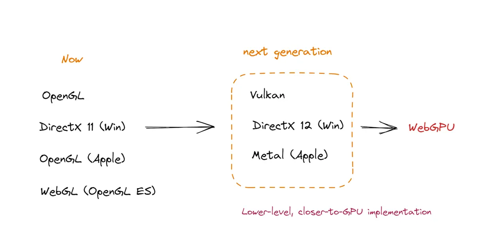

下一代图形 API 是对 GPU 更低级别的抽象，也是更接近现在 GPU 架构的实现，对 GPU 有更高的控制权限和灵活性，同样的使用成本变高，但性能收益更高。

此外，通过 WebGL 和 WebGPU 各自所使用的着色器语言代码也可以明显感受到后者更加低级，基本上是对 GPU 内存的直接操作，所以拥有更高的性能符合我们的认知。

## Web 平台的通用计算

接下来便是本文关注的核心，即 WebGPU 为 Web 平台带来的通用计算领域的应用场景。通用图形处理单元（GPGPU）在 Web 平台还是一个略微陌生的概念，但在云计算等其它领域已是一个被大家所熟知的概念。

实际上，目前在 Web 平台也有一些大数据计算场景的应用，例如机器学习的离线支持，代表性工具就是文中刚开始提到的 TensorFlow.js。鉴于 Web 平台 JavaScript 单线程模型的限制，在 Web 客户端做大数据计算的性能限制很大，不过如果能利用现代 GPU 的数据计算能力，则可以解决此类问题。

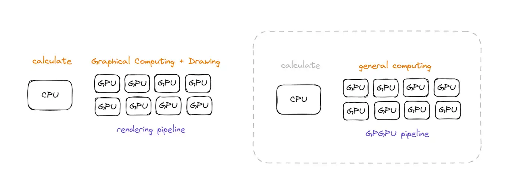

长期以来 Web 平台利用 GPU 能力的途径只有 WebGL API，也就是 3D 图形开发领域，如上图所示左侧的渲染管道，CPU 承担了相当多的计算任务，而 GPU 则解决的是绘图相关的任务。另一方面，在 GPGPU 技术中，CPU 仅承担一些必要的计算任务，GPU 可以单独完成一些纯计算类的任务，如上图右侧所示。

WebGPU 的出现为 Web 平台 GPGPU 提供了一流的支持，但在这之前，WebGL 时代也有相应的尝试。

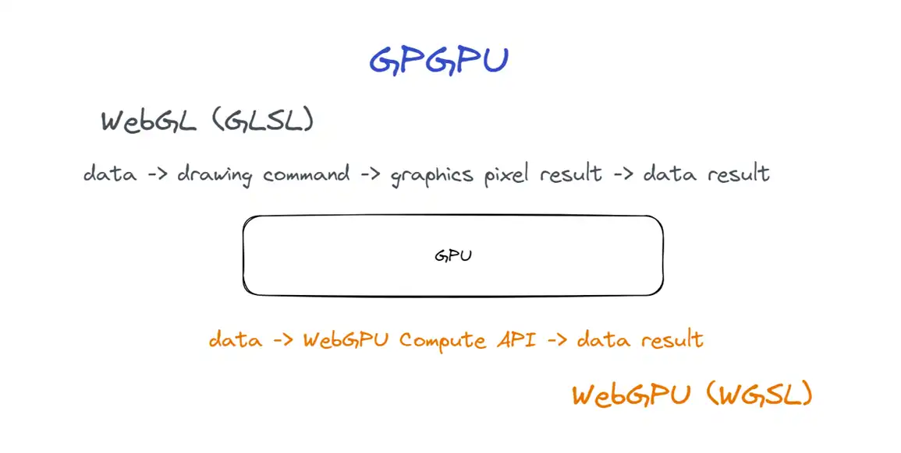

如上图所示，虽然 WebGL API 是用来绘图的，但可以将数据计算任务转换为绘图指令，得到绘制的结果后，再从像素数据转换为数据结果。通过一种间接的方式，也能基于 WebGL 为 Web 平台提供 GPGPU 技术的支持，但这种方式的问题在于将数据计算任务转换为绘图指令的过程是极其繁琐的。

接下来，来了解一下一个开源工具库 [turbo.js](https://turbo.js.org/)，其就是做了上面所描述的事情，针对以上过程进行封装抽象降低了开发者的使用成本。

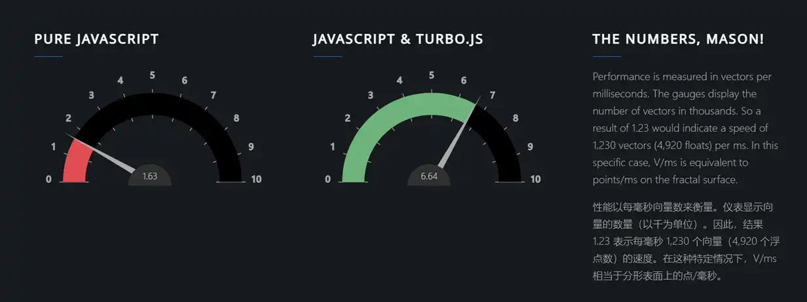

其官方展示了一个针对访问者机器的性能基准测试的结果，可见利用 GPU 完成计算任务相比于 CPU 的性能高出数倍。来看看如何使用：

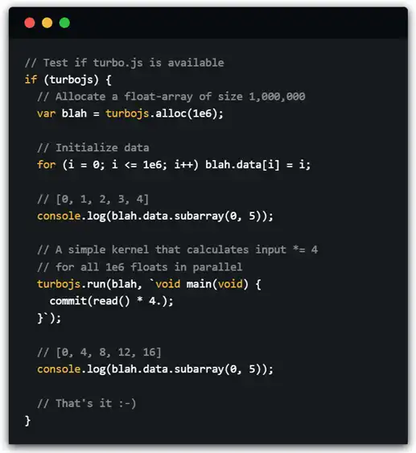

从给出的示例代码来看，本质上开发者需要将计算逻辑的代码转换为着色器代码，因为着色器程序是 GPU 硬件的可编程入口。再来看看其源码实现，验证下是否与上述描述一致。

```javascript title="https://github.com/turbo/js/blob/master/turbo.js#L117"
run(ipt, code) {
  var fragmentShader = gl.createShader(gl.FRAGMENT_SHADER);

  gl.shaderSource(
    fragmentShader,
    stdlib + code
  );

  gl.compileShader(fragmentShader);

  // ...

  var program = gl.createProgram();

  gl.attachShader(program, vertexShader);
  gl.attachShader(program, fragmentShader);
  gl.linkProgram(program);

  // ...

  // highlight-next-line
  gl.readPixels(0, 0, size, size, gl.RGBA, gl.FLOAT, ipt.data);
  //                                 ^ 4 x 32 bit ^

  return ipt.data.subarray(0, ipt.length);
}
```

以上是截取的一段 `run()` 的实现代码，可以比较清晰的看到是先利用数据进行图形绘制，然后再从绘制结果的像素数据中进行结果读取，符合之前所描述的实现思路。该工具库目前已经不再维护，还有另一个工具库 [GPU.js](https://gpu.rocks/) 也值得参考。

虽然通过 WebGL API 也能实现 GPGPU 技术，但过程繁琐，还有一定的性能损失，而 WebGPU 为 GPGPU 技术提供了一流的支持。

```wgsl
// Define global buffer size
const BUFFER_SIZE = 1000;

const shader = `
@group(0) @binding(0)
var<storage, read_write> output: array<f32>;

@compute @workgroup_size(64)
fn main(
  @builtin(global_invocation_id)
  global_id : vec3u,

  @builtin(local_invocation_id)
  local_id : vec3u,
) {
  // Avoid accessing the buffer out of bounds
  if (global_id.x >= ${BUFFER_SIZE}) {
    return;
  }

  output[global_id.x] =
    f32(global_id.x) * 1000. + f32(local_id.x);
}
`;
```

以上代码截取自 [MDN 文档](https://developer.mozilla.org/en-US/docs/Web/API/WebGPU_API#basic_compute_pipeline)，可以看到通过 `@compute` 代码关键字表明了计算任务的处理能力是 WebGPU API 官方支持的，而其对应的绘图相关的代码关键字则为 `@vertex`、`@fragment`，这其实对应了不同类型的着色器，也即 GPU 流水线架构设计中的不同阶段。

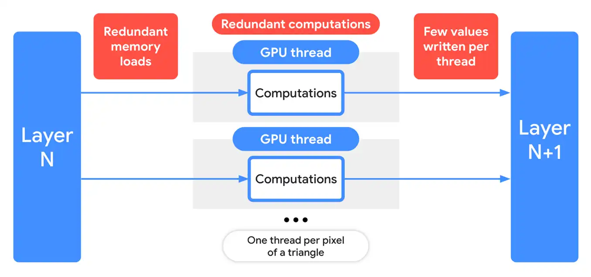

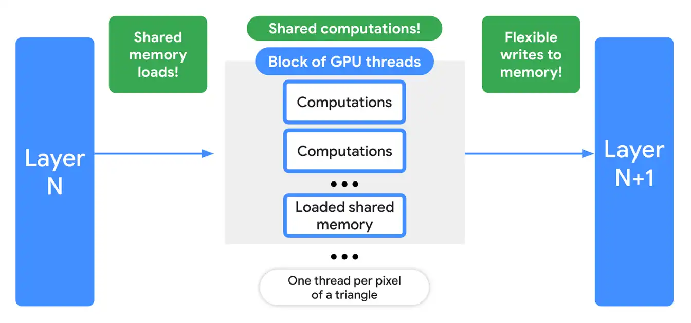

以上两图来自 Chrome 开发者官方博客，概述了基于 WebGL 和 WebGPU 两种方案实现的 GPGPU 技术在机器学习领域的应用差异，很明显后者灵活性和可控性更高，也具备性能优势。

说句题外话，在 Web 平台上提高数据计算性能的方案不止有 GPGPU，还有 WebAssembly SIMD 技术，但后者对前端开发者的能力要求偏高，上手起来不是很容易，相比较来说，WebGPU API 的方案门槛更低一些。

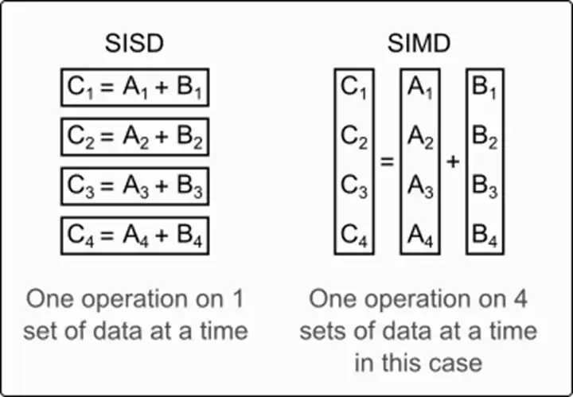

## 参考资料

- https://developer.chrome.com/blog/new-in-chrome-113
- https://en.wikipedia.org/wiki/WebGL
- https://www.khronos.org/webgl/
- https://en.wikipedia.org/wiki/WebGPU
- https://www.w3.org/TR/webgpu/
- https://en.wikipedia.org/wiki/OpenGL_ES
- https://en.wikipedia.org/wiki/WebGL
- https://blog.devgenius.io/will-webgpu-be-the-webgl-killer-60a49509b806
- https://forum.babylonjs.com/t/i-have-an-important-question-about-webgpu/36896
- https://webgpufundamentals.org/webgpu/lessons/webgpu-from-webgl.html
- https://en.wikipedia.org/wiki/General-purpose_computing_on_graphics_processing_units
- https://turbo.js.org/
- https://gpu.rocks/
- https://developer.mozilla.org/en-US/docs/Web/API/WebGPU_API#basic_compute_pipeline
- https://developer.chrome.com/blog/webgpu-io2023/
- https://en.wikipedia.org/wiki/Single_instruction,_multiple_data
- https://v8.dev/features/simd
- https://codelabs.developers.google.com/your-first-webgpu-app
