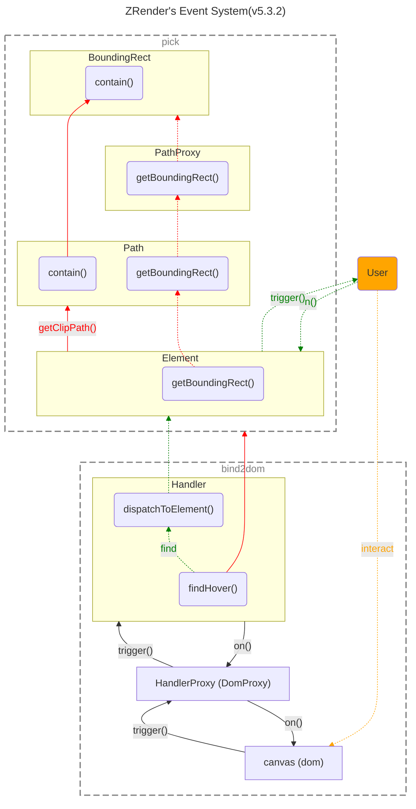

> _最后更新于 2024-06-16 16:09:00_

绘图引擎支持丰富交互的前提是拥有一套事件系统，而在画布中如何拾取元素是实现的关键，从 [ZRender](https://ecomfe.github.io/zrender-doc/public/) 的源码来看看其事件系统是如何设计的。



<!-- truncate -->

上图为其事件系统的工作流程图，可将其简单的看作两个阶段，即**绑定宿主环境的事件（bind2dom）和元素拾取（pick）**。

简单的来说，ZRender 会绑定宿主环境（例如 Web 环境的 canvas Dom 实例）的事件，用户直接和宿主环境进行交互（例如鼠标点击），宿主环境通知 ZRender 发生用户交互事件并给出一些信息（例如鼠标坐标），ZRender 开始在渲染的图形列表中拾取元素，若拾取到元素，则响应用户主动监听的元素交互事件。

其中 `Element` 是 ZRender 中绘图元素的基类，[其继承自 `Eventful`](https://github.com/ecomfe/zrender/blob/5.3.2/src/Element.ts#L1698)（类似于 Node 中的 EventEmitter 模块），向用户暴露事件相关的 APIs（例如 `on()`、`off()` 等等）。

下面根据源码来分析具体逻辑的实现。

## 绑定宿主环境事件

第一阶段，在 ZRender 实例化过程中就会绑定宿主环境的事件。具体的过程是，ZRender 会实例化一个用来处理用户事件的 `Handler` 类实例，但真正负责绑定宿主环境事件的实现在抽象类 `HandlerProxy` 中（Web 环境对应的实现为 `HandlerDomProxy`）。

初始化：

```typescript title="https://github.com/ecomfe/zrender/blob/5.3.2/src/zrender.ts#L126"
class ZRender {
  constructor(id: number, dom?: HTMLElement, opts?: ZRenderInitOpt) {
    // ...

    // highlight-start
    const handerProxy = (!env.node && !env.worker && !ssrMode)
        ? new HandlerProxy(painter.getViewportRoot(), painter.root)
        : null;
    this.handler = new Handler(storage, painter, handerProxy, painter.root);
    // highlight-end

    // ...
  }
}
```

接下来，绑定宿主环境的事件：

```typescript title="https://github.com/ecomfe/zrender/blob/5.3.2/src/dom/HandlerProxy.ts#L593"
export default class HandlerDomProxy extends Eventful {
  constructor(dom: HTMLElement, painterRoot: HTMLElement) {
    // ...

    // highlight-next-line
    mountLocalDOMEventListeners(this, this._localHandlerScope);
  }
}
```

然后，监听宿主环境事件并实现响应事件的处理逻辑（**需要注意的是，这里将绑定宿主环境事件和响应事件的逻辑分别放在两个不同的类中实现是有意的，这样便于实现跨平台支持**）：

```typescript title="https://github.com/ecomfe/zrender/blob/5.3.2/src/Handler.ts#L179"
class Handler extends Eventful {
  setHandlerProxy(proxy: HandlerProxyInterface) {
      if (this.proxy) {
          this.proxy.dispose();
      }

      if (proxy) {
          // highlight-start
          util.each(handlerNames, function (name) {
              proxy.on && proxy.on(name, this[name as HandlerName], this);
          }, this);
          // highlight-end
          // Attach handler
          proxy.handler = this;
      }
      this.proxy = proxy;
  }

  mousemove(event: ZRRawEvent) {
    const x = event.zrX;
    const y = event.zrY;

    const isOutside = isOutsideBoundary(this, x, y);

    let lastHovered = this._hovered;
    let lastHoveredTarget = lastHovered.target;

    // If lastHoveredTarget is removed from zr (detected by '__zr') by some API call
    // (like 'setOption' or 'dispatchAction') in event handlers, we should find
    // lastHovered again here. Otherwise 'mouseout' can not be triggered normally.
    // See #6198.
    if (lastHoveredTarget && !lastHoveredTarget.__zr) {
        // highlight-next-line
        lastHovered = this.findHover(lastHovered.x, lastHovered.y);
        lastHoveredTarget = lastHovered.target;
    }

    const hovered = this._hovered = isOutside ? new HoveredResult(x, y) : this.findHover(x, y);
    const hoveredTarget = hovered.target;

    const proxy = this.proxy;
    proxy.setCursor && proxy.setCursor(hoveredTarget ? hoveredTarget.cursor : 'default');

    // Mouse out on previous hovered element
    if (lastHoveredTarget && hoveredTarget !== lastHoveredTarget) {
        // highlight-next-line
        this.dispatchToElement(lastHovered, 'mouseout', event);
    }

    // Mouse moving on one element
    // highlight-next-line
    this.dispatchToElement(hovered, 'mousemove', event);

    // Mouse over on a new element
    if (hoveredTarget && hoveredTarget !== lastHoveredTarget) {
        // highlight-next-line
        this.dispatchToElement(hovered, 'mouseover', event);
    }
  }
}
```

上述代码中在响应鼠标移动事件的逻辑中，先调用了 `findHover()` 来找到鼠标坐标所在区域内的图形实例（即元素拾取），拾取到元素后，再通过 `dispatchToElement()` 方法响应用户绑定到元素实例上的鼠标事件。

最后，看看元素拾取的逻辑实现：

```typescript title="https://github.com/ecomfe/zrender/blob/5.3.2/src/Handler.ts#L337"
class Handler extends Eventful {
  findHover(x: number, y: number, exclude?: Displayable): HoveredResult {
      const list = this.storage.getDisplayList();
      const out = new HoveredResult(x, y);

      for (let i = list.length - 1; i >= 0; i--) {
          let hoverCheckResult;
          if (list[i] !== exclude
              // getDisplayList may include ignored item in VML mode
              && !list[i].ignore
              // highlight-next-line
              && (hoverCheckResult = isHover(list[i], x, y))
          ) {
              !out.topTarget && (out.topTarget = list[i]);
              if (hoverCheckResult !== SILENT) {
                  out.target = list[i];
                  break;
              }
          }
      }

      return out;
  }
}

function isHover(displayable: Displayable, x: number, y: number) {
  if (displayable[displayable.rectHover ? 'rectContain' : 'contain'](x, y)) {
      let el: Element = displayable;
      let isSilent;
      let ignoreClip = false;
      while (el) {
          // Ignore clip on any ancestors.
          if (el.ignoreClip) {
              ignoreClip = true;
          }
          if (!ignoreClip) {
              // highlight-next-line
              let clipPath = el.getClipPath();
              // If clipped by ancestor.
              // FIXME: If clipPath has neither stroke nor fill,
              // el.clipPath.contain(x, y) will always return false.
              // highlight-next-line
              if (clipPath && !clipPath.contain(x, y)) {
                  return false;
              }
              if (el.silent) {
                  isSilent = true;
              }
          }
          // Consider when el is textContent, also need to be silent
          // if any of its host el and its ancestors is silent.
          const hostEl = el.__hostTarget;
          el = hostEl ? hostEl : el.parent;
      }
      return isSilent ? SILENT : true;
  }

  return false;
}
```

通过遍历渲染的图形列表，调用每个图形的路径实例的 `contain()` 方法来判断鼠标坐标是否在该图形区域内。

## 元素拾取

第二阶段，是元素拾取的具体实现，ZRender 采用了**外接矩形（即包围盒，Bounding Box）** 的判定策略。

```typescript title="https://github.com/ecomfe/zrender/blob/5.3.2/src/graphic/Path.ts#L392"
class Path<Props extends PathProps = PathProps> extends Displayable<Props> {
    contain(x: number, y: number): boolean {
        const localPos = this.transformCoordToLocal(x, y);
        const rect = this.getBoundingRect();
        const style = this.style;
        x = localPos[0];
        y = localPos[1];

        // highlight-next-line
        if (rect.contain(x, y)) {
            const pathProxy = this.path;
            if (this.hasStroke()) {
                let lineWidth = style.lineWidth;
                let lineScale = style.strokeNoScale ? this.getLineScale() : 1;
                // Line scale can't be 0;
                if (lineScale > 1e-10) {
                    // Only add extra hover lineWidth when there are no fill
                    if (!this.hasFill()) {
                        lineWidth = Math.max(lineWidth, this.strokeContainThreshold);
                    }
                    // highlight-start
                    if (pathContain.containStroke(
                        pathProxy, lineWidth / lineScale, x, y
                    )) {
                    // highlight-end
                        return true;
                    }
                }
            }
            if (this.hasFill()) {
                // highlight-next-line
                return pathContain.contain(pathProxy, x, y);
            }
        }
        return false;
    }
}
```

根据以上源码分析，在这个过程中，也分为两个步骤，**第一步先通过图形元素的整体包围盒粗略的进行判定，如果通过，则进行第二步即更细粒度的指令包含判定。**

### 整体包围盒判定

第一步，元素图形实例整体包围盒的计算逻辑在关联的 `PathProxy` 实例中实现：

```typescript title="https://github.com/ecomfe/zrender/blob/5.3.2/src/core/PathProxy.ts#L478"
export default class PathProxy {
  getBoundingRect() {
    min[0] = min[1] = min2[0] = min2[1] = Number.MAX_VALUE;
    max[0] = max[1] = max2[0] = max2[1] = -Number.MAX_VALUE;

    // ...

    let i;
    for (i = 0; i < this._len;) {
        const cmd = data[i++] as number;

        // ...

        // highlight-start
        switch (cmd) {
            case CMD.M:
                // ...
                break;
            case CMD.L:
                // ...
                break;
            case CMD.C:
                // ...
                break;
            case CMD.Q:
                // ...
                break;
            case CMD.A:
                // ...
                break;
            case CMD.R:
                // ...
                break;
            case CMD.Z:
                xi = x0;
                yi = y0;
                break;
        }
        // highlight-end

        // Union
        vec2.min(min, min, min2);
        vec2.max(max, max, max2);
    }

    // ...

    return new BoundingRect(
        min[0], min[1], max[0] - min[0], max[1] - min[1]
    );
  }
}
```

根据以上源码来看，**一个复杂图形的包围盒是由每一段绘制命令对应的子图形的包围盒组合在一起计算得到的**。

而判断一个坐标是否在一个矩形中则在 `BoundingRect` 类中实现，逻辑比较简单：

```typescript title="https://github.com/ecomfe/zrender/blob/5.3.2/src/core/BoundingRect.ts#L177"
export default class BoundingRect {
  contain(x: number, y: number): boolean {
      const rect = this;
      // highlight-start
      return x >= rect.x
          && x <= (rect.x + rect.width)
          && y >= rect.y
          && y <= (rect.y + rect.height);
      // highlight-end
  }
}
```

### 指令包含判定

第二步则是更细粒度的判断，因为任意图形元素实例的包围盒都是一个矩形框，在遇到一些不规则图形（例如凹凸多边形）时误差较大，所以整体包围盒的判定策略粒度较粗。

```typescript title="https://github.com/ecomfe/zrender/blob/5.3.2/src/contain/path.ts#L212"
export function contain(pathProxy: PathProxy, x: number, y: number): boolean {
    return containPath(pathProxy, 0, false, x, y);
}

export function containStroke(pathProxy: PathProxy, lineWidth: number, x: number, y: number): boolean {
    return containPath(pathProxy, lineWidth, true, x, y);
}

function containPath(
    path: PathProxy, lineWidth: number, isStroke: boolean, x: number, y: number
): boolean {
    const data = path.data;
    const len = path.len();
     let w = 0;

    // ...

    for (let i = 0; i < len;) {
        const cmd = data[i++];

        // ...

        // highlight-start
        switch (cmd) {
            case CMD.M:
                // ...
                break;
            case CMD.L:
                // ...
                break;
            case CMD.C:
                // ...
                break;
            case CMD.Q:
                // ...
                break;
            case CMD.A:
                // ...
                break;
            case CMD.R:
                // ...
                break;
            case CMD.Z:
                // ...
                break;
        }
        // highlight-end
    }

    // ...

    return w !== 0;
}
```

根据源码实现来看，**第二步与第一步中计算包围盒的算法类似，都是根据绘制图形元素的指令逐条解析，不同的是，第一步仅计算绘制指令绘制的图形的包围盒，第二步则用更复杂的算法判断点坐标是否在绘制指令所绘制的图形路径中。**

以上就是 ZRender 事件系统实现的大致原理，其采用了几何判断的方式实现了画布上的元素拾取。

## 延伸：碰撞检测

上述分析中，ZRender 元素拾取的实现是采用了外接矩形的判定策略，而基于外接矩形还可以实现简单的碰撞检测。而且，ZRender 的 `BoundingRect` 类中已经实现了一个 `intersect()` 方法来判断两个元素是否相交，来看看具体实现：

```typescript title="https://github.com/ecomfe/zrender/blob/5.3.2/src/core/BoundingRect.ts#L91"
export default class BoundingRect {
  intersect(b: RectLike, mtv?: PointLike): boolean {
      if (!b) {
          return false;
      }

      if (!(b instanceof BoundingRect)) {
          // Normalize negative width/height.
          b = BoundingRect.create(b);
      }

      const a = this;
      // highlight-start
      const ax0 = a.x;
      const ax1 = a.x + a.width;
      const ay0 = a.y;
      const ay1 = a.y + a.height;

      const bx0 = b.x;
      const bx1 = b.x + b.width;
      const by0 = b.y;
      const by1 = b.y + b.height;

      let overlap = !(ax1 < bx0 || bx1 < ax0 || ay1 < by0 || by1 < ay0);
      // highlight-end
      if (mtv) {
        // ...
      }

      if (mtv) {
          Point.copy(mtv, overlap ? minTv : maxTv);
      }
      return overlap;
  }
}
```

以上代码中高亮部分逻辑的实现应用了**分离轴定理（Separating Axis Theorem, SAT）**，该定理的判断准确度很高，而且适用范围广泛，可以用于检测二维平面及三维空间中的多边形碰撞，但需要注意的是**仅适用于凸多边形**。

另外，注意上述代码中的第二个参数 `mvt`，其为**最小平移向量（Minimum Translation Vector, MVT）**，这个值恰好就是将两个物体由碰撞变为不碰撞时，所需移动的最小距离。运用该值，我们可以使两个相互碰撞的物体分离，也可以使两个尚未碰撞的物体粘在一起，还可以让一个物体从另一个物体表面弹开。

## 参考资源

- <https://ecomfe.github.io/zrender-doc/public/>
- <https://en.wikipedia.org/wiki/Hyperplane_separation_theorem>
- <http://programmerart.weebly.com/separating-axis-theorem.html>
- <https://dyn4j.org/2010/01/sat/>
- <https://gamedev.stackexchange.com/questions/32545/what-is-the-mtv-minimum-translation-vector-in-sat-seperation-of-axis>
