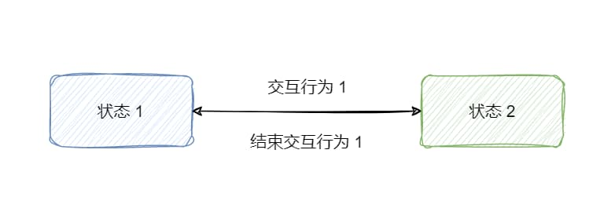
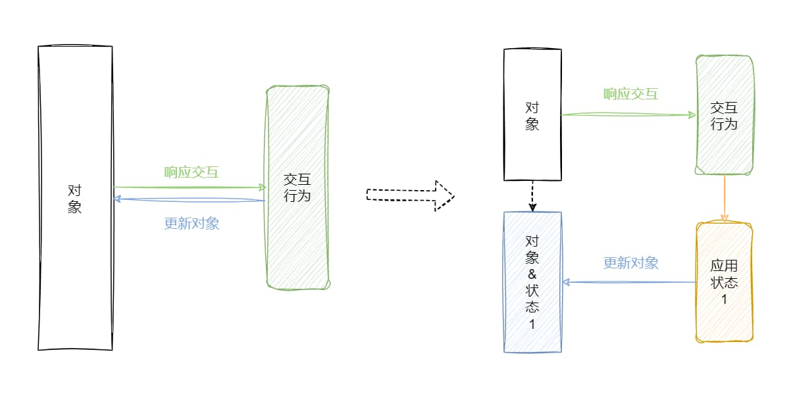
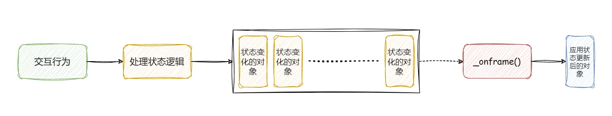
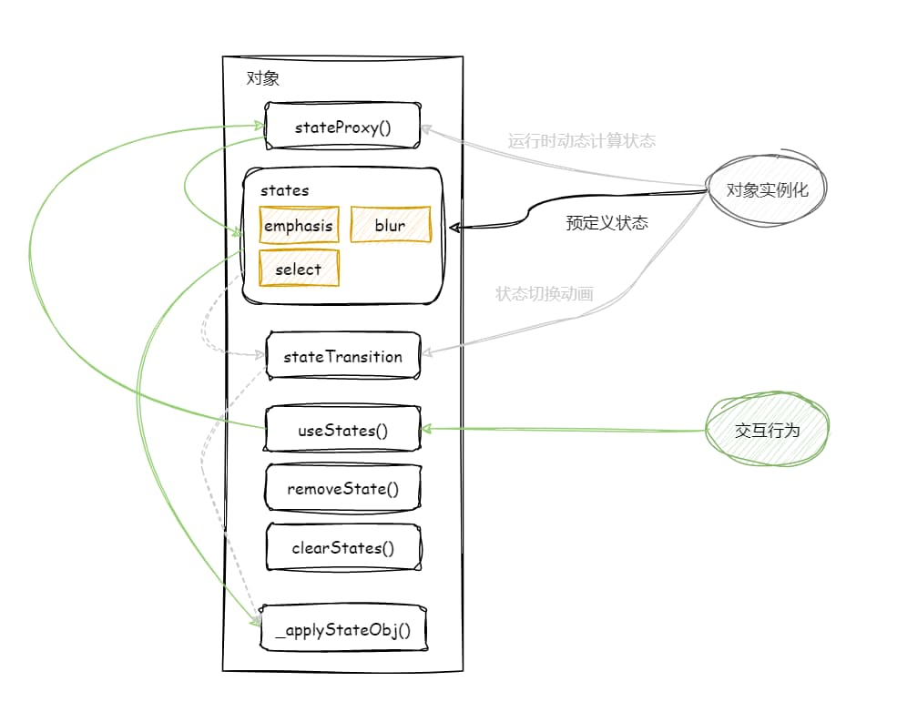

通常，对于 Web 页面的交互处理中，尤其是 DOM 元素样式的变化用 CSS 处理是非常简单的，但如果是普通对象呢？问题似乎变得复杂起来了，这篇文章通过探索 ECharts 与 ZRender 在交互状态设计相关方面的源码实现，讨论一下在复杂场景中处理交互状态的设计方案，如何将命令式编码的复杂性通过声明式编码来降低，该怎样应对复杂场景下的状态叠加问题。

<!-- truncate -->

## 什么是交互状态

在开始讨论之前，有必要清晰的理解即将要讨论的问题的核心：**交互状态**。

对于强交互的应用来说，用户不同的交互行为会导致应用呈现不同的状态。以 Web 场景举一个简单的例子，对于 `button` 标签来说，用 CSS 可以声明 `:hover`、`:active`、`:disabled` 及默认样式，这里就对应了一个按钮的 4 种样式（状态），它们都是在特定的交互行为下才会触发的样式（状态），这里要讨论的交互状态则就是类似这 4 种样式的概念。如下所示：

```css
button {
  color: white;
}
button:hover {
  color: green;
}
button:active {
  color: red;
}
button:disabled {
  color: gray;
}
```

需要清楚的是，这里的交互指的并不一定是常规的鼠标交互行为，其代表的是我们将一种事物变更为另一种状态的行为，例如一个列表中文本的搜索、筛选高亮，交互则指的是搜索和筛选的这两种用户行为。



## 交互与状态

以上 `button` 标签的例子中，CSS 声明了 4 种状态，浏览器本身已经实现了 `button` 标签用户交互行为事件监听，并自动帮助开发者在不同的交互行为下切换相应的状态（样式）。这是处理交互状态中最省心、最简单的场景，只需要声明交互状态即可。

另一方面，熟悉 DOM API 的开发者经常会这样做：

```javascript
button.onmouseenter = () => {
  button.style.color = 'green';
}
button.onmouseleave = () => {
  button.style.color = 'white';
}

button.onkeydown = () => {
  button.style.color = 'red';
}
button.onkeyup = () => {
  button.style.color = 'white';
}

if (/* disabled */) {
  button.style.color = 'gray';
}
```

以上属于命令式（过程式）的编码风格，对于仅需要改变 `button` 元素的一个 `color` 属性来说代码是比较简洁的，但如果需要改变 `button` 元素的多个属性或者逻辑更复杂时，显然代码就变得更加复杂和不易维护了。

当然，遵循 Web 开发中表现与行为相分离的原则，可以将样式（状态）改为用 CSS 类进行声明，如下所示：

```javascript
button.onmouseenter = () => {
  button.classList.add(hoverClassName);
}
button.onmouseleave = () => {
  button.classList.remove(hoverClassName);
}

button.onkeydown = () => {
  button.classList.add(activeClassName);
}
button.onkeyup = () => {
  button.classList.remove(activeClassName);
}

if (/* disabled */) {
  button.classList.add(disabledClassName);
}
```

所以，将状态和状态变更的逻辑进行拆分，代码会更清晰、易维护一些，状态采用声明式方案预先定义好，在相应的交互行为触发时进行状态的切换即可，而且不同交互行为触发状态变更时可以复用状态定义。



### ECharts 中的交互状态流程设计

ECharts 是一个提供了丰富图表类型的可交互的声明式图表库，在不同类型的图表（`series`）中，大部分都可以看到类似高亮（`series.emphasis`）、弱化（`series.blur`）、选中（`series.select`）的图形样式配置项，这些样式配置只有在光标悬浮到图形元素上、点击图形元素或者通过 `dispatchAction` API 触发生效，同样的由于交互行为的结束又可以恢复到原来的样式配置（normal style）。

接下来，根据源码探索一下 ECharts 是如何完成从图形元素响应交互到更改状态，再到更新图形元素的整个过程。先来看看 ECharts 是如何响应图形元素交互的：

```typescript title="https://github.com/apache/echarts/blob/5.4.1/src/core/echarts.ts#L2038"
bindMouseEvent = function (zr: zrender.ZRenderType, ecIns: ECharts): void {
  zr.on('mouseover', function (e) {
    const el = e.target;
    // highlight-next-line
    const dispatcher = findEventDispatcher(el, isHighDownDispatcher);
    if (dispatcher) {
      // highlight-next-line
      handleGlobalMouseOverForHighDown(dispatcher, e, ecIns._api);
      // highlight-next-line
      markStatusToUpdate(ecIns);
    }
  })
    .on('mouseout', function (e) {})
    .on('click', function (e) {});
};
```

ECharts 的底层绘制引擎是 ZRender，其提供了画布的事件响应机制，比如 `mouseover`、`mouseout`、`click` 事件。以 `mouseover` 事件为例，`findEventDispatcher()` 方法用来寻找当前触发事件元素到根元素上离得最近的**可高亮元素**，查看 `isHighDownDispatcher()` 方法的源码可以发现是通过判断元素对象的 `__highDownDispatcher` 标记字段是否为 _true_。当找到可高亮的元素后，通过 `handleGlobalMouseOverForHighDown()` 方法对元素的状态逻辑进行处理，当光标悬浮到某个图形元素上时，将其置为 _emphasis_ 状态，同时要将剩余其它的同类型元素置为 _blur_ 状态，需要注意的是该步骤只完成了图形元素的状态更新，但状态的变化还没有应用（更新）到图形元素上。最后，通过 `markStatusToUpdate()` 方法标记 ECharts 实例需要更新状态，最终在帧循环（`_onframe()`）中通过调用 `applyChangedStates()` 方法**批量渲染**所有需要更新状态的图形元素。

这里有一个细节需要注意下，为什么说 `applyChangedStates()` 是批量渲染？因为其不是同步执行的，在两个帧循环之间可能多次触发 `mouseover` 事件，这样一个帧循环就会批量处理掉由于多次触发 `mouseover` 事件累积的需要应用状态更新的图形元素。



上图就是 ECharts 中交互状态的大致流程设计，在交互响应阶段，关联的对象会被进行标记，此时对象视图并未更新，在帧更新到来前，其它交互行为还会影响已被标记的对象，但对象视图始终在该阶段保持上一次帧更新的结果，待到帧更新阶段到来后，所有被标记的对象会批量进行提交，完成对象视图更新绘制。一句话总结，多次响应交互（对象标记）后统一提交更新。

这里其实应该思考一下为何有这样延迟更新（批量提交）的设计？对于浏览器来说，交互事件的回调在两次帧更新之间（大约 16ms）可能会多次触发，如果每一次触发交互事件回调时都去执行直接更新对象的逻辑不仅耗费性能，而且毫无意义，因为对象没有等待到帧更新时不会重新渲染。另一方面，将交互响应和对象实际更新独立开来，提高性能的同时也降低了代码复杂度和耦合度，对于处理快速且频繁多次不同交互造成的对象状态更新的复杂场景来说会更少出错。

### ZRender 中的对象状态管理

接下来看看 ECharts 最终是如何完成状态到对象更新的操作的。

```typescript title="https://github.com/apache/echarts/blob/5.4.1/src/core/echarts.ts#L2259"
applyChangedStates = function (ecIns: ECharts): void {
  if (!ecIns[STATUS_NEEDS_UPDATE_KEY]) {
    return;
  }

  ecIns.getZr().storage.traverse(function (el: ECElement) {
    // Not applied on removed elements, it may still in fading.
    if (graphic.isElementRemoved(el)) {
      return;
    }
    // highlight-next-line
    applyElementStates(el);
  });

  ecIns[STATUS_NEEDS_UPDATE_KEY] = false;
};

function applyElementStates(el: ECElement) {
  const newStates = [];

  const oldStates = el.currentStates;
  // Keep other states.
  for (let i = 0; i < oldStates.length; i++) {
    const stateName = oldStates[i];
    if (
      !(
        stateName === 'emphasis' ||
        stateName === 'blur' ||
        stateName === 'select'
      )
    ) {
      newStates.push(stateName);
    }
  }

  // Only use states when it's exists.
  if (el.selected && el.states.select) {
    newStates.push('select');
  }
  if (el.hoverState === HOVER_STATE_EMPHASIS && el.states.emphasis) {
    newStates.push('emphasis');
  } else if (el.hoverState === HOVER_STATE_BLUR && el.states.blur) {
    newStates.push('blur');
  }

  // highlight-next-line
  el.useStates(newStates);
}
```

根据源码来看，在帧循环（`_onframe()`）中调用了 `applyChangedStates()` 方法，对实例中的所有画布元素进行遍历应用状态，也就是更新对象视图。`applyElementStates()` 方法完成了指定对象的状态应用逻辑，其中最关键的则是对对象的 `useStates()` 方法的调用。

如果查看 ZRender(V5) 的源码，会发现元素对象实例有很多状态管理相关的 API 方法，如 `useStates()`、`useState()`、`removeState()`、`clearStates()` 等。

```typescript title="https://github.com/ecomfe/zrender/blob/5.3.2/src/Element.ts#L939"
class Element {
  useStates(
    states: string[],
    noAnimation?: boolean,
    forceUseHoverLayer?: boolean
  ) {
    // ...

    if (this.stateProxy) {
      // highlight-next-line
      stateObj = this.stateProxy(stateName, states);
    }
    if (!stateObj) {
      // highlight-next-line
      stateObj = this.states[stateName];
    }
    if (stateObj) {
      stateObjects.push(stateObj);
    }

    // ...

    // highlight-next-line
    const animationCfg = this.stateTransition;

    // ...

    // highlight-next-line
    this._applyStateObj();

    // ...
  }
}
```

根据以上 `useStates()` 方法的源码实现来看，对象状态应用的过程分为两步：首先是获取状态定义，其次是更新对象。这里需要注意的是，对象状态定义的获取又分为通过 `stateProxy()` 方法动态计算和直接获取 `states` 字段相应的预定义状态对象；然后，在对象实际更新的过程中还会进行是否需要动画的判断，状态切换的动画配置存储在 `stateTransition` 字段中。

先来看看状态定义，元素对象 `states` 字段中存储的预定义状态对象实际上就是前文提到的 ECharts 的 `series.emphasis`、`series.blur`、`series.select` 等配置项解析而来，至于 `stateProxy()` 后续会提到。

然后，对于状态更新的动画可能很多人都没怎么注意到，实际上对象的 `stateTransition` 字段中的内容与 ECharts 的 `stateAnimation` 配置项有关。



上图大致描述了一个 ZRender 对象从实例化到触发交互行为后状态更新的过程，其中灰色箭头和虚线是可选的流程。

综上所述，以 ECharts 和 ZRender 的实现为例，**对于一个复杂的 Web 应用来说，交互状态的处理总体上抽象为两个过程：一是系统级别的交互响应和对象状态标记及批量对象更新调度，二是局部单个对象的完整状态管理和更新机制。**

## 实践案例

通过对 ECharts 和 ZRender 源码实现的分析，对于 Web 应用中交互状态的处理有了可参考的解决方案，这里以一个实际案例来说明如何应对此类场景。

在近期一个 3D 关系图的需求中，基于 three.js 来进行开发，而且有很复杂的交互逻辑需要处理，恰好作为尝试对交互状态的处理做了简单的抽象设计。

### 整体设计

在 3D 关系图的场景中，基本元素对象是节点（Node）和边（Edge），参照 ECharts 的设计，将整个交互状态的处理流程划分为全局和局部，全局实现交互事件回调的状态更新业务逻辑，然后在帧渲染中批量应用状态和更新对象（Node 和 Edge）调度，局部对象（Node 和 Edge）要实现自身的状态管理机制（API）。

```typescript title="全局设计"
// - 交互事件回调
function handleClickNode(nodeId) {
  const toUpdateNodes = [];
  const toUpdateEdges = [];

  // TODO 处理交互逻辑

  // 更新状态和标记对象
  toUpdateNodes.forEach((node) => {
    // highlight-next-line
    node.pendingUpdateState = 'stateName';
    // highlight-next-line
    node.dirty = 1;
  });
  toUpdateEdges.forEach((edge) => {
    // highlight-next-line
    edge.pendingUpdateState = 'stateName';
    // highlight-next-line
    edge.dirty = 1;
  });
}

// - 对象批量状态应用和更新
function updateState() {
  // 应用对象状态
  // highlight-next-line
  function applyObjectState(obj) {
    // 利用 dirty 标记位来触发对象的状态更新
    // highlight-next-line
    if (obj.dirty) {
      let { pendingUpdateState } = obj;
      obj.pendingUpdateState = null;

      if (!pendingUpdateState) {
        pendingUpdateState = obj.states.pop() || OBJECT_STATE.NORMAL;
      }
      obj.states.push(pendingUpdateState);

      // 程序上下文切换到局部对象
      // highlight-next-line
      obj.useState(pendingUpdateState);
    }

    obj.dirty = 0;
  }

  nodes.forEach((node) => {
    // highlight-next-line
    applyObjectState(node);
  });
  edges.forEach((edge) => {
    // highlight-next-line
    applyObjectState(edge);
  });
}

// - 帧渲染
function onFrame() {
  // 批量应用状态更新对象
  // highlight-next-line
  updateState();

  // 重新渲染场景
  render();
}
```

以上是系统级别的全局设计伪代码示例，下面来看看对象局部的设计：

```typescript title="局部设计"
class Node {
  /** 标记位 */
  dirty = 0;

  /** 保存对象现有的状态 */
  states = [];

  // highlight-next-line
  setNormal() {}
  // highlight-next-line
  setEmphasis() {}
  // highlight-next-line
  setBlur() {}
  // highlight-next-line
  setSelected() {}

  useState(stateName) {
    // TODO 根据指定状态更新对象 setNormal or setEmphasis or setBlur or setSelected
  }
}
```

以上伪代码对比 ZRender 的对象状态 API，缺少了存储预定义状态对象的 `states` 字段，反而多了 `setEmphasis()`、`setBlur()` 这类方法，也缺少了状态切换动画配置（这次没用到）。为何会有这些差异，后续问题分析时会提到，也是在具体的业务场景中很典型的问题。

### 问题分析

在 3D 关系图的业务场景中面临多个问题，均会影响交互状态管理的程序设计。

#### 基本元素对象和状态类型的抽象粒度

在这里，将 3D 场景中的基本元素抽象为 Node 和 Edge，实际上粒度是很粗的，根据业务数据的特征，Node 也会有子类型，所以状态的抽象很关键。为何没有进一步抽象 Node 的子类？是为了简化设计，避免过度设计，而且业务场景并非特别复杂，可以将一定的业务复杂度放在 Node 类中处理。

根据交互类型进行状态类型的抽象之后（例如光标悬浮、点击选中），由于 Node 实例的数据特征差异，会出现不同 Node 对象同一类型状态拥有不同的状态对象定义。在这里可以选择进一步细化状态类型，但无疑会大大增加代码复杂度，而且代码不可控。另一方面，动态计算状态对象定义是可行的，但也有两个选择，第一是对象实例化时预先计算好存储起来，第二个是运行时动态计算，前者会增加内存消耗量，后者会影响运行时性能，因为考虑到其它问题所以选择了后者。

#### 如何用状态表达对象的系统特征

由于节点（Node）的抽象粒度较粗，而其关联数据的特征信息很多，对于数据分析场景来说，其实有很高的信息表达复杂度。于是出现了这样一个需求：通过一个开关可让用户控制是否需要按节点类型分组着色的效果。说明白一点就是，在按交互行为类型对状态类型进行抽象设计的情况下，一个 Node 实例对象在 `normal` 状态下可能会因为开关的状态不同而表现不同，该如何应对此类场景？

其实也有两个方案，一是对开关的状态进行状态类型抽象，这样就可以实现 `normal` 和 `switchOpen` 两个状态叠加应用并更新对象，但状态的叠加还会产生其它问题，例如状态叠加的顺序。不过，查看 ZRender 的源码，其实可以看到对多状态的叠加是支持的，但在实际使用过程中，叠加的多个状态定义也会产生一些问题。

从按交互行为对状态类型进行抽象的角度来看，这是全部 Node 对象共有的交互特性，也可看作是 Node 个体特征，而要将全部 Node 分组进行着色实际上是 Node 的系统特征的表达。所以，第二种方案就是将交互行为分为两类：用户行为（个体行为）和系统行为。在状态类型抽象设计时，具体的状态类型表达的是用户行为，而对应的状态对象定义可以动态计算，其依赖于系统行为状态。这样，就避免了状态叠加的复杂性和问题，利用命令式编码的灵活性来方便的应对此类复杂场景。实际上，这也是之前为何选择了动态计算状态定义的方案，而 ZRender 中 `stateProxy()` 的设计应该也是考虑了此类场景。

## 结语

本文通过引出强交互体验的 Web 应用中交互状态管理的复杂性问题，通过对 ECharts 和 ZRender 在该方面的相关源码实现进行分析，总结了应对此类问题可参考的程序设计思路，并通过一个实际的实践案例应用来分析真实场景中会面临哪些典型问题，如何调整程序设计以解决问题。

总的来说，对于复杂应用的交互状态管理设计首先应该划分为：全局调度和局部对象状态管理机制。在全局将整个流程拆分为交互响应、对象状态更新、对象批量更新等多个阶段以降低代码复杂度和耦合性，在局部对象中提供预先定义状态对象的机制应对简单场景，也可以提供动态计算状态定义的机制来应对复杂场景，并结合动画来进一步提高用户体验。

## 参考资源

- <https://echarts.apache.org/zh/index.html>
- <https://ecomfe.github.io/zrender-doc/public/>
