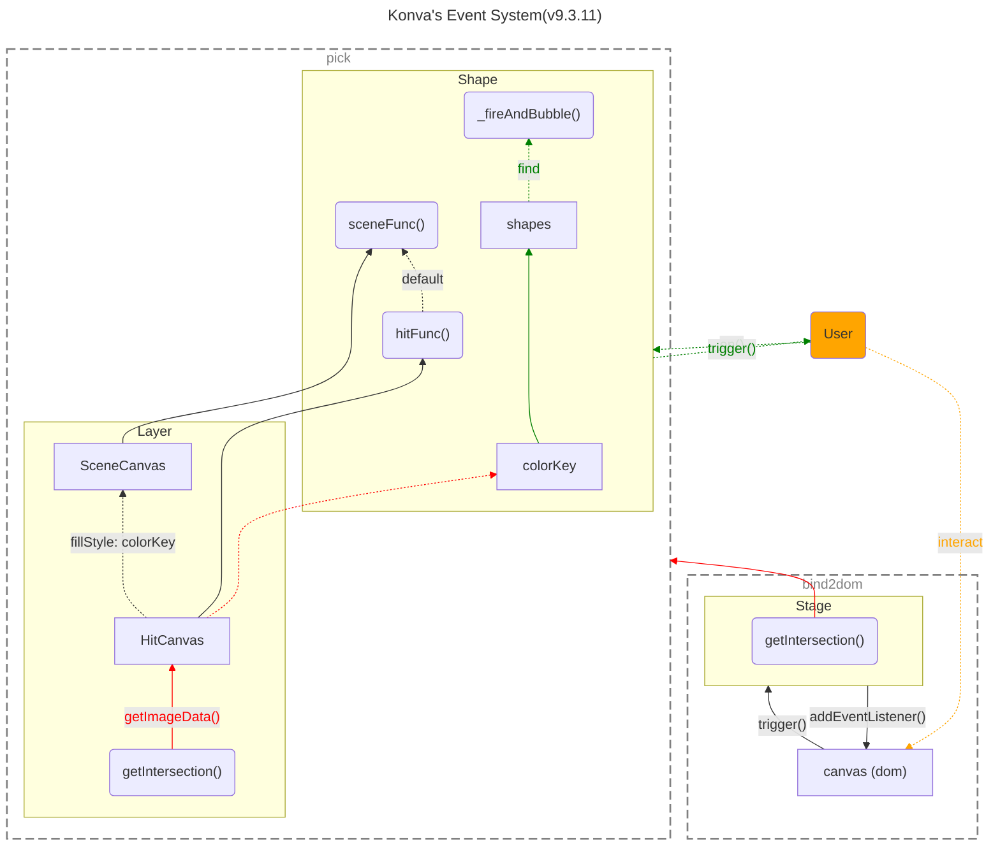

> _最后更新于 2024-06-02 19:47:00_

绘图引擎支持丰富交互的前提是拥有一套事件系统，而在画布中如何拾取元素是实现的关键，从 [Konva.js](https://konvajs.org/) 的源码来看看其事件系统是如何设计的。

_（之前分析过 ZRender 的源码实现，其采用了几何判断的方式来实现元素拾取，而 Konva.js 采用了不同的方案。）_



<!-- truncate -->

通常，画布（Canvas）元素作为原生 DOM 会提供相应的事件 APIs，但画布中绘制的内容由不同的绘图库进行抽象设计，基础元素（例如矩形、圆、线等）的事件由绘图库进行支持。

绘图库为了实现事件系统，一般的策略分为两步：**首先，通过绑定画布元素的原生 DOM 事件来支持对用户交互事件的响应；其次，在响应画布的原生 DOM 事件时，获取坐标等信息在画布上进行元素拾取，来进一步判断触发交互事件的具体元素。**

其中，`Node` 是 Konva.js 中很重要的基类，几乎所有绘图相关的类（`Stage`、`Layer`、`Shape`）都继承自它，其实现了事件相关的 APIs（例如 `on()`、`off()` 等等）。

下面根据源码来分析具体逻辑的实现。

## 绑定宿主环境事件

```typescript title="https://konvajs.org/docs/overview.html"
// first we need to create a stage
var stage = new Konva.Stage({
  container: 'container',   // id of container <div>
  width: 500,
  height: 500
});
```

第一阶段，在 Konva.js 实例化过程中就会绑定宿主环境的事件。具体过程为，在实例化 `Stage` 时，会在内部直接绑定容器 DOM 元素的宿主事件（同时支持鼠标、触摸、指针三种类型事件）。

绑定宿主环境事件：

```typescript title="https://github.com/konvajs/konva/blob/9.3.11/src/Stage.ts#L177"
export class Stage extends Container<Layer> {
  constructor(config: StageConfig) {
    super(checkNoClip(config));
    this._buildDOM();
    // highlight-next-line
    this._bindContentEvents();

    // ...
  }

  _bindContentEvents() {
    if (!Konva.isBrowser) {
      return;
    }
    // highlight-start
    EVENTS.forEach(([event, methodName]) => {
      this.content.addEventListener(
        event,
        (evt) => {
          this[methodName](evt);
        },
        { passive: false }
      );
    });
    // highlight-end
  }
}
```

画布元素的原生 DOM 事件的响应逻辑在 `Stage` 类中直接实现：

```typescript title="https://github.com/konvajs/konva/blob/9.3.11/src/Stage.ts#L589"
export class Stage extends Container<Layer> {
  _pointermove(evt: TouchEvent | MouseEvent | PointerEvent) {
    // ...

    // highlight-next-line
    this.setPointersPositions(evt);

    // ...

    var processedShapesIds = {};
    let triggeredOnShape = false;
    var targetShape = this._getTargetShape(eventType);
    this._changedPointerPositions.forEach((pos) => {
      // highlight-start
      const shape = (PointerEvents.getCapturedShape(pos.id) ||
        this.getIntersection(pos)) as Shape;
      // highlight-end
      const pointerId = pos.id;
      const event = { evt: evt, pointerId };

      var differentTarget = targetShape !== shape;

      if (differentTarget && targetShape) {
        // highlight-next-line
        targetShape._fireAndBubble(events.pointerout, { ...event }, shape);
        // highlight-next-line
        targetShape._fireAndBubble(events.pointerleave, { ...event }, shape);
      }

      if (shape) {
        if (processedShapesIds[shape._id]) {
          return;
        }
        processedShapesIds[shape._id] = true;
      }

      if (shape && shape.isListening()) {
        triggeredOnShape = true;
        if (differentTarget) {
          // highlight-next-line
          shape._fireAndBubble(events.pointerover, { ...event }, targetShape);
          // highlight-next-line
          shape._fireAndBubble(events.pointerenter, { ...event }, targetShape);
          this[eventType + 'targetShape'] = shape;
        }
        // highlight-next-line
        shape._fireAndBubble(events.pointermove, { ...event });
      } else {
        if (targetShape) {
          this._fire(events.pointerover, {
            evt: evt,
            target: this,
            currentTarget: this,
            pointerId,
          });
          this[eventType + 'targetShape'] = null;
        }
      }
    });

    if (!triggeredOnShape) {
      this._fire(events.pointermove, {
        evt: evt,
        target: this,
        currentTarget: this,
        pointerId: this._changedPointerPositions[0].id,
      });
    }
  }
}
```

上述源码是 `pointermove` 事件的响应逻辑，其中**最关键的便是对 `this.getIntersection(pos)` 的调用，这一步实现了指定坐标点的元素拾取**。拾取到元素后，则会调用元素的 `_fireAndBubble()` 方法来触发用户绑定的事件回调。

```typescript title="https://github.com/konvajs/konva/blob/9.3.11/src/Stage.ts#L365"
export class Stage extends Container<Layer> {
  /**
   * get visible intersection shape. This is the preferred
   *  method for determining if a point intersects a shape or not
   * @method
   * @name Konva.Stage#getIntersection
   * @param {Object} pos
   * @param {Number} pos.x
   * @param {Number} pos.y
   * @returns {Konva.Node}
   * @example
   * var shape = stage.getIntersection({x: 50, y: 50});
   */
  getIntersection(pos: Vector2d) {
    if (!pos) {
      return null;
    }
    var layers = this.children,
      len = layers.length,
      end = len - 1,
      n;

    for (n = end; n >= 0; n--) {
      // highlight-next-line
      const shape = layers[n].getIntersection(pos);
      if (shape) {
        return shape;
      }
    }

    return null;
  }
}
```

在 `Stage` 类中，元素拾取过程是遍历所有的层（`Layer`），并调用其 `getIntersection()` 方法，因此真正的元素拾取逻辑实现在 `Layer` 中。

## 元素拾取

第二阶段，是元素拾取的具体实现，Konva.js 采用了**缓存 Canvas 颜色拾取（Color Pick）** 的判定策略，意味着**每一个 `Layer` 都对应着两个 Canvas 元素：用于渲染的场景画布（SceneCanvas）和用于元素拾取的命中测试缓存画布（HitCanvas）。**

```typescript title="https://github.com/konvajs/konva/blob/9.3.11/src/Layer.ts#L57"
export class Layer extends Container<Group | Shape> {
  // highlight-start
  canvas = new SceneCanvas();
  hitCanvas = new HitCanvas({
    pixelRatio: 1,
  });
  // highlight-end
}
```

来看看 `getIntersection()` 方法是如何实现的：

```typescript title="https://github.com/konvajs/konva/blob/9.3.11/src/Layer.ts#L321"
export class Layer extends Container<Group | Shape> {
  /**
   * get visible intersection shape. This is the preferred
   * method for determining if a point intersects a shape or not
   * also you may pass optional selector parameter to return ancestor of intersected shape
   * @method
   * @name Konva.Layer#getIntersection
   * @param {Object} pos
   * @param {Number} pos.x
   * @param {Number} pos.y
   * @returns {Konva.Node}
   * @example
   * var shape = layer.getIntersection({x: 50, y: 50});
   */
  getIntersection(pos: Vector2d) {
    if (!this.isListening() || !this.isVisible()) {
      return null;
    }
    // in some cases antialiased area may be bigger than 1px
    // it is possible if we will cache node, then scale it a lot
    // highlight-next-line
    var spiralSearchDistance = 1;
    var continueSearch = false;
    while (true) {
      for (let i = 0; i < INTERSECTION_OFFSETS_LEN; i++) {
        const intersectionOffset = INTERSECTION_OFFSETS[i];
        // highlight-start
        const obj = this._getIntersection({
          x: pos.x + intersectionOffset.x * spiralSearchDistance,
          y: pos.y + intersectionOffset.y * spiralSearchDistance,
        });
        const shape = obj.shape;
        if (shape) {
            return shape;
        }
        // highlight-end
        // we should continue search if we found antialiased pixel
        // that means our node somewhere very close
        continueSearch = !!obj.antialiased;
        // stop search if found empty pixel
        if (!obj.antialiased) {
          break;
        }
      }
      // if no shape, and no antialiased pixel, we should end searching
      if (continueSearch) {
        // highlight-next-line
        spiralSearchDistance += 1;
      } else {
        return null;
      }
    }
  }

  _getIntersection(pos: Vector2d): { shape?: Shape; antialiased?: boolean } {
    const ratio = this.hitCanvas.pixelRatio;
    // highlight-start
    const p = this.hitCanvas.context.getImageData(
      Math.round(pos.x * ratio),
      Math.round(pos.y * ratio),
      1,
      1
    ).data;
    // highlight-end
    const p3 = p[3];

    // fully opaque pixel
    if (p3 === 255) {
      // highlight-start
      const colorKey = Util._rgbToHex(p[0], p[1], p[2]);
      const shape = shapes[HASH + colorKey];
      if (shape) {
        return {
          shape: shape,
        };
      }
      // highlight-end
      return {
        antialiased: true,
      };
    } else if (p3 > 0) {
      // antialiased pixel
      return {
        antialiased: true,
      };
    }
    // empty pixel
    return {};
  }
}
```

根据以上源码来看，**首先以拾取坐标为中心的 2×2 矩形中找出 5 个关键点（`INTERSECTION_OFFSETS`，中心和四个顶点）进行遍历，分别通过调用缓存画布（hitCanvas）的 `getImageData()` 来获取坐标点的像素值，然后在颜色与图形元素实例的映射表 `shapes` 中找到目标元素**。这个过程中，实际上也考虑了抗锯齿像素对元素拾取产生的影响。

每一个元素实例都有一个唯一的 `colorKey`：

```typescript title="https://github.com/konvajs/konva/blob/9.3.11/src/Shape.ts#L184"
export class Shape<Config extends ShapeConfig = ShapeConfig> extends Node<Config> {
  constructor(config?: Config) {
    super(config);
    // set colorKey
    let key: string;

    // highlight-start
    while (true) {
      key = Util.getRandomColor();
      if (key && !(key in shapes)) {
        break;
      }
    }

    this.colorKey = key;
    shapes[key] = this;
    // highlight-end
  }
}
```

每一个元素会同时在渲染画布和缓存画布中绘制一遍：

```typescript title="https://github.com/konvajs/konva/blob/9.3.11/src/Shape.ts#L572"
export class Shape<Config extends ShapeConfig = ShapeConfig> extends Node<Config> {
  getSceneFunc() {
    return this.attrs.sceneFunc || this['_sceneFunc'];
  }

  getHitFunc() {
    return this.attrs.hitFunc || this['_hitFunc'];
  }

  drawScene(can?: SceneCanvas, top?: Node, bufferCanvas?: SceneCanvas) {
    var canvas = can || layer!.getCanvas(),
      context = canvas.getContext() as SceneContext,
      cachedCanvas = this._getCanvasCache(),
      // highlight-next-line
      drawFunc = this.getSceneFunc();

    // ...
  }

  drawHit(can?: HitCanvas, top?: Node, skipDragCheck = false) {
    var layer = this.getLayer(),
      canvas = can || layer!.hitCanvas,
      context = canvas && canvas.getContext(),
      // highlight-next-line
      drawFunc = this.hitFunc() || this.sceneFunc();

    // ...
  }
}
```

根据源码可以看到，绘制时分别调用了 `sceneFunc()` 和 `hitFunc()`，但前者作为后者的备选项，也就是说默认情况下渲染两次实际上调用的都是 `sceneFunc()`，确保图形元素的绘制结果（即形状）一致（`hitFunc()` 可以自定义实现，参考[文档](https://konvajs.org/docs/events/Custom_Hit_Region.html)）。不同的是，缓存画布中绘制时使用了元素的 `colorKey` 对应的颜色：

```typescript title="https://github.com/konvajs/konva/blob/9.3.11/src/Context.ts#L984"
export class HitContext extends Context {
  _stroke(shape) {
    if (shape.hasHitStroke()) {
      // ignore strokeScaleEnabled for Text
      const strokeScaleEnabled = shape.getStrokeScaleEnabled();
      if (!strokeScaleEnabled) {
        this.save();
        var pixelRatio = this.getCanvas().getPixelRatio();
        this.setTransform(pixelRatio, 0, 0, pixelRatio, 0, 0);
      }
      this._applyLineCap(shape);

      var hitStrokeWidth = shape.hitStrokeWidth();
      var strokeWidth =
        hitStrokeWidth === 'auto' ? shape.strokeWidth() : hitStrokeWidth;

      this.setAttr('lineWidth', strokeWidth);
      // highlight-next-line
      this.setAttr('strokeStyle', shape.colorKey);
      shape._strokeFuncHit(this);
      if (!strokeScaleEnabled) {
        this.restore();
      }
    }
  }
}
```

以上就是 Konva.js 事件系统实现的大致原理。简单的来说，**Konva.js 会在实例化每个元素时，为其生成一个 `colorKey`，该值实际上代表一个随机颜色，在绘制该元素时，会以该随机颜色为填充色将该元素图形同时绘制在缓存画布（HitCanvas）中，当用户在渲染画布（SceneCanvas）中进行交互时，会根据触发的 DOM 事件得到一个坐标，根据该坐标从缓存画布（HitCanvas）中拾取像素值，再根据该色值从元素与颜色映射表中获取元素实例。**

## 延伸：重叠元素的拾取

上述分析中，实际上没有考虑到当多个元素在同一个坐标点重叠时的情况。根据上述实现，在渲染过程中，在同一个坐标点上后渲染的元素会覆盖掉之前渲染元素的颜色，最终拾取时得到的是最后一次渲染元素的颜色，这适用于大多数业务场景，仅获取最顶层元素。

实际上，Konva.js 提供了一个拾取重叠元素的 APIs [`getAllIntersections()`](https://konvajs.org/api/Konva.Stage.html#getAllIntersections__anchor)，来看看其源码实现：

```typescript title="https://github.com/konvajs/konva/blob/9.3.11/src/Container.ts#L317"
export abstract class Container<ChildType extends Node = Node> extends Node<ContainerConfig> {
  /**
   * get all shapes that intersect a point.  Note: because this method must clear a temporary
   * canvas and redraw every shape inside the container, it should only be used for special situations
   * because it performs very poorly.  Please use the {@link Konva.Stage#getIntersection} method if at all possible
   * because it performs much better
   * @method
   * @name Konva.Container#getAllIntersections
   * @param {Object} pos
   * @param {Number} pos.x
   * @param {Number} pos.y
   * @returns {Array} array of shapes
   */
  getAllIntersections(pos) {
    var arr: Shape[] = [];

    this.find<Shape>('Shape').forEach((shape) => {
      if (shape.isVisible() && shape.intersects(pos)) {
        arr.push(shape);
      }
    });

    return arr;
  }
}
```

遍历场景中的所有可见元素，并调用元素的 `intersects()` 方法进行相交测试：

```typescript title="https://github.com/konvajs/konva/blob/9.3.11/src/Shape.ts#L440"
export class Shape<Config extends ShapeConfig = ShapeConfig> extends Node<Config> {
  /**
   * determines if point is in the shape, regardless if other shapes are on top of it.  Note: because
   *  this method clears a temporary canvas and then redraws the shape, it performs very poorly if executed many times
   *  consecutively.  Please use the {@link Konva.Stage#getIntersection} method if at all possible
   *  because it performs much better
   * @method
   * @name Konva.Shape#intersects
   * @param {Object} point
   * @param {Number} point.x
   * @param {Number} point.y
   * @returns {Boolean}
   */
  intersects(point) {
    var stage = this.getStage();
    if (!stage) {
      return false;
    }
    const bufferHitCanvas = stage.bufferHitCanvas;

    bufferHitCanvas.getContext().clear();
    this.drawHit(bufferHitCanvas, undefined, true);
    const p = bufferHitCanvas.context.getImageData(
      Math.round(point.x),
      Math.round(point.y),
      1,
      1
    ).data;
    return p[3] > 0;
  }
}
```

依次将每个元素的缓存图像数据绘制到全局的缓存画布中，并拾取坐标点的像素颜色来判断是否相交。

## 参考资源

- <https://konvajs.org/>
- <https://konvajs.org/docs/events/Image_Events.html>
