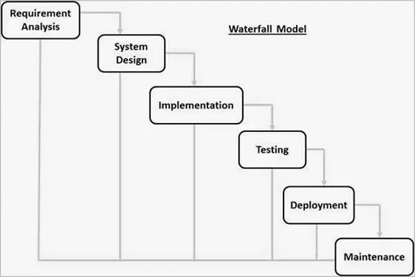
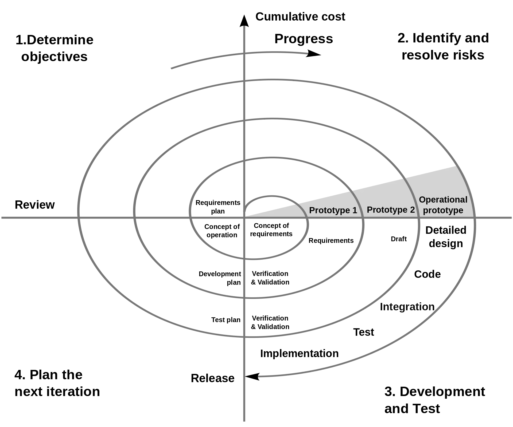
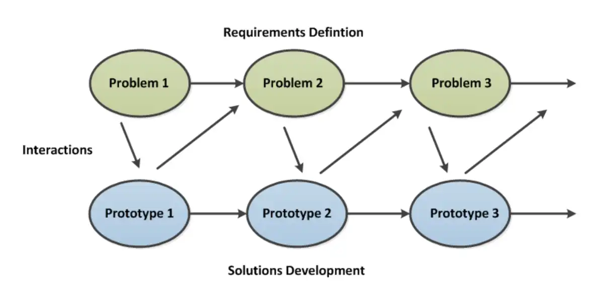

在日常工作中，经常被糟糕的项目进度控制和需求变更等因素搞得人身心俱疲，为了缓解这类问题，产品设计、程序设计、项目管理等多个环节都需要参考一些优秀的案例，而《设计原本》就针对**设计过程**进行了较为深入的探讨，在阅读过后发现其中一些概念是日常在用的，但没有意识到的，也有我们大多数人一直追求的理想状态被作者认为是不合理的，值得一读。

<!-- truncate -->

在翻阅博文中读书相关分类的文章时，发现自 2021 年更新后一年多已经没有更新了，倒也不是这一年多没有看书，只是看书是断断续续的，也没有坚持持续性的记录下来。近段时间刚好不是很忙，看到电脑中之前收藏的一本电子书《设计原本》，便饶有兴致的看了起来。鉴于现在工作忙的原因，一般看书的时候都是下班后晚上进行速读，遇到好的内容会花多一些时间深入阅读，这本书是连续几个晚上，总共花费 6 个多小时阅读完的，虽然时间不多，但还是有一些收获的。

这本书总体来说，内容并不是偏向学术理论的，文中有大量的实际案例，更具备实用性。也是在这本书中，又一次见到了“银弹”的说法，对这个说法有了更深入的了解。

## 关于理性模型的讨论

在阅读这本书的过程中，我被吸引的第一个关注点就是关于“理性模型”的讨论，实际上在这之前我对这个概念没有任何认知。

> 将设计过程建模为一种系统化的、按部就班的过程的观念。

以上是书中对“理性模型”这个概念的概述，这对很多人来说似乎稀松平常，如果进一步了解作者在后续过程中举例的软件开发领域的“瀑布模型”之后更会觉得原来不过如此。

如上图所示，这就是软件开发领域的理性模型，即瀑布模型。乍一看这不就是我们每天开发软件的总体流程吗？

但是，本书的作者却不完全认同理性模型，认为这是过于理想化的东西，不符合现实情况。仔细想想也有道理，因为按这样的流程开发软件时，对于一些过程中的细节我们总会因为各种各样的现实情况而妥协或者采取折中方案。

### 理性模型的优点

针对理性模型的讨论，作者先叙述了其优点。

> 与“先开始编码再说，先开始构建再说”的行为相比，任何将设计过程系统化的工作都可以视为一种长足的进步。它为设计项目的规划提供了清晰的步骤。它为日程规划和进度评估定义了明确的阶段里程碑。它为项目组织和人员配备指明了方向。它改进了设计团队的内部沟通。而在设计团队和其项目经理之间以及项目经理和其他利益攸关者之间而言，它对于沟通的改进尤为显著。新手很容易就可以上手。掌握了它，新手在面对分派给他的第一个设计任务时，就知道从何人手了。

根据实际来看，以上叙述比较符合我们日常工作的感受。

> 理性模型在特定的情形下会体现出更多的长处。在项目早期就给出目标的显式陈述、相关的必要条件以及约束说明，这有助于避免让团队陷于举棋不定的局面，也促使团队形成关于项目宗旨的统一认识。在开始编码或正式的制图工作开始之前做好整体的设计过程规划，就能够规避大量麻烦，也避免让许多努力付之东流。

以上两部分内容算是对理性模型优点的总体概括，感觉还是比较深刻的，尤其是对于团队协作、设计项目管理等方面的考虑很到位。

### 理性模型的缺陷

接下来便是探讨了理性模型的缺陷，这部分内容其实也是最值得我们阅读和思考的。

首要的一点便是我们在初始阶段并不真正地知道目标是什么，理性模型最严重的缺陷在于，设计师们往往只有一个模糊不清的、不完整的既定目标，或者说是主要目的。

> 设计中最困难的部分在于决定要设计什么。

在我们日常的软件开发工作中，项目发起时大家都会明确目标，不过这个目标偏向于结果，对于项目或者产品本身没有太多具体的表述，如何具体去落地这个事情便成为了一个最大难题。这就会导致项目过程中出现频繁的需求变更，更甚者还需要进行目标修正，这一般会导致项目周期拉长，多次延期。当然，应对此类问题书中提了一种方案，那就是快速原型设计。

> 设计师的主要任务乃是帮助客户发现他们想要的设计。

快速原型设计采用一种迭代的过程和方式，来帮助客户逐渐明确需求，从而确定设计目标。也就是说，目标的迭代须作为设计过程的固有组成部分加以考虑。

其次，设计不是一蹴而就的，在一些高技术的领域，一个人很难有足够的知识在一开始就确定好设计目标，对于周期长的项目还会出现中途换人的情况，所以这实际是一种探索的过程。那么理性模型在这方面来看就过于理想化。

另一方面，项目进行过程中，很多设计决策并不是最终方案，实际上只能算是一个暂定方案，随着项目的进行，一些未考虑到的因素会被发现并影响既有的设计决策，同时客户的需求发生变化也会产生同样的结果。也就是说，在现实情况中，不可控因素有很多，理性模型注重的是按部就班、持续推进的单向工作流，但这明显不符合现实情况。

还有一种观点认为，设计师通常并不会按理性模型预想的步骤做事，这样只会限制他们的创造力。

最令我印象深刻则是，书中作者大胆指出，很多时候我们自己并不按理性模型设计的那样做事，但又要求别人如此做事，而这样的方式对于我们来说无法给别人提供很好的帮助。

基于以上所有的讨论，书中也做了几点总结，作为参考：

> 一个正式的设计过程模型是必需的，目的是帮助组织设计工作、辅助为项目内部以及项目相关的沟通工作，亦有益于教学。
>
> 给予设计过程模式以可视化的几何表示至关重要，因为设计师们都擅长空间思维。他们最乐于学习、思考、分享和讨论有着明确儿何图像的模型。
>
> 对工程师来说，设计的理性模型是自然而然的。
>
> 线性的按部就班的理性模型具有很大的误导性。它并未能反映出设计师的真实工作，或是一流的设计思想家所认定的设计过程的本质。
>
> 坏的模型流毒甚广。它会导致需求的过早固定，从而导致过度膨胀的产品，以及日程表、预算和性能的灾难。
>
> 理性模型在实践中积重难返，尽管它有种种不足，而且对它早有大量有说服力的批判。这是因为它具有诱人的逻辑简单性，也是因为构建者和客户之间需要“合同”。

通过阅读这些内容，给人感受最深的有两点：第一，我们预期的过程通常与我们实际做事的过程不相符；第二，理性模型（瀑布模型）是在没有更好的方案之时，为了快速达成某些前置目标而选取的方案。

### 螺旋模型

在批评了理性模型之后，书中也探讨了一些其它模型的方案，其中螺旋模型作者认为比较合理。

> 螺旋的形状当然表示的是过程。它将同一活动的连续反复彼此关联起来。这种几何形状很容易理解，而且令人印象深刻。该模型强调的是原型方法，它主张远在一个可以跑起来的原型成为可能之前，就从用户界面原型和用户测试起步。

从瀑布模型和螺旋模型两者可视化表示的层面来看，从前者的线性模型变成了后者的迭代式模型，这意味着设计是一个不断重复的过程，这似乎更符合我们的现实情况。

当然，作者提出螺旋模型并不是目前最优的方案，但基于螺旋模型进行迭代和发展是一个非常有潜力的方向。

## 其它设计过程模型

作者在书中探讨比瀑布模型更好的设计过程模型时当然没有武断地直接提出“螺旋模型”就是最好的，还提到了一些其它的模型进行了简单的分析讨论，考虑到其在有我们日常接触的系统的应用，所以提一下。

### 共同演化模型

如上图所示，共同演化模型实际上指的是需求问题和解决方案原型不断相互迭代完善的过程。

> 共同演化模型当然强调了对于需求的递进式探索和构造。它的视觉表现令人难忘。它并不包罗万象：它没有伪装成将设计一构建一测试一部署一维护一扩展这些过程的所有方面都包含在内的样子。此外，该模型的几何图像也没有示意一个收敛的过程。

作者认为，在它原始的构造形态中，并没有表示阶段里程碑和合同的节点。虽然该模型有它的闪光点，也比理性模型要好，但并不认为它已经充分完整。

### 集市模型

集市模型没有可参考的图片，但集市的概念对于我们来说是再也熟悉不过了，可以作以类比想象。

> Raymond 在他的集市过程中如是说：在用户与生产者社区中，某个成员发现了一个需要，然后开发出一个模块来满足它，并将该模块作为礼物提供给他的同伴使用。而这个将模块整合的过程，对于 Linux 社区而言，极大地受益于 Linux 的模块化结构，特别是它的管道和过滤器机制。同样的过程也适用于缺陷修复。某个成员在他所使用的模块中检测出一个缺陷，然后把它修复以使自己能完成手头的工作，尔后他就把这个修复成果作为礼物提供给社区。

当然，对于一些很容易想到的疑问，书中也给出了答案。

> 显然，人们编写新的模块，以及修复缺陷是为了使他们可以做到想做的事。但他们又为什么将自己的工作成果分发出来，尤其是这么一来必要的测试、文档撰写以及发布等，都要求人们去做大量的额外工作呢？8Raymond 的答案，我觉得有几分道理，那就是，这样做带来的激励和回报就是在社区中的威望。

以及市场机制可能发挥的巨大作用。

> 经常地，多个模块以及对于同一个缺陷的多个修复会同时提供给社区。Raymond 提出，这时市场机制（即使对于免费商品而言）会发挥作用。更好的工具、修复结果，会赢得更广泛的受众，而它的作者也相应地会赢得更高的威望。
>
> 这样，集市就逐渐地被很多电子化提供他们的数字产品的“供应商”填充。许多买家，以投票的方式，通过增加在全球化社区中以电子化形式表现的威望来对他们给予回报。

现如今活跃在开源社区的大多数开发者都没有相应的收益，但开源社区运动依然进行的如火如荼，这就是威望这种礼物的巨大吸引力。

但是集市模型并不完全适合用来作为设计过程的指导模型，作者由于没有进行过实践，也只是给出了几条评论。简单的来说，集市模型产出的实际上是副产品，工具比产品多，而且没有经过大量测试的不合格产品占比很高；Linux 之所以在开源社区中如此成功，是因为有 Linus Torvalds 始终作为一个保持其概念完整性的关键首脑力量存在，以及 UNIX 已经提供了总体系统设计。

## 结语

书中还针对远程协作等内容做了论述，这里不再赘述，因为书中大量的示例结合上下文看会容易理解一些，这里提到的是一些偏概念性的，也是感觉这本书中最核心的内容。

## 书

- 《设计原本》- [美] Jr·Frederick P·Brooks 著，王海鹏、高博 译
